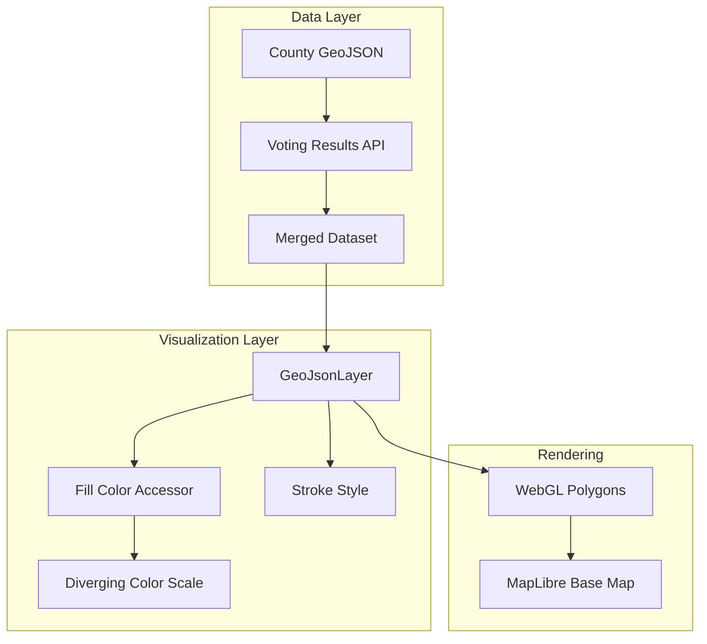

# Implementation Plan: View County Voting Map

## User Story

**As a** user
**I want to** see county voting data plotted on a map
**So that I** can visualize voting patterns across different regions

## Acceptance Criteria

- [ ] Map displays with a base layer showing geographic context
- [ ] County boundaries are rendered as polygons on the map
- [ ] Each county polygon is filled based on voting results
- [ ] Color gradient indicates vote margin or party affiliation
- [ ] County boundaries are clearly visible

## Approach

Use deck.gl's `GeoJsonLayer` to render county boundaries as filled polygons with stroke outlines. The layer supports GeoJSON data directly and provides efficient WebGL rendering for complex polygon geometries. A diverging color scale (blue to red) will indicate party affiliation, with color intensity reflecting vote margin.

## Architecture



## Libraries

| Library | Purpose |
|---------|---------|
| `@deck.gl/layers` | GeoJsonLayer for polygon rendering |
| `@deck.gl/react` | React integration |
| `react-map-gl/maplibre` | MapLibre base map |
| `d3-scale` | Diverging color scale |
| `zod` | Runtime data validation |

## Data Structures

```typescript
// src/types/county.ts
import { z } from 'zod';

export const CountyVotingSchema = z.object({
  fips: z.string(),           // 5-digit FIPS code
  name: z.string(),           // County name
  state: z.string(),          // State abbreviation
  stateFips: z.string(),      // 2-digit state FIPS
  totalVotes: z.number(),
  democratVotes: z.number(),
  republicanVotes: z.number(),
  otherVotes: z.number(),
  margin: z.number(),         // Positive = Democrat, Negative = Republican
  marginPercent: z.number(),  // -100 to +100
});

export type CountyVoting = z.infer<typeof CountyVotingSchema>;

// GeoJSON Feature with voting properties
export interface CountyFeature {
  type: 'Feature';
  properties: CountyVoting;
  geometry: GeoJSON.Polygon | GeoJSON.MultiPolygon;
}

export interface CountyFeatureCollection {
  type: 'FeatureCollection';
  features: CountyFeature[];
}
```

## Implementation Steps

### 1. Create Diverging Color Scale

```typescript
// src/components/CountyVotingMap/layers/votingColorScale.ts
import { scaleLinear } from 'd3-scale';

// Blue (Democrat) to White (neutral) to Red (Republican)
const DEMOCRAT_COLOR: [number, number, number] = [33, 102, 172];   // #2166ac
const NEUTRAL_COLOR: [number, number, number] = [247, 247, 247];   // #f7f7f7
const REPUBLICAN_COLOR: [number, number, number] = [178, 24, 43];  // #b2182b

export function getVotingColor(
  marginPercent: number,
  opacity: number = 200
): [number, number, number, number] {
  // Clamp margin to -100 to +100
  const clampedMargin = Math.max(-100, Math.min(100, marginPercent));

  // Normalize to 0-1 range (0 = full Republican, 0.5 = neutral, 1 = full Democrat)
  const t = (clampedMargin + 100) / 200;

  let r: number, g: number, b: number;

  if (t < 0.5) {
    // Republican side: blend from red to white
    const localT = t * 2;
    r = Math.round(REPUBLICAN_COLOR[0] + (NEUTRAL_COLOR[0] - REPUBLICAN_COLOR[0]) * localT);
    g = Math.round(REPUBLICAN_COLOR[1] + (NEUTRAL_COLOR[1] - REPUBLICAN_COLOR[1]) * localT);
    b = Math.round(REPUBLICAN_COLOR[2] + (NEUTRAL_COLOR[2] - REPUBLICAN_COLOR[2]) * localT);
  } else {
    // Democrat side: blend from white to blue
    const localT = (t - 0.5) * 2;
    r = Math.round(NEUTRAL_COLOR[0] + (DEMOCRAT_COLOR[0] - NEUTRAL_COLOR[0]) * localT);
    g = Math.round(NEUTRAL_COLOR[1] + (DEMOCRAT_COLOR[1] - NEUTRAL_COLOR[1]) * localT);
    b = Math.round(NEUTRAL_COLOR[2] + (DEMOCRAT_COLOR[2] - NEUTRAL_COLOR[2]) * localT);
  }

  return [r, g, b, opacity];
}

// For colorblind accessibility: alternative purple-orange scale
export function getAccessibleVotingColor(
  marginPercent: number,
  opacity: number = 200
): [number, number, number, number] {
  const ORANGE: [number, number, number] = [230, 97, 1];
  const PURPLE: [number, number, number] = [94, 60, 153];

  const clampedMargin = Math.max(-100, Math.min(100, marginPercent));
  const t = (clampedMargin + 100) / 200;

  const r = Math.round(ORANGE[0] + (PURPLE[0] - ORANGE[0]) * t);
  const g = Math.round(ORANGE[1] + (PURPLE[1] - ORANGE[1]) * t);
  const b = Math.round(ORANGE[2] + (PURPLE[2] - ORANGE[2]) * t);

  return [r, g, b, opacity];
}
```

### 2. Create County Layer Factory

```typescript
// src/components/CountyVotingMap/layers/countyLayer.ts
import { GeoJsonLayer } from '@deck.gl/layers';
import type { CountyFeature, CountyFeatureCollection } from '../../../types/county';
import { getVotingColor } from './votingColorScale';

interface CountyLayerOptions {
  data: CountyFeatureCollection;
  highlightedFips?: string | null;
  onHover?: (info: { object?: CountyFeature; x: number; y: number }) => void;
  onClick?: (info: { object?: CountyFeature }) => void;
}

export function createCountyLayer({
  data,
  highlightedFips,
  onHover,
  onClick,
}: CountyLayerOptions) {
  return new GeoJsonLayer<CountyFeature>({
    id: 'county-voting-layer',
    data,
    pickable: true,
    stroked: true,
    filled: true,
    extruded: false,

    // Fill color based on vote margin
    getFillColor: (feature) => {
      const isHighlighted = feature.properties.fips === highlightedFips;
      const opacity = isHighlighted ? 255 : 200;
      return getVotingColor(feature.properties.marginPercent, opacity);
    },

    // Subtle gray borders
    getLineColor: (feature) => {
      const isHighlighted = feature.properties.fips === highlightedFips;
      return isHighlighted ? [0, 0, 0, 255] : [100, 100, 100, 150];
    },
    getLineWidth: (feature) => {
      const isHighlighted = feature.properties.fips === highlightedFips;
      return isHighlighted ? 2 : 0.5;
    },
    lineWidthUnits: 'pixels',
    lineWidthMinPixels: 0.5,
    lineWidthMaxPixels: 3,

    // Interaction handlers
    onHover,
    onClick,

    // Performance: update only when data or highlight changes
    updateTriggers: {
      getFillColor: [highlightedFips],
      getLineColor: [highlightedFips],
      getLineWidth: [highlightedFips],
    },
  });
}
```

### 3. Create Data Fetching Hook

```typescript
// src/hooks/useCountyVotingData.ts
import { useState, useEffect } from 'react';
import { z } from 'zod';
import type { CountyFeatureCollection, CountyVoting } from '../types/county';
import { CountyVotingSchema } from '../types/county';

const COUNTY_GEOJSON_URL = '/data/us-counties.geojson';
const VOTING_DATA_URL = '/data/county-voting-results.json';

interface UseCountyVotingDataResult {
  data: CountyFeatureCollection | null;
  loading: boolean;
  error: Error | null;
}

export function useCountyVotingData(): UseCountyVotingDataResult {
  const [data, setData] = useState<CountyFeatureCollection | null>(null);
  const [loading, setLoading] = useState(true);
  const [error, setError] = useState<Error | null>(null);

  useEffect(() => {
    async function fetchData() {
      try {
        // Fetch GeoJSON and voting data in parallel
        const [geoResponse, votingResponse] = await Promise.all([
          fetch(COUNTY_GEOJSON_URL),
          fetch(VOTING_DATA_URL),
        ]);

        if (!geoResponse.ok || !votingResponse.ok) {
          throw new Error('Failed to fetch county data');
        }

        const geoJson = await geoResponse.json();
        const votingData: Record<string, CountyVoting> = await votingResponse.json();

        // Validate voting data
        const validatedVoting: Record<string, CountyVoting> = {};
        for (const [fips, county] of Object.entries(votingData)) {
          try {
            validatedVoting[fips] = CountyVotingSchema.parse(county);
          } catch {
            console.warn(`Invalid voting data for county ${fips}`);
          }
        }

        // Merge GeoJSON with voting data
        const mergedFeatures = geoJson.features
          .map((feature: GeoJSON.Feature) => {
            const fips = feature.properties?.GEOID || feature.properties?.fips;
            const voting = validatedVoting[fips];

            if (!voting) return null;

            return {
              ...feature,
              properties: voting,
            };
          })
          .filter(Boolean);

        setData({
          type: 'FeatureCollection',
          features: mergedFeatures,
        });
      } catch (err) {
        setError(err instanceof Error ? err : new Error('Unknown error'));
      } finally {
        setLoading(false);
      }
    }

    fetchData();
  }, []);

  return { data, loading, error };
}
```

### 4. Create Main Map Component

```typescript
// src/components/CountyVotingMap/CountyVotingMap.tsx
import { useMemo, useState, useCallback } from 'react';
import DeckGL from '@deck.gl/react';
import Map from 'react-map-gl/maplibre';
import 'maplibre-gl/dist/maplibre-gl.css';

import { createCountyLayer } from './layers/countyLayer';
import { CountyTooltip } from './Tooltip/CountyTooltip';
import { VotingLegend } from './Legend/VotingLegend';
import type { CountyFeature, CountyFeatureCollection } from '../../types/county';

const MAP_STYLE = 'https://basemaps.cartocdn.com/gl/dark-matter-gl-style/style.json';

const INITIAL_VIEW_STATE = {
  longitude: -98.5795,
  latitude: 39.8283,
  zoom: 4,
  pitch: 0,
  bearing: 0,
};

interface CountyVotingMapProps {
  data: CountyFeatureCollection;
}

export function CountyVotingMap({ data }: CountyVotingMapProps) {
  const [viewState, setViewState] = useState(INITIAL_VIEW_STATE);
  const [hoveredCounty, setHoveredCounty] = useState<CountyFeature | null>(null);
  const [tooltipPosition, setTooltipPosition] = useState({ x: 0, y: 0 });

  const handleHover = useCallback(
    (info: { object?: CountyFeature; x: number; y: number }) => {
      setHoveredCounty(info.object || null);
      setTooltipPosition({ x: info.x, y: info.y });
    },
    []
  );

  const layers = useMemo(
    () => [
      createCountyLayer({
        data,
        highlightedFips: hoveredCounty?.properties.fips,
        onHover: handleHover,
      }),
    ],
    [data, hoveredCounty, handleHover]
  );

  return (
    <div className="relative w-full h-full">
      <DeckGL
        viewState={viewState}
        onViewStateChange={({ viewState }) => setViewState(viewState)}
        controller={true}
        layers={layers}
      >
        <Map mapStyle={MAP_STYLE} />
      </DeckGL>

      {hoveredCounty && (
        <CountyTooltip
          county={hoveredCounty.properties}
          x={tooltipPosition.x}
          y={tooltipPosition.y}
        />
      )}

      <VotingLegend />
    </div>
  );
}
```

### 5. Create Voting Legend Component

```typescript
// src/components/CountyVotingMap/Legend/VotingLegend.tsx
import { getVotingColor } from '../layers/votingColorScale';

const LEGEND_STEPS = [-50, -25, 0, 25, 50];

export function VotingLegend() {
  return (
    <div className="absolute bottom-4 left-4 bg-gray-800/90 backdrop-blur-sm rounded-lg p-4 shadow-lg">
      <h3 className="text-white text-sm font-medium mb-2">Vote Margin</h3>

      <div className="flex items-center gap-1">
        <span className="text-xs text-gray-300">R +50</span>
        <div className="flex h-4">
          {LEGEND_STEPS.map((margin, i) => {
            const [r, g, b] = getVotingColor(margin);
            return (
              <div
                key={i}
                className="w-8 h-full"
                style={{ backgroundColor: `rgb(${r}, ${g}, ${b})` }}
              />
            );
          })}
        </div>
        <span className="text-xs text-gray-300">D +50</span>
      </div>

      <div className="flex justify-between mt-1 text-xs text-gray-400">
        <span>Republican</span>
        <span>Democrat</span>
      </div>
    </div>
  );
}
```

## Performance Considerations

### GeoJSON Simplification

For improved rendering performance, simplify county geometries:

```typescript
// Pre-process GeoJSON with mapshaper or turf.js
import simplify from '@turf/simplify';

const simplifiedGeoJson = simplify(countyGeoJson, {
  tolerance: 0.01,
  highQuality: true,
});
```

### Binary Data Format

For datasets with many counties, use binary attribute format:

```typescript
const layer = new GeoJsonLayer({
  // Use pre-computed binary buffers for colors
  _subLayerProps: {
    'polygons-fill': {
      getFillColor: {
        value: colorBuffer,
        size: 4,
        type: 'uint8',
        normalized: true,
      },
    },
  },
});
```

### Memoization

```typescript
// Memoize layer creation to prevent unnecessary re-renders
const layers = useMemo(
  () => [createCountyLayer({ data, highlightedFips })],
  [data, highlightedFips]
);
```

## Responsiveness

- Legend repositions based on screen size (bottom-left on desktop, top on mobile)
- Touch-friendly map controls on mobile devices
- Reduced polygon detail at lower zoom levels

```typescript
// Responsive legend positioning
const legendPosition = useMediaQuery('(max-width: 768px)')
  ? 'top-4 left-4 right-4'
  : 'bottom-4 left-4';
```

## Testing

### Unit Tests

```typescript
// src/components/CountyVotingMap/layers/votingColorScale.test.ts
- Test getVotingColor returns blue for positive margins
- Test getVotingColor returns red for negative margins
- Test getVotingColor returns neutral for zero margin
- Test color values are clamped to valid range

// src/components/CountyVotingMap/layers/countyLayer.test.ts
- Test createCountyLayer returns GeoJsonLayer instance
- Test layer is pickable
- Test getFillColor uses voting color scale
- Test getLineColor highlights selected county

// src/hooks/useCountyVotingData.test.ts
- Test loading state transitions
- Test data merging between GeoJSON and voting results
- Test error handling for failed fetches
- Test Zod validation filters invalid records
```

### Acceptance Tests

```gherkin
Feature: County Voting Map Display
  Scenario: Display county voting map
    Given I am on the county voting page
    When the map data has loaded
    Then I should see the base map layer
    And I should see county polygons rendered
    And counties should be colored by voting results
    And I should see the voting legend
```
