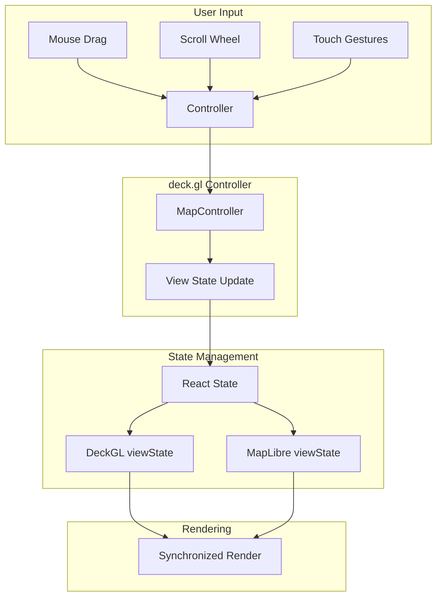

# Implementation Plan: Interact with Map

## User Story

**As a** user
**I want to** pan and zoom the map
**So that I** can explore different regions and detail levels

## Acceptance Criteria

- [ ] Map supports click-and-drag panning
- [ ] Map supports scroll wheel zooming
- [ ] County polygons maintain positions during navigation

## Approach

Leverage deck.gl's built-in `controller` prop which provides map interaction handling out of the box. The controller integrates with MapLibre GL for synchronized view state management. View state will be managed in React state with optional persistence to Zustand for cross-component access.

## Architecture



## Libraries

| Library | Purpose |
|---------|---------|
| `@deck.gl/react` | DeckGL component with controller |
| `@deck.gl/core` | MapController for interaction handling |
| `react-map-gl/maplibre` | MapLibre base map sync |
| `zustand` | Optional global view state |

## Implementation Steps

### 1. Define View State Types

```typescript
// src/types/mapView.ts
export interface MapViewState {
  longitude: number;
  latitude: number;
  zoom: number;
  pitch: number;
  bearing: number;
  transitionDuration?: number;
}

export const INITIAL_VIEW_STATE: MapViewState = {
  longitude: -98.5795,  // Center of contiguous US
  latitude: 39.8283,
  zoom: 4,
  pitch: 0,
  bearing: 0,
};

// View bounds for constraining navigation
export const VIEW_BOUNDS = {
  minZoom: 3,
  maxZoom: 12,
  minLatitude: 24,   // Southern US border
  maxLatitude: 50,   // Northern US border
  minLongitude: -125, // Western US border
  maxLongitude: -66,  // Eastern US border
};
```

### 2. Create View State Hook

```typescript
// src/components/CountyVotingMap/hooks/useMapViewState.ts
import { useState, useCallback } from 'react';
import type { MapViewState } from '../../../types/mapView';
import { INITIAL_VIEW_STATE, VIEW_BOUNDS } from '../../../types/mapView';

interface ViewStateChangeInfo {
  viewState: MapViewState;
  interactionState: {
    isDragging: boolean;
    isPanning: boolean;
    isZooming: boolean;
    isRotating: boolean;
  };
}

export function useMapViewState(initialState: MapViewState = INITIAL_VIEW_STATE) {
  const [viewState, setViewState] = useState<MapViewState>(initialState);

  const handleViewStateChange = useCallback(({ viewState }: ViewStateChangeInfo) => {
    // Constrain view to bounds
    const constrainedState: MapViewState = {
      ...viewState,
      zoom: Math.max(VIEW_BOUNDS.minZoom, Math.min(VIEW_BOUNDS.maxZoom, viewState.zoom)),
      latitude: Math.max(
        VIEW_BOUNDS.minLatitude,
        Math.min(VIEW_BOUNDS.maxLatitude, viewState.latitude)
      ),
      longitude: Math.max(
        VIEW_BOUNDS.minLongitude,
        Math.min(VIEW_BOUNDS.maxLongitude, viewState.longitude)
      ),
    };

    setViewState(constrainedState);
  }, []);

  const resetView = useCallback(() => {
    setViewState({
      ...INITIAL_VIEW_STATE,
      transitionDuration: 500,
    });
  }, []);

  const flyTo = useCallback((target: Partial<MapViewState>) => {
    setViewState((prev) => ({
      ...prev,
      ...target,
      transitionDuration: 1000,
    }));
  }, []);

  return {
    viewState,
    onViewStateChange: handleViewStateChange,
    resetView,
    flyTo,
  };
}
```

### 3. Create Zustand Store for Global View State

```typescript
// src/stores/mapViewStore.ts
import { create } from 'zustand';
import type { MapViewState } from '../types/mapView';
import { INITIAL_VIEW_STATE, VIEW_BOUNDS } from '../types/mapView';

interface MapViewStore {
  viewState: MapViewState;
  setViewState: (viewState: MapViewState) => void;
  flyTo: (target: Partial<MapViewState>) => void;
  resetView: () => void;
  reset: () => void;
}

function constrainViewState(viewState: MapViewState): MapViewState {
  return {
    ...viewState,
    zoom: Math.max(VIEW_BOUNDS.minZoom, Math.min(VIEW_BOUNDS.maxZoom, viewState.zoom)),
    latitude: Math.max(
      VIEW_BOUNDS.minLatitude,
      Math.min(VIEW_BOUNDS.maxLatitude, viewState.latitude)
    ),
    longitude: Math.max(
      VIEW_BOUNDS.minLongitude,
      Math.min(VIEW_BOUNDS.maxLongitude, viewState.longitude)
    ),
  };
}

export const useMapViewStore = create<MapViewStore>((set) => ({
  viewState: INITIAL_VIEW_STATE,

  setViewState: (viewState) => {
    set({ viewState: constrainViewState(viewState) });
  },

  flyTo: (target) => {
    set((state) => ({
      viewState: constrainViewState({
        ...state.viewState,
        ...target,
        transitionDuration: 1000,
      }),
    }));
  },

  resetView: () => {
    set({
      viewState: {
        ...INITIAL_VIEW_STATE,
        transitionDuration: 500,
      },
    });
  },

  reset: () => {
    set({ viewState: INITIAL_VIEW_STATE });
  },
}));
```

### 4. Integrate Controller with Map Component

```typescript
// src/components/CountyVotingMap/CountyVotingMap.tsx
import { useMemo } from 'react';
import DeckGL from '@deck.gl/react';
import Map from 'react-map-gl/maplibre';
import { FlyToInterpolator } from '@deck.gl/core';
import 'maplibre-gl/dist/maplibre-gl.css';

import { useMapViewStore } from '../../stores/mapViewStore';
import { createCountyLayer } from './layers/countyLayer';
import { ZoomControls } from './ZoomControls';

const MAP_STYLE = 'https://basemaps.cartocdn.com/gl/dark-matter-gl-style/style.json';

export function CountyVotingMap({ data }: CountyVotingMapProps) {
  const viewState = useMapViewStore((state) => state.viewState);
  const setViewState = useMapViewStore((state) => state.setViewState);
  const resetView = useMapViewStore((state) => state.resetView);

  const layers = useMemo(
    () => [createCountyLayer({ data })],
    [data]
  );

  return (
    <div className="relative w-full h-full">
      <DeckGL
        viewState={viewState}
        onViewStateChange={({ viewState }) => setViewState(viewState)}
        controller={{
          dragPan: true,
          dragRotate: false,  // Disable rotation for 2D map
          scrollZoom: true,
          touchZoom: true,
          touchRotate: false,
          doubleClickZoom: true,
          keyboard: true,
          inertia: true,
        }}
        layers={layers}
        getCursor={({ isDragging }) => (isDragging ? 'grabbing' : 'grab')}
      >
        <Map
          mapStyle={MAP_STYLE}
          reuseMaps
          attributionControl={false}
        />
      </DeckGL>

      <ZoomControls onReset={resetView} />
    </div>
  );
}
```

### 5. Create Zoom Controls Component

```typescript
// src/components/CountyVotingMap/ZoomControls.tsx
import { useMapViewStore } from '../../stores/mapViewStore';
import { VIEW_BOUNDS } from '../../types/mapView';

interface ZoomControlsProps {
  onReset?: () => void;
}

export function ZoomControls({ onReset }: ZoomControlsProps) {
  const viewState = useMapViewStore((state) => state.viewState);
  const setViewState = useMapViewStore((state) => state.setViewState);

  const handleZoomIn = () => {
    if (viewState.zoom < VIEW_BOUNDS.maxZoom) {
      setViewState({
        ...viewState,
        zoom: viewState.zoom + 1,
        transitionDuration: 300,
      });
    }
  };

  const handleZoomOut = () => {
    if (viewState.zoom > VIEW_BOUNDS.minZoom) {
      setViewState({
        ...viewState,
        zoom: viewState.zoom - 1,
        transitionDuration: 300,
      });
    }
  };

  return (
    <div className="absolute top-4 right-4 flex flex-col gap-2">
      <button
        onClick={handleZoomIn}
        disabled={viewState.zoom >= VIEW_BOUNDS.maxZoom}
        className="w-10 h-10 bg-gray-800/90 hover:bg-gray-700 disabled:opacity-50
                   text-white rounded-lg flex items-center justify-center
                   backdrop-blur-sm shadow-lg transition-colors"
        aria-label="Zoom in"
      >
        <svg className="w-5 h-5" fill="none" stroke="currentColor" viewBox="0 0 24 24">
          <path strokeLinecap="round" strokeLinejoin="round" strokeWidth={2} d="M12 6v12m6-6H6" />
        </svg>
      </button>

      <button
        onClick={handleZoomOut}
        disabled={viewState.zoom <= VIEW_BOUNDS.minZoom}
        className="w-10 h-10 bg-gray-800/90 hover:bg-gray-700 disabled:opacity-50
                   text-white rounded-lg flex items-center justify-center
                   backdrop-blur-sm shadow-lg transition-colors"
        aria-label="Zoom out"
      >
        <svg className="w-5 h-5" fill="none" stroke="currentColor" viewBox="0 0 24 24">
          <path strokeLinecap="round" strokeLinejoin="round" strokeWidth={2} d="M18 12H6" />
        </svg>
      </button>

      {onReset && (
        <button
          onClick={onReset}
          className="w-10 h-10 bg-gray-800/90 hover:bg-gray-700
                     text-white rounded-lg flex items-center justify-center
                     backdrop-blur-sm shadow-lg transition-colors mt-2"
          aria-label="Reset view"
        >
          <svg className="w-5 h-5" fill="none" stroke="currentColor" viewBox="0 0 24 24">
            <path strokeLinecap="round" strokeLinejoin="round" strokeWidth={2}
                  d="M3 12l2-2m0 0l7-7 7 7M5 10v10a1 1 0 001 1h3m10-11l2 2m-2-2v10a1 1 0 01-1 1h-3" />
          </svg>
        </button>
      )}
    </div>
  );
}
```

## Performance Considerations

### Throttle View State Updates

```typescript
// Throttle rapid view state changes during animation
import { throttle } from 'lodash-es';

const throttledSetViewState = useMemo(
  () => throttle(setViewState, 16), // ~60fps
  [setViewState]
);
```

### Efficient Layer Updates

The GeoJsonLayer should NOT re-render during pan/zoom since polygons maintain their geographic positions. Use stable references:

```typescript
// Polygons don't need updateTriggers for view changes
const layer = new GeoJsonLayer({
  // ...
  updateTriggers: {
    // Only update when data or highlight changes, NOT view state
    getFillColor: [highlightedFips],
  },
});
```

### Inertia Settings

```typescript
controller={{
  inertia: {
    deceleration: 4000,   // Smooth deceleration
    maxSpeed: 1500,       // Reasonable max speed
  },
}}
```

## Responsiveness

### Touch Gesture Support

deck.gl's controller handles touch gestures automatically:
- Single finger drag = pan
- Pinch = zoom
- Double tap = zoom in

### Mobile-Optimized Controls

```typescript
// Larger touch targets on mobile
const isMobile = useMediaQuery('(max-width: 768px)');

<button
  className={`${isMobile ? 'w-12 h-12' : 'w-10 h-10'} ...`}
>
```

### Disable Rotation for 2D Maps

```typescript
controller={{
  dragRotate: false,
  touchRotate: false,
  keyboard: {
    zoomSpeed: 2,
    panSpeed: 100,
    rotateSpeed: 0,  // Disable rotation
  },
}}
```

## Testing

### Unit Tests

```typescript
// src/components/CountyVotingMap/hooks/useMapViewState.test.ts
- Test initial view state is set correctly
- Test view state updates on handleViewStateChange
- Test view constraints are applied (min/max zoom, bounds)
- Test resetView returns to initial state
- Test flyTo updates with transition duration

// src/stores/mapViewStore.test.ts
- Test setViewState updates store
- Test constrainViewState clamps values to bounds
- Test flyTo sets transition duration
- Test reset returns to initial state

// src/components/CountyVotingMap/ZoomControls.test.tsx
- Test zoom in button increments zoom
- Test zoom out button decrements zoom
- Test zoom in disabled at max zoom
- Test zoom out disabled at min zoom
- Test reset button calls onReset
```

### Acceptance Tests

```gherkin
Feature: Map Interaction
  Scenario: Pan the map by dragging
    Given I am on the county voting page
    And the map has loaded
    When I click and drag on the map
    Then the map view should pan in the drag direction
    And county polygons should maintain their positions

  Scenario: Zoom with scroll wheel
    Given I am on the county voting page
    And the map has loaded
    When I scroll up on the map
    Then the map should zoom in
    When I scroll down on the map
    Then the map should zoom out

  Scenario: Use zoom controls
    Given I am on the county voting page
    When I click the zoom in button
    Then the map should zoom in
    When I click the zoom out button
    Then the map should zoom out
    When I click the reset view button
    Then the map should return to the default view
```
