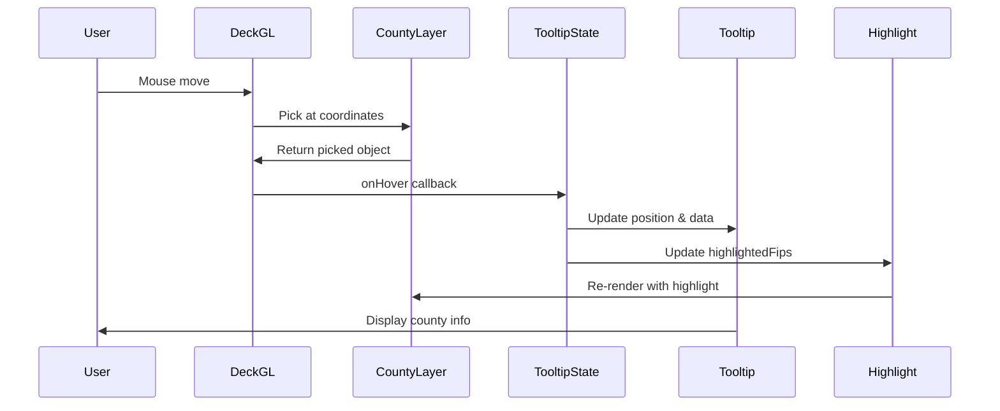

# Implementation Plan: View County Details

## User Story

**As a** user
**I want to** see details when hovering over a county
**So that I** can learn about specific voting results

## Acceptance Criteria

- [ ] Tooltip appears on county hover
- [ ] Tooltip displays county name, state, vote totals, and margin
- [ ] Tooltip dismisses when cursor moves away
- [ ] Hovered county is visually highlighted

## Approach

Use deck.gl's built-in picking system to detect hover events on county polygons. A tooltip component will render at the cursor position displaying voting details. The hovered county will be highlighted by modifying its fill color opacity and stroke width through `updateTriggers`.

## Architecture



## Libraries

| Library | Purpose |
|---------|---------|
| `@deck.gl/layers` | GeoJsonLayer picking |
| `@deck.gl/core` | Picking info types |
| `react` | Tooltip component state |

## Implementation Steps

### 1. Create Tooltip State Hook

```typescript
// src/components/CountyVotingMap/hooks/useTooltip.ts
import { useState, useCallback } from 'react';
import type { CountyFeature } from '../../../types/county';

export interface TooltipState {
  county: CountyFeature['properties'] | null;
  x: number;
  y: number;
}

export function useTooltip() {
  const [tooltip, setTooltip] = useState<TooltipState>({
    county: null,
    x: 0,
    y: 0,
  });

  const handleHover = useCallback(
    (info: { object?: CountyFeature; x: number; y: number }) => {
      if (info.object) {
        setTooltip({
          county: info.object.properties,
          x: info.x,
          y: info.y,
        });
      } else {
        setTooltip((prev) => ({
          ...prev,
          county: null,
        }));
      }
    },
    []
  );

  const clearTooltip = useCallback(() => {
    setTooltip((prev) => ({
      ...prev,
      county: null,
    }));
  }, []);

  return {
    tooltip,
    handleHover,
    clearTooltip,
    hoveredFips: tooltip.county?.fips ?? null,
  };
}
```

### 2. Create Tooltip Content Component

```typescript
// src/components/CountyVotingMap/Tooltip/TooltipContent.tsx
import type { CountyVoting } from '../../../types/county';
import { formatNumber, formatPercent } from '../../../utils/formatters';

interface TooltipContentProps {
  county: CountyVoting;
}

export function TooltipContent({ county }: TooltipContentProps) {
  const winnerParty = county.margin > 0 ? 'Democrat' : 'Republican';
  const winnerColor = county.margin > 0 ? 'text-blue-400' : 'text-red-400';
  const marginAbs = Math.abs(county.marginPercent);

  return (
    <div className="min-w-48">
      {/* Header */}
      <div className="border-b border-gray-600 pb-2 mb-2">
        <h3 className="font-semibold text-white text-lg">
          {county.name}
        </h3>
        <p className="text-gray-400 text-sm">{county.state}</p>
      </div>

      {/* Vote Totals */}
      <div className="space-y-1 mb-3">
        <div className="flex justify-between text-sm">
          <span className="text-blue-400">Democrat</span>
          <span className="text-white">{formatNumber(county.democratVotes)}</span>
        </div>
        <div className="flex justify-between text-sm">
          <span className="text-red-400">Republican</span>
          <span className="text-white">{formatNumber(county.republicanVotes)}</span>
        </div>
        {county.otherVotes > 0 && (
          <div className="flex justify-between text-sm">
            <span className="text-gray-400">Other</span>
            <span className="text-white">{formatNumber(county.otherVotes)}</span>
          </div>
        )}
      </div>

      {/* Margin */}
      <div className="border-t border-gray-600 pt-2">
        <div className="flex justify-between items-center">
          <span className="text-gray-300 text-sm">Margin</span>
          <span className={`font-semibold ${winnerColor}`}>
            {winnerParty} +{formatPercent(marginAbs)}
          </span>
        </div>
        <div className="flex justify-between items-center mt-1">
          <span className="text-gray-300 text-sm">Total Votes</span>
          <span className="text-white">{formatNumber(county.totalVotes)}</span>
        </div>
      </div>
    </div>
  );
}
```

### 3. Create Tooltip Container Component

```typescript
// src/components/CountyVotingMap/Tooltip/CountyTooltip.tsx
import { useRef, useEffect, useState } from 'react';
import type { CountyVoting } from '../../../types/county';
import { TooltipContent } from './TooltipContent';

interface CountyTooltipProps {
  county: CountyVoting;
  x: number;
  y: number;
}

export function CountyTooltip({ county, x, y }: CountyTooltipProps) {
  const tooltipRef = useRef<HTMLDivElement>(null);
  const [position, setPosition] = useState({ left: x, top: y });

  // Adjust position to keep tooltip within viewport
  useEffect(() => {
    if (!tooltipRef.current) return;

    const tooltip = tooltipRef.current;
    const rect = tooltip.getBoundingClientRect();
    const padding = 16;

    let left = x + 12;  // Offset from cursor
    let top = y + 12;

    // Prevent overflow on right edge
    if (left + rect.width > window.innerWidth - padding) {
      left = x - rect.width - 12;
    }

    // Prevent overflow on bottom edge
    if (top + rect.height > window.innerHeight - padding) {
      top = y - rect.height - 12;
    }

    // Prevent overflow on left edge
    if (left < padding) {
      left = padding;
    }

    // Prevent overflow on top edge
    if (top < padding) {
      top = padding;
    }

    setPosition({ left, top });
  }, [x, y]);

  return (
    <div
      ref={tooltipRef}
      className="absolute z-50 pointer-events-none"
      style={{
        left: position.left,
        top: position.top,
      }}
    >
      <div className="bg-gray-800/95 backdrop-blur-sm rounded-lg shadow-xl
                      border border-gray-600/50 p-3 animate-fade-in">
        <TooltipContent county={county} />
      </div>
    </div>
  );
}
```

### 4. Create Number Formatters

```typescript
// src/utils/formatters.ts
export function formatNumber(value: number): string {
  return new Intl.NumberFormat('en-US').format(value);
}

export function formatPercent(value: number, decimals: number = 1): string {
  return `${value.toFixed(decimals)}%`;
}

export function formatCompactNumber(value: number): string {
  if (value >= 1_000_000) {
    return `${(value / 1_000_000).toFixed(1)}M`;
  }
  if (value >= 1_000) {
    return `${(value / 1_000).toFixed(1)}K`;
  }
  return value.toString();
}
```

### 5. Update County Layer for Highlighting

```typescript
// src/components/CountyVotingMap/layers/countyLayer.ts
import { GeoJsonLayer } from '@deck.gl/layers';
import type { CountyFeature, CountyFeatureCollection } from '../../../types/county';
import { getVotingColor } from './votingColorScale';

interface CountyLayerOptions {
  data: CountyFeatureCollection;
  highlightedFips?: string | null;
  onHover?: (info: { object?: CountyFeature; x: number; y: number }) => void;
}

export function createCountyLayer({
  data,
  highlightedFips,
  onHover,
}: CountyLayerOptions) {
  return new GeoJsonLayer<CountyFeature>({
    id: 'county-voting-layer',
    data,
    pickable: true,
    stroked: true,
    filled: true,

    // Fill with highlight support
    getFillColor: (feature) => {
      const isHighlighted = feature.properties.fips === highlightedFips;
      const baseColor = getVotingColor(feature.properties.marginPercent);

      if (isHighlighted) {
        // Brighten the highlighted county
        return [
          Math.min(255, baseColor[0] + 40),
          Math.min(255, baseColor[1] + 40),
          Math.min(255, baseColor[2] + 40),
          255,
        ];
      }

      // Dim non-highlighted counties when something is hovered
      if (highlightedFips) {
        return [...baseColor.slice(0, 3), 150] as [number, number, number, number];
      }

      return baseColor;
    },

    // Stroke for highlighting
    getLineColor: (feature) => {
      const isHighlighted = feature.properties.fips === highlightedFips;
      return isHighlighted ? [255, 255, 255, 255] : [80, 80, 80, 150];
    },

    getLineWidth: (feature) => {
      const isHighlighted = feature.properties.fips === highlightedFips;
      return isHighlighted ? 2 : 0.5;
    },

    lineWidthUnits: 'pixels',
    lineWidthMinPixels: 0.5,
    lineWidthMaxPixels: 4,

    // Hover handler
    onHover,
    autoHighlight: false,  // We handle highlighting manually

    // Re-render on highlight change
    updateTriggers: {
      getFillColor: [highlightedFips],
      getLineColor: [highlightedFips],
      getLineWidth: [highlightedFips],
    },
  });
}
```

### 6. Integrate Tooltip with Map Component

```typescript
// src/components/CountyVotingMap/CountyVotingMap.tsx
import { useMemo } from 'react';
import DeckGL from '@deck.gl/react';
import Map from 'react-map-gl/maplibre';
import 'maplibre-gl/dist/maplibre-gl.css';

import { useMapViewStore } from '../../stores/mapViewStore';
import { useTooltip } from './hooks/useTooltip';
import { createCountyLayer } from './layers/countyLayer';
import { CountyTooltip } from './Tooltip/CountyTooltip';
import { VotingLegend } from './Legend/VotingLegend';
import type { CountyFeatureCollection } from '../../types/county';

const MAP_STYLE = 'https://basemaps.cartocdn.com/gl/dark-matter-gl-style/style.json';

interface CountyVotingMapProps {
  data: CountyFeatureCollection;
}

export function CountyVotingMap({ data }: CountyVotingMapProps) {
  const viewState = useMapViewStore((state) => state.viewState);
  const setViewState = useMapViewStore((state) => state.setViewState);

  const { tooltip, handleHover, hoveredFips } = useTooltip();

  const layers = useMemo(
    () => [
      createCountyLayer({
        data,
        highlightedFips: hoveredFips,
        onHover: handleHover,
      }),
    ],
    [data, hoveredFips, handleHover]
  );

  return (
    <div className="relative w-full h-full">
      <DeckGL
        viewState={viewState}
        onViewStateChange={({ viewState }) => setViewState(viewState)}
        controller={true}
        layers={layers}
        getCursor={({ isHovering }) => (isHovering ? 'pointer' : 'grab')}
      >
        <Map mapStyle={MAP_STYLE} />
      </DeckGL>

      {tooltip.county && (
        <CountyTooltip
          county={tooltip.county}
          x={tooltip.x}
          y={tooltip.y}
        />
      )}

      <VotingLegend />
    </div>
  );
}
```

### 7. Add Tooltip Animation Styles

```css
/* src/index.css or tailwind config */
@keyframes fade-in {
  from {
    opacity: 0;
    transform: translateY(4px);
  }
  to {
    opacity: 1;
    transform: translateY(0);
  }
}

.animate-fade-in {
  animation: fade-in 0.15s ease-out;
}
```

## Performance Considerations

### Debounce Hover Events

```typescript
// Throttle hover updates to prevent excessive re-renders
import { throttle } from 'lodash-es';

const throttledHandleHover = useMemo(
  () => throttle(handleHover, 16), // ~60fps
  [handleHover]
);
```

### Minimize Layer Updates

Only include `highlightedFips` in updateTriggers, not the full tooltip state:

```typescript
updateTriggers: {
  getFillColor: [highlightedFips],  // Only FIPS, not full tooltip
}
```

### Memoize Tooltip Content

```typescript
const tooltipContent = useMemo(
  () => tooltip.county && <TooltipContent county={tooltip.county} />,
  [tooltip.county]
);
```

## Responsiveness

### Touch Device Considerations

On touch devices, hover doesn't work. Consider tap-to-show tooltip:

```typescript
// Handle both hover and click for mobile support
const handleInteraction = useCallback(
  (info: PickingInfo) => {
    if (info.object) {
      setTooltip({
        county: info.object.properties,
        x: info.x,
        y: info.y,
      });
    }
  },
  []
);

<DeckGL
  onHover={handleInteraction}
  onClick={handleInteraction}  // For touch devices
/>
```

### Mobile Tooltip Positioning

```typescript
// Center tooltip on mobile instead of following cursor
const isMobile = useMediaQuery('(max-width: 768px)');

const tooltipStyle = isMobile
  ? { left: '50%', bottom: '80px', transform: 'translateX(-50%)' }
  : { left: position.left, top: position.top };
```

## Accessibility

### ARIA Attributes

```typescript
<div
  role="tooltip"
  aria-hidden={!tooltip.county}
  className="..."
>
  <TooltipContent county={tooltip.county} />
</div>
```

### Screen Reader Support

```typescript
// Announce tooltip content for screen readers
<div className="sr-only" aria-live="polite">
  {tooltip.county && (
    `${tooltip.county.name}, ${tooltip.county.state}:
     ${formatPercent(Math.abs(tooltip.county.marginPercent))}
     ${tooltip.county.margin > 0 ? 'Democrat' : 'Republican'} margin`
  )}
</div>
```

## Testing

### Unit Tests

```typescript
// src/components/CountyVotingMap/hooks/useTooltip.test.ts
- Test initial tooltip state is null
- Test handleHover sets tooltip when object provided
- Test handleHover clears county when no object
- Test clearTooltip resets county to null
- Test hoveredFips returns correct FIPS code

// src/components/CountyVotingMap/Tooltip/TooltipContent.test.tsx
- Test displays county name and state
- Test displays Democrat vote count formatted
- Test displays Republican vote count formatted
- Test displays margin with correct party color
- Test displays total votes formatted
- Test handles zero other votes (hidden)

// src/components/CountyVotingMap/Tooltip/CountyTooltip.test.tsx
- Test renders at correct position
- Test adjusts position for right edge overflow
- Test adjusts position for bottom edge overflow
- Test applies fade-in animation class

// src/utils/formatters.test.ts
- Test formatNumber adds thousands separators
- Test formatPercent adds % symbol
- Test formatCompactNumber shows M/K suffixes
```

### Acceptance Tests

```gherkin
Feature: County Details Tooltip
  Scenario: Display tooltip on county hover
    Given I am on the county voting page
    And the map has loaded
    When I hover over a county polygon
    Then I should see a tooltip appear
    And the tooltip should display the county name
    And the tooltip should display the state
    And the tooltip should display vote totals
    And the tooltip should display the vote margin

  Scenario: Highlight county on hover
    Given I am on the county voting page
    When I hover over a county polygon
    Then the county should be visually highlighted
    And other counties should be dimmed

  Scenario: Dismiss tooltip on mouse leave
    Given I am viewing a county tooltip
    When I move my cursor away from the county
    Then the tooltip should disappear
    And the county highlight should be removed
```
