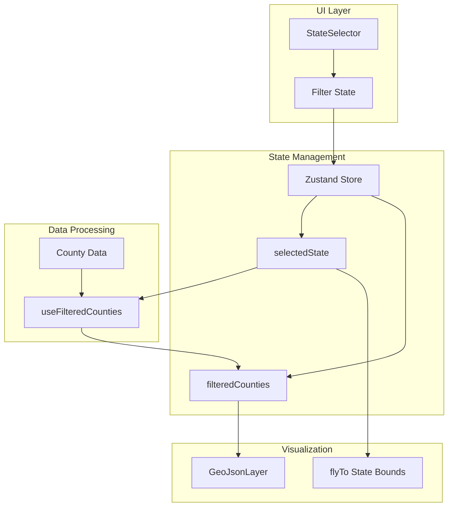

# Implementation Plan: Filter by State

## User Story

**As a** user
**I want to** filter counties by state
**So that I** can focus on specific geographic areas

## Acceptance Criteria

- [ ] State selector is available
- [ ] Map updates to show only counties within selected state
- [ ] Option to view all states simultaneously

## Approach

Create a state selector component using a dropdown with all US states. Filter state is managed in Zustand for cross-component access. When a state is selected, the county layer filters to show only counties within that state, and the map view transitions to center on the selected state. An "All States" option allows returning to the national view.

## Architecture



## Libraries

| Library         | Purpose                           |
| --------------- | --------------------------------- |
| `zustand`       | Filter state management           |
| `@turf/bbox`    | Calculate state bounding box      |
| `@deck.gl/core` | FlyToInterpolator for transitions |

## Data Structures

```typescript
// src/types/states.ts
export interface USState {
  code: string; // e.g., 'CA'
  name: string; // e.g., 'California'
  fips: string; // e.g., '06'
}

export const US_STATES: USState[] = [
  { code: 'AL', name: 'Alabama', fips: '01' },
  { code: 'AK', name: 'Alaska', fips: '02' },
  { code: 'AZ', name: 'Arizona', fips: '04' },
  // ... all 50 states + DC
  { code: 'WY', name: 'Wyoming', fips: '56' },
];

// State center coordinates for fly-to
export const STATE_CENTERS: Record<
  string,
  { longitude: number; latitude: number; zoom: number }
> = {
  AL: { longitude: -86.9023, latitude: 32.3182, zoom: 6 },
  AK: { longitude: -154.4931, latitude: 63.385, zoom: 4 },
  AZ: { longitude: -111.0937, latitude: 34.0489, zoom: 6 },
  // ... all states
};
```

## Implementation Steps

### 1. Create Filter Store

```typescript
// src/stores/countyFilterStore.ts
import { create } from 'zustand';

interface CountyFilterStore {
  selectedState: string | null; // State FIPS code, null = all states
  setSelectedState: (stateFips: string | null) => void;
  reset: () => void;
}

export const useCountyFilterStore = create<CountyFilterStore>((set) => ({
  selectedState: null,

  setSelectedState: (stateFips) => {
    set({ selectedState: stateFips });
  },

  reset: () => {
    set({ selectedState: null });
  },
}));
```

### 2. Create Filtered Counties Hook

```typescript
// src/components/CountyVotingMap/hooks/useFilteredCounties.ts
import { useMemo } from 'react';
import type {
  CountyFeatureCollection,
  CountyFeature,
} from '../../../types/county';
import { useCountyFilterStore } from '../../../stores/countyFilterStore';

export function useFilteredCounties(data: CountyFeatureCollection | null) {
  const selectedState = useCountyFilterStore((state) => state.selectedState);

  const filteredData = useMemo(() => {
    if (!data) return null;

    // If no state filter, return all counties
    if (!selectedState) {
      return data;
    }

    // Filter counties by state FIPS
    const filteredFeatures = data.features.filter(
      (feature) => feature.properties.stateFips === selectedState
    );

    return {
      type: 'FeatureCollection' as const,
      features: filteredFeatures,
    };
  }, [data, selectedState]);

  const stats = useMemo(() => {
    if (!filteredData) return null;

    const counties = filteredData.features;
    const totalVotes = counties.reduce(
      (sum, f) => sum + f.properties.totalVotes,
      0
    );
    const democratVotes = counties.reduce(
      (sum, f) => sum + f.properties.democratVotes,
      0
    );
    const republicanVotes = counties.reduce(
      (sum, f) => sum + f.properties.republicanVotes,
      0
    );

    return {
      countyCount: counties.length,
      totalVotes,
      democratVotes,
      republicanVotes,
      overallMargin: ((democratVotes - republicanVotes) / totalVotes) * 100,
    };
  }, [filteredData]);

  return { filteredData, stats, isFiltered: selectedState !== null };
}
```

### 3. Create State Selector Component

```typescript
// src/components/CountyVotingMap/Filters/StateSelector.tsx
import { useCallback } from 'react';
import { useCountyFilterStore } from '../../../stores/countyFilterStore';
import { useMapViewStore } from '../../../stores/mapViewStore';
import { US_STATES, STATE_CENTERS } from '../../../types/states';
import { INITIAL_VIEW_STATE } from '../../../types/mapView';

export function StateSelector() {
  const selectedState = useCountyFilterStore((state) => state.selectedState);
  const setSelectedState = useCountyFilterStore((state) => state.setSelectedState);
  const flyTo = useMapViewStore((state) => state.flyTo);

  const handleStateChange = useCallback(
    (event: React.ChangeEvent<HTMLSelectElement>) => {
      const stateFips = event.target.value || null;
      setSelectedState(stateFips);

      // Fly to selected state or reset to national view
      if (stateFips) {
        const state = US_STATES.find((s) => s.fips === stateFips);
        if (state && STATE_CENTERS[state.code]) {
          flyTo(STATE_CENTERS[state.code]);
        }
      } else {
        flyTo({
          longitude: INITIAL_VIEW_STATE.longitude,
          latitude: INITIAL_VIEW_STATE.latitude,
          zoom: INITIAL_VIEW_STATE.zoom,
        });
      }
    },
    [setSelectedState, flyTo]
  );

  return (
    <div className="bg-gray-800/90 backdrop-blur-sm rounded-lg p-4 shadow-lg">
      <label
        htmlFor="state-selector"
        className="block text-sm font-medium text-gray-300 mb-2"
      >
        Filter by State
      </label>

      <select
        id="state-selector"
        value={selectedState || ''}
        onChange={handleStateChange}
        className="w-full bg-gray-700 text-white border border-gray-600 rounded-md
                   px-3 py-2 text-sm focus:outline-none focus:ring-2
                   focus:ring-blue-500 focus:border-transparent"
      >
        <option value="">All States</option>
        {US_STATES.map((state) => (
          <option key={state.fips} value={state.fips}>
            {state.name}
          </option>
        ))}
      </select>
    </div>
  );
}
```

### 4. Create Filter Stats Display

```typescript
// src/components/CountyVotingMap/Filters/FilterStats.tsx
import { formatNumber, formatPercent } from '../../../utils/formatters';

interface FilterStatsProps {
  stats: {
    countyCount: number;
    totalVotes: number;
    democratVotes: number;
    republicanVotes: number;
    overallMargin: number;
  } | null;
  isFiltered: boolean;
  stateName?: string;
}

export function FilterStats({ stats, isFiltered, stateName }: FilterStatsProps) {
  if (!stats) return null;

  const winnerParty = stats.overallMargin > 0 ? 'Democrat' : 'Republican';
  const winnerColor = stats.overallMargin > 0 ? 'text-blue-400' : 'text-red-400';

  return (
    <div className="bg-gray-800/90 backdrop-blur-sm rounded-lg p-4 shadow-lg">
      <h3 className="text-white font-medium mb-2">
        {isFiltered ? stateName : 'National'} Summary
      </h3>

      <div className="space-y-1 text-sm">
        <div className="flex justify-between">
          <span className="text-gray-400">Counties</span>
          <span className="text-white">{formatNumber(stats.countyCount)}</span>
        </div>

        <div className="flex justify-between">
          <span className="text-gray-400">Total Votes</span>
          <span className="text-white">{formatNumber(stats.totalVotes)}</span>
        </div>

        <div className="flex justify-between pt-1 border-t border-gray-700">
          <span className="text-gray-400">Overall Margin</span>
          <span className={winnerColor}>
            {winnerParty} +{formatPercent(Math.abs(stats.overallMargin))}
          </span>
        </div>
      </div>
    </div>
  );
}
```

### 5. Integrate Filters with Map Component

```typescript
// src/components/CountyVotingMap/CountyVotingMap.tsx
import { useMemo } from 'react';
import DeckGL from '@deck.gl/react';
import Map from 'react-map-gl/maplibre';
import 'maplibre-gl/dist/maplibre-gl.css';

import { useMapViewStore } from '../../stores/mapViewStore';
import { useCountyFilterStore } from '../../stores/countyFilterStore';
import { useTooltip } from './hooks/useTooltip';
import { useFilteredCounties } from './hooks/useFilteredCounties';
import { createCountyLayer } from './layers/countyLayer';
import { CountyTooltip } from './Tooltip/CountyTooltip';
import { VotingLegend } from './Legend/VotingLegend';
import { StateSelector } from './Filters/StateSelector';
import { FilterStats } from './Filters/FilterStats';
import { US_STATES } from '../../types/states';
import type { CountyFeatureCollection } from '../../types/county';

const MAP_STYLE = 'https://basemaps.cartocdn.com/gl/dark-matter-gl-style/style.json';

interface CountyVotingMapProps {
  data: CountyFeatureCollection;
}

export function CountyVotingMap({ data }: CountyVotingMapProps) {
  const viewState = useMapViewStore((state) => state.viewState);
  const setViewState = useMapViewStore((state) => state.setViewState);
  const selectedState = useCountyFilterStore((state) => state.selectedState);

  const { tooltip, handleHover, hoveredFips } = useTooltip();
  const { filteredData, stats, isFiltered } = useFilteredCounties(data);

  const selectedStateName = useMemo(() => {
    if (!selectedState) return undefined;
    return US_STATES.find((s) => s.fips === selectedState)?.name;
  }, [selectedState]);

  const layers = useMemo(
    () =>
      filteredData
        ? [
            createCountyLayer({
              data: filteredData,
              highlightedFips: hoveredFips,
              onHover: handleHover,
            }),
          ]
        : [],
    [filteredData, hoveredFips, handleHover]
  );

  return (
    <div className="relative w-full h-full">
      <DeckGL
        viewState={viewState}
        onViewStateChange={({ viewState }) => setViewState(viewState)}
        controller={true}
        layers={layers}
        getCursor={({ isHovering }) => (isHovering ? 'pointer' : 'grab')}
      >
        <Map mapStyle={MAP_STYLE} />
      </DeckGL>

      {/* Filter Controls */}
      <div className="absolute top-4 left-4 space-y-4">
        <StateSelector />
        <FilterStats
          stats={stats}
          isFiltered={isFiltered}
          stateName={selectedStateName}
        />
      </div>

      {/* Tooltip */}
      {tooltip.county && (
        <CountyTooltip
          county={tooltip.county}
          x={tooltip.x}
          y={tooltip.y}
        />
      )}

      <VotingLegend />
    </div>
  );
}
```

### 6. Add State Centers Data

```typescript
// src/types/states.ts (extended)
export const STATE_CENTERS: Record<
  string,
  { longitude: number; latitude: number; zoom: number }
> = {
  '01': { longitude: -86.9023, latitude: 32.3182, zoom: 6 }, // Alabama
  '02': { longitude: -154.4931, latitude: 63.385, zoom: 4 }, // Alaska
  '04': { longitude: -111.0937, latitude: 34.0489, zoom: 6 }, // Arizona
  '05': { longitude: -91.8318, latitude: 35.201, zoom: 6 }, // Arkansas
  '06': { longitude: -119.4179, latitude: 36.7783, zoom: 5 }, // California
  '08': { longitude: -105.3111, latitude: 39.0598, zoom: 6 }, // Colorado
  '09': { longitude: -72.7554, latitude: 41.6032, zoom: 8 }, // Connecticut
  '10': { longitude: -75.5277, latitude: 38.9108, zoom: 8 }, // Delaware
  '11': { longitude: -77.0369, latitude: 38.9072, zoom: 11 }, // DC
  '12': { longitude: -81.5158, latitude: 27.6648, zoom: 6 }, // Florida
  '13': { longitude: -82.9001, latitude: 32.1656, zoom: 6 }, // Georgia
  '15': { longitude: -155.5828, latitude: 19.8968, zoom: 6 }, // Hawaii
  '16': { longitude: -114.4788, latitude: 44.0682, zoom: 5 }, // Idaho
  '17': { longitude: -89.3985, latitude: 40.6331, zoom: 6 }, // Illinois
  '18': { longitude: -86.1349, latitude: 40.2672, zoom: 6 }, // Indiana
  '19': { longitude: -93.0977, latitude: 41.878, zoom: 6 }, // Iowa
  '20': { longitude: -98.4842, latitude: 39.0119, zoom: 6 }, // Kansas
  '21': { longitude: -84.27, latitude: 37.8393, zoom: 6 }, // Kentucky
  '22': { longitude: -91.9623, latitude: 30.9843, zoom: 6 }, // Louisiana
  '23': { longitude: -69.4455, latitude: 45.2538, zoom: 6 }, // Maine
  '24': { longitude: -76.6413, latitude: 39.0458, zoom: 7 }, // Maryland
  '25': { longitude: -71.3824, latitude: 42.4072, zoom: 7 }, // Massachusetts
  '26': { longitude: -84.5555, latitude: 44.3148, zoom: 6 }, // Michigan
  '27': { longitude: -94.6859, latitude: 46.7296, zoom: 5 }, // Minnesota
  '28': { longitude: -89.3985, latitude: 32.3547, zoom: 6 }, // Mississippi
  '29': { longitude: -91.8318, latitude: 37.9643, zoom: 6 }, // Missouri
  '30': { longitude: -110.3626, latitude: 46.8797, zoom: 5 }, // Montana
  '31': { longitude: -99.9018, latitude: 41.4925, zoom: 6 }, // Nebraska
  '32': { longitude: -116.4194, latitude: 38.8026, zoom: 5 }, // Nevada
  '33': { longitude: -71.5724, latitude: 43.1939, zoom: 7 }, // New Hampshire
  '34': { longitude: -74.4057, latitude: 40.0583, zoom: 7 }, // New Jersey
  '35': { longitude: -105.8701, latitude: 34.5199, zoom: 6 }, // New Mexico
  '36': { longitude: -75.4999, latitude: 43.2994, zoom: 6 }, // New York
  '37': { longitude: -79.0193, latitude: 35.7596, zoom: 6 }, // North Carolina
  '38': { longitude: -101.002, latitude: 47.5515, zoom: 6 }, // North Dakota
  '39': { longitude: -82.9071, latitude: 40.4173, zoom: 6 }, // Ohio
  '40': { longitude: -97.0929, latitude: 35.0078, zoom: 6 }, // Oklahoma
  '41': { longitude: -120.5542, latitude: 43.8041, zoom: 6 }, // Oregon
  '42': { longitude: -77.1945, latitude: 41.2033, zoom: 6 }, // Pennsylvania
  '44': { longitude: -71.4774, latitude: 41.5801, zoom: 9 }, // Rhode Island
  '45': { longitude: -81.1637, latitude: 33.8361, zoom: 6 }, // South Carolina
  '46': { longitude: -99.9018, latitude: 43.9695, zoom: 6 }, // South Dakota
  '47': { longitude: -86.5804, latitude: 35.5175, zoom: 6 }, // Tennessee
  '48': { longitude: -99.9018, latitude: 31.9686, zoom: 5 }, // Texas
  '49': { longitude: -111.0937, latitude: 39.321, zoom: 6 }, // Utah
  '50': { longitude: -72.5778, latitude: 44.5588, zoom: 7 }, // Vermont
  '51': { longitude: -78.6569, latitude: 37.4316, zoom: 6 }, // Virginia
  '53': { longitude: -120.7401, latitude: 47.7511, zoom: 6 }, // Washington
  '54': { longitude: -80.4549, latitude: 38.5976, zoom: 7 }, // West Virginia
  '55': { longitude: -89.6165, latitude: 43.7844, zoom: 6 }, // Wisconsin
  '56': { longitude: -107.2903, latitude: 43.076, zoom: 6 }, // Wyoming
};
```

## Performance Considerations

### Efficient Filtering

Use memoization to avoid re-filtering on every render:

```typescript
const filteredData = useMemo(() => {
  if (!selectedState) return data;
  return {
    ...data,
    features: data.features.filter(
      (f) => f.properties.stateFips === selectedState
    ),
  };
}, [data, selectedState]);
```

### Smooth Transitions

Use deck.gl's built-in transition system:

```typescript
flyTo({
  ...STATE_CENTERS[stateCode],
  transitionDuration: 1000,
  transitionInterpolator: new FlyToInterpolator(),
});
```

### Layer Data Attribute

Changing `data` prop triggers full layer re-creation. Use `dataTransform` for filtering if performance is critical:

```typescript
const layer = new GeoJsonLayer({
  data: countyData,
  _dataDiff: (newData, oldData) => {
    // Custom diffing for filtered data
  },
});
```

## Responsiveness

### Mobile-Friendly Selector

```typescript
// Collapsible filter panel on mobile
const [isFilterOpen, setIsFilterOpen] = useState(false);
const isMobile = useMediaQuery('(max-width: 768px)');

{isMobile ? (
  <button onClick={() => setIsFilterOpen(!isFilterOpen)}>
    {isFilterOpen ? 'Hide Filters' : 'Show Filters'}
  </button>
) : null}

{(!isMobile || isFilterOpen) && <StateSelector />}
```

### Responsive Layout

```typescript
// Position filters differently on mobile
const filterPosition = isMobile
  ? 'bottom-20 left-4 right-4'
  : 'top-4 left-4 w-64';
```

## Testing

### Unit Tests

```typescript
// src/stores/countyFilterStore.test.ts
- Test initial state is null (all states)
- Test setSelectedState updates selectedState
- Test reset returns to null

// src/components/CountyVotingMap/hooks/useFilteredCounties.test.ts
- Test returns all counties when selectedState is null
- Test filters counties by state FIPS
- Test stats are calculated correctly
- Test isFiltered flag is accurate

// src/components/CountyVotingMap/Filters/StateSelector.test.tsx
- Test renders all state options
- Test "All States" option is first
- Test onChange updates store
- Test flyTo is called on state selection
- Test flyTo resets view on "All States"

// src/components/CountyVotingMap/Filters/FilterStats.test.tsx
- Test displays county count
- Test displays total votes
- Test displays correct party winner
- Test shows state name when filtered
- Test shows "National" when not filtered
```

### Acceptance Tests

```gherkin
Feature: Filter by State
  Scenario: Select a state to filter
    Given I am on the county voting page
    And the map has loaded
    When I select "California" from the state selector
    Then only California counties should be visible
    And the map should zoom to California
    And the stats should show California summary

  Scenario: View all states
    Given I am filtering by "Texas"
    When I select "All States" from the state selector
    Then all counties should be visible
    And the map should zoom to national view
    And the stats should show national summary

  Scenario: Stats update on filter change
    Given I am on the county voting page
    When I select "Florida" from the state selector
    Then the county count should update
    And the vote totals should reflect Florida only
```
