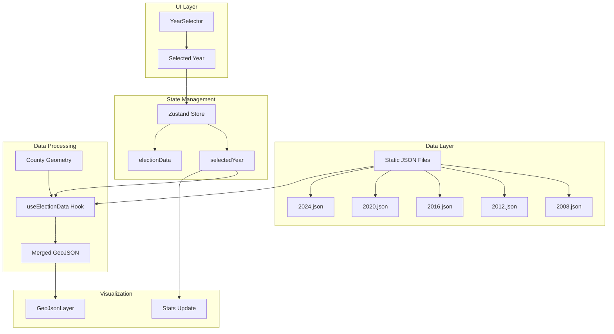

# Implementation Plan: Filter by Election Year

## User Story

**As a** user
**I want to** filter counties by election year
**So that I** can focus on specific geographic areas

## Acceptance Criteria

- [ ] Election selector is available
- [ ] Map updates with counties' voting data for the selected year
- [ ] Fetch election data once and cache in the project and version control system to avoid redundant requests
- [ ] Match data shape that is already in place

## Approach

Pre-download and cache election data for multiple presidential election years (2008, 2012, 2016, 2020, 2024) as static JSON files in the project. Create a year selector component that allows users to switch between election years. The selected year is managed in Zustand, and the map layer updates to display voting data for the chosen year. County geometry is loaded once and reused across all years, while voting data is swapped based on selection.

## Architecture



## Data Caching Strategy

### Static Data Files

Election data will be cached as static JSON files in the project to avoid redundant network requests:

```
public/
└── data/
    └── elections/
        ├── 2008.json
        ├── 2012.json
        ├── 2016.json
        ├── 2020.json
        └── 2024.json
```

### Data Shape

Each JSON file contains an array of county voting records matching the existing `CountyVoting` type:

```typescript
// public/data/elections/2024.json
[
  {
    fips: '01001',
    name: 'Autauga',
    state: 'AL',
    stateFips: '01',
    totalVotes: 28450,
    democratVotes: 6500,
    republicanVotes: 21200,
    otherVotes: 750,
    margin: -14700,
    marginPercent: -51.67,
  },
  // ... ~3,100 counties
];
```

### Build-Time Data Generation

Create a script to download and transform election data during build:

```typescript
// scripts/download-election-data.ts
import { writeFileSync, mkdirSync } from 'fs';

const YEARS = [2008, 2012, 2016, 2020, 2024];
const DATA_SOURCE_BASE =
  'https://raw.githubusercontent.com/tonmcg/US_County_Level_Election_Results_08-24/master';

const YEAR_FILE_MAP: Record<number, string> = {
  2008: '2008_US_County_Level_Presidential_Results.csv',
  2012: '2012_US_County_Level_Presidential_Results.csv',
  2016: '2016_US_County_Level_Presidential_Results.csv',
  2020: '2020_US_County_Level_Presidential_Results.csv',
  2024: '2024_US_County_Level_Presidential_Results.csv',
};

async function downloadAndTransform(year: number): Promise<void> {
  const url = `${DATA_SOURCE_BASE}/${YEAR_FILE_MAP[year]}`;
  const response = await fetch(url);
  const csv = await response.text();

  const data = parseCsvToCountyVoting(csv);

  mkdirSync('public/data/elections', { recursive: true });
  writeFileSync(
    `public/data/elections/${year}.json`,
    JSON.stringify(data, null, 2)
  );
}
```

## Libraries

| Library           | Purpose                           |
| ----------------- | --------------------------------- |
| `zustand`         | Year selection state management   |
| `@deck.gl/core`   | WebGL visualization               |
| `zod`             | Runtime validation of cached data |
| `topojson-client` | County geometry processing        |

## Data Structures

### Election Year Type

```typescript
// src/types/election.ts
export type ElectionYear = 2008 | 2012 | 2016 | 2020 | 2024;

export const ELECTION_YEARS: ElectionYear[] = [2024, 2020, 2016, 2012, 2008];

export interface ElectionYearInfo {
  year: ElectionYear;
  label: string;
  description: string;
}

export const ELECTION_YEAR_INFO: Record<ElectionYear, ElectionYearInfo> = {
  2024: { year: 2024, label: '2024', description: 'Biden vs Trump' },
  2020: { year: 2020, label: '2020', description: 'Biden vs Trump' },
  2016: { year: 2016, label: '2016', description: 'Clinton vs Trump' },
  2012: { year: 2012, label: '2012', description: 'Obama vs Romney' },
  2008: { year: 2008, label: '2008', description: 'Obama vs McCain' },
};
```

### Cached Election Data Schema

```typescript
// src/types/county.ts (extended)
import { z } from 'zod';

export const CachedElectionDataSchema = z.array(CountyVotingSchema);

export type CachedElectionData = z.infer<typeof CachedElectionDataSchema>;
```

## Implementation Steps

### 1. Create Election Data Download Script

```typescript
// scripts/download-election-data.ts
import { writeFileSync, mkdirSync } from 'fs';

const STATE_FIPS_TO_ABBR: Record<string, string> = {
  '01': 'AL',
  '02': 'AK',
  // ... all states
};

interface ElectionCsvRow {
  state_name: string;
  county_fips: string;
  county_name: string;
  votes_gop: string;
  votes_dem: string;
  total_votes: string;
  per_point_diff: string;
}

function parseCsv(csvText: string): ElectionCsvRow[] {
  const lines = csvText.trim().split('\n');
  const headers = lines[0].split(',');

  return lines.slice(1).map((line) => {
    const values = line.split(',');
    const row: Record<string, string> = {};
    headers.forEach((header, index) => {
      row[header.trim()] = values[index]?.trim() || '';
    });
    return row as ElectionCsvRow;
  });
}

function transformToCountyVoting(rows: ElectionCsvRow[]): CountyVoting[] {
  return rows.map((row) => {
    const fips = row.county_fips.padStart(5, '0');
    const stateFips = fips.slice(0, 2);
    const gopVotes = parseInt(row.votes_gop, 10) || 0;
    const demVotes = parseInt(row.votes_dem, 10) || 0;
    const totalVotes = parseInt(row.total_votes, 10) || 0;

    return {
      fips,
      name: row.county_name,
      state: STATE_FIPS_TO_ABBR[stateFips] || stateFips,
      stateFips,
      totalVotes,
      democratVotes: demVotes,
      republicanVotes: gopVotes,
      otherVotes: Math.max(0, totalVotes - gopVotes - demVotes),
      margin: demVotes - gopVotes,
      marginPercent: -(parseFloat(row.per_point_diff) || 0) * 100,
    };
  });
}

async function main() {
  for (const year of [2008, 2012, 2016, 2020, 2024]) {
    console.log(`Downloading ${year} election data...`);
    // Download, transform, and save
  }
}

main();
```

### 2. Update County Filter Store

```typescript
// src/stores/countyFilterStore.ts
import { create } from 'zustand';
import type { ElectionYear } from '../types/election';

interface CountyFilterStore {
  selectedState: string | null;
  selectedYear: ElectionYear;

  setSelectedState: (stateFips: string | null) => void;
  setSelectedYear: (year: ElectionYear) => void;
  reset: () => void;
}

export const useCountyFilterStore = create<CountyFilterStore>((set) => ({
  selectedState: null,
  selectedYear: 2024,

  setSelectedState: (stateFips) => {
    set({ selectedState: stateFips });
  },

  setSelectedYear: (year) => {
    set({ selectedYear: year });
  },

  reset: () => {
    set({ selectedState: null, selectedYear: 2024 });
  },
}));
```

### 3. Create Election Data Fetching Hook

```typescript
// src/hooks/useElectionData.ts
import { useState, useEffect, useMemo } from 'react';
import type { ElectionYear } from '../types/election';
import type { CountyVoting, CountyFeatureCollection } from '../types/county';
import { CachedElectionDataSchema } from '../types/county';

// Cache for loaded election data
const electionDataCache = new Map<ElectionYear, CountyVoting[]>();

async function loadElectionData(year: ElectionYear): Promise<CountyVoting[]> {
  // Check cache first
  const cached = electionDataCache.get(year);
  if (cached) return cached;

  // Fetch from static file
  const response = await fetch(`/data/elections/${year}.json`);
  if (!response.ok) {
    throw new Error(`Failed to load ${year} election data`);
  }

  const data = await response.json();

  // Validate with Zod
  const validated = CachedElectionDataSchema.parse(data);

  // Cache for future use
  electionDataCache.set(year, validated);

  return validated;
}

interface UseElectionDataResult {
  data: CountyVoting[] | null;
  loading: boolean;
  error: Error | null;
}

export function useElectionData(year: ElectionYear): UseElectionDataResult {
  const [data, setData] = useState<CountyVoting[] | null>(null);
  const [loading, setLoading] = useState(true);
  const [error, setError] = useState<Error | null>(null);

  useEffect(() => {
    let cancelled = false;

    async function load() {
      setLoading(true);
      setError(null);

      try {
        const electionData = await loadElectionData(year);
        if (!cancelled) {
          setData(electionData);
          setLoading(false);
        }
      } catch (err) {
        if (!cancelled) {
          setError(err instanceof Error ? err : new Error('Failed to load'));
          setLoading(false);
        }
      }
    }

    load();

    return () => {
      cancelled = true;
    };
  }, [year]);

  return { data, loading, error };
}
```

### 4. Create Combined County Voting Data Hook

```typescript
// src/hooks/useCountyVotingData.ts (updated)
import { useState, useEffect, useMemo } from 'react';
import type { CountyFeatureCollection, CountyVoting } from '../types/county';
import type { ElectionYear } from '../types/election';
import { useElectionData } from './useElectionData';
import { fetchCountyGeometry } from '../api/countyGeometry';

// Cache geometry since it doesn't change between years
let geometryCache: FeatureCollection | null = null;

interface UseCountyVotingDataResult {
  data: CountyFeatureCollection | null;
  loading: boolean;
  error: Error | null;
}

export function useCountyVotingData(
  year: ElectionYear
): UseCountyVotingDataResult {
  const [geometry, setGeometry] = useState<FeatureCollection | null>(null);
  const [geometryLoading, setGeometryLoading] = useState(true);
  const [geometryError, setGeometryError] = useState<Error | null>(null);

  const {
    data: electionData,
    loading: electionLoading,
    error: electionError,
  } = useElectionData(year);

  // Load geometry once
  useEffect(() => {
    if (geometryCache) {
      setGeometry(geometryCache);
      setGeometryLoading(false);
      return;
    }

    fetchCountyGeometry()
      .then((geo) => {
        geometryCache = geo;
        setGeometry(geo);
        setGeometryLoading(false);
      })
      .catch((err) => {
        setGeometryError(err);
        setGeometryLoading(false);
      });
  }, []);

  // Merge geometry with election data
  const data = useMemo(() => {
    if (!geometry || !electionData) return null;

    // Create lookup map for election data
    const electionMap = new Map<string, CountyVoting>();
    electionData.forEach((county) => {
      electionMap.set(county.fips, county);
    });

    // Merge geometry with election data
    const features = geometry.features
      .map((feature) => {
        const fips = feature.id?.toString().padStart(5, '0') || '';
        const election = electionMap.get(fips);

        if (!election) return null;

        return {
          type: 'Feature' as const,
          properties: election,
          geometry: feature.geometry,
        };
      })
      .filter((f): f is NonNullable<typeof f> => f !== null);

    return { type: 'FeatureCollection' as const, features };
  }, [geometry, electionData]);

  return {
    data,
    loading: geometryLoading || electionLoading,
    error: geometryError || electionError,
  };
}
```

### 5. Create Year Selector Component

```typescript
// src/components/CountyVotingMap/Filters/YearSelector.tsx
import { useCallback } from 'react';
import { useCountyFilterStore } from '../../../stores/countyFilterStore';
import { ELECTION_YEARS, ELECTION_YEAR_INFO } from '../../../types/election';
import type { ElectionYear } from '../../../types/election';

export function YearSelector() {
  const selectedYear = useCountyFilterStore((state) => state.selectedYear);
  const setSelectedYear = useCountyFilterStore((state) => state.setSelectedYear);

  const handleYearChange = useCallback(
    (event: React.ChangeEvent<HTMLSelectElement>) => {
      const year = parseInt(event.target.value, 10) as ElectionYear;
      setSelectedYear(year);
    },
    [setSelectedYear]
  );

  return (
    <div className="bg-gray-900/80 backdrop-blur-md rounded-lg p-3 shadow-lg border border-white/10">
      <label
        htmlFor="year-selector"
        className="block text-xs font-medium text-gray-400 mb-1.5"
      >
        Election Year
      </label>

      <select
        id="year-selector"
        value={selectedYear}
        onChange={handleYearChange}
        className="w-full bg-gray-800 text-white border border-gray-600 rounded-md
                   px-2.5 py-1.5 text-sm focus:outline-none focus:ring-2
                   focus:ring-blue-500 focus:border-transparent cursor-pointer"
      >
        {ELECTION_YEARS.map((year) => (
          <option key={year} value={year}>
            {ELECTION_YEAR_INFO[year].label} -{' '}
            {ELECTION_YEAR_INFO[year].description}
          </option>
        ))}
      </select>
    </div>
  );
}
```

### 6. Integrate Year Selector with Map Component

```typescript
// src/components/CountyVotingMap/CountyVotingMap.tsx (updated)
import { useMemo, useCallback } from 'react';
import Map from 'react-map-gl/maplibre';
import DeckGL from '@deck.gl/react';
import 'maplibre-gl/dist/maplibre-gl.css';

import { createCountyLayer } from './layers/countyLayer';
import { VotingLegend } from './Legend';
import { CountyTooltip } from './Tooltip';
import { ZoomControls } from './ZoomControls';
import { StateSelector, FilterStats, YearSelector } from './Filters';
import { useTooltip } from './hooks/useTooltip';
import { useFilteredCounties } from './hooks/useFilteredCounties';
import { useCountyVotingData } from '../../hooks/useCountyVotingData';
import { useCountyVotingViewStore } from '../../stores/countyVotingViewStore';
import { useCountyFilterStore } from '../../stores/countyFilterStore';
import { getStateNameByFips } from '../../types/states';

const MAP_STYLE =
  'https://basemaps.cartocdn.com/gl/dark-matter-gl-style/style.json';

export function CountyVotingMap() {
  // Get selected year from store
  const selectedYear = useCountyFilterStore((state) => state.selectedYear);

  // Fetch data for selected year
  const { data, loading, error } = useCountyVotingData(selectedYear);

  // View state and filters
  const viewState = useCountyVotingViewStore((state) => state.viewState);
  const setViewState = useCountyVotingViewStore((state) => state.setViewState);
  const selectedState = useCountyFilterStore((state) => state.selectedState);

  const { filteredData, stats, isFiltered } = useFilteredCounties(data);
  const { tooltip, onHover, clearTooltip, hoveredFips } = useTooltip();

  const selectedStateName = useMemo(() => {
    if (!selectedState) return undefined;
    return getStateNameByFips(selectedState);
  }, [selectedState]);

  const layers = useMemo(() => {
    if (!filteredData) return [];
    return [
      createCountyLayer({
        data: filteredData,
        highlightedFips: hoveredFips,
        onHover,
      }),
    ];
  }, [filteredData, hoveredFips, onHover]);

  // ... rest of component

  return (
    <div className="w-full h-full relative">
      {/* Loading and error states */}
      {loading && (
        <div className="absolute top-4 left-4 z-10 ...">
          Loading {selectedYear} election data...
        </div>
      )}

      <DeckGL viewState={viewState} /* ... */ layers={layers}>
        <Map mapStyle={MAP_STYLE} reuseMaps attributionControl={false} />
      </DeckGL>

      {/* Filter controls */}
      {!loading && !error && data && (
        <div className="absolute top-4 left-4 z-10 space-y-2 w-48">
          <YearSelector />
          <StateSelector />
          <FilterStats
            stats={stats}
            isFiltered={isFiltered}
            stateName={selectedStateName}
            year={selectedYear}
          />
        </div>
      )}

      {/* ... tooltip, legend, etc. */}
    </div>
  );
}
```

### 7. Update Filter Stats to Show Year

```typescript
// src/components/CountyVotingMap/Filters/FilterStats.tsx (updated)
import type { ElectionYear } from '../../../types/election';
import { ELECTION_YEAR_INFO } from '../../../types/election';

interface FilterStatsProps {
  stats: FilterStatsType | null;
  isFiltered: boolean;
  stateName?: string;
  year: ElectionYear;
}

export function FilterStats({
  stats,
  isFiltered,
  stateName,
  year,
}: FilterStatsProps) {
  if (!stats) return null;

  const yearInfo = ELECTION_YEAR_INFO[year];

  return (
    <div className="bg-gray-900/80 backdrop-blur-md rounded-lg p-3 shadow-lg border border-white/10">
      <h3 className="text-white text-sm font-medium mb-1">
        {isFiltered ? stateName : 'National'} Summary
      </h3>
      <p className="text-gray-400 text-xs mb-2">{yearInfo.description}</p>

      {/* ... rest of stats display */}
    </div>
  );
}
```

## Performance Considerations

### Efficient Data Caching

```typescript
// In-memory cache prevents redundant fetches
const electionDataCache = new Map<ElectionYear, CountyVoting[]>();

// Geometry is loaded once and reused
let geometryCache: FeatureCollection | null = null;
```

### Preloading Adjacent Years

```typescript
// Preload adjacent years for faster switching
function preloadAdjacentYears(currentYear: ElectionYear) {
  const index = ELECTION_YEARS.indexOf(currentYear);
  const adjacent = [ELECTION_YEARS[index - 1], ELECTION_YEARS[index + 1]];

  adjacent.filter(Boolean).forEach((year) => {
    if (!electionDataCache.has(year)) {
      loadElectionData(year); // Fire and forget
    }
  });
}
```

### Optimized Layer Updates

```typescript
// Use updateTriggers to only update when data changes
const layer = new GeoJsonLayer({
  id: 'counties',
  data: filteredData,
  updateTriggers: {
    getFillColor: [selectedYear, hoveredFips],
  },
});
```

### Static File Size Optimization

```typescript
// Minify JSON files during build
const data = transformToCountyVoting(rows);
writeFileSync(`public/data/elections/${year}.json`, JSON.stringify(data));
// ~300KB per year, ~1.5MB total
```

## Responsiveness

### Mobile-Friendly Year Selector

```typescript
// Compact year selector on mobile
<select
  className={`
    ${isMobile ? 'text-xs py-1' : 'text-sm py-1.5'}
    w-full bg-gray-800 text-white border border-gray-600 rounded-md
  `}
>
  {ELECTION_YEARS.map((year) => (
    <option key={year} value={year}>
      {isMobile ? year : `${year} - ${ELECTION_YEAR_INFO[year].description}`}
    </option>
  ))}
</select>
```

### Year Pills for Desktop

```typescript
// Alternative: year pills for larger screens
function YearPills() {
  return (
    <div className="hidden md:flex gap-1">
      {ELECTION_YEARS.map((year) => (
        <button
          key={year}
          onClick={() => setSelectedYear(year)}
          className={`px-3 py-1 rounded-full text-sm ${
            selectedYear === year
              ? 'bg-blue-500 text-white'
              : 'bg-gray-700 text-gray-300 hover:bg-gray-600'
          }`}
        >
          {year}
        </button>
      ))}
    </div>
  );
}
```

## Testing

### Unit Tests

```typescript
// src/stores/countyFilterStore.test.ts
- Test initial selectedYear is 2024
- Test setSelectedYear updates selectedYear
- Test reset returns selectedYear to 2024

// src/hooks/useElectionData.test.ts
- Test loads data for specified year
- Test caches data after first load
- Test handles fetch errors
- Test validates data with Zod

// src/components/CountyVotingMap/Filters/YearSelector.test.tsx
- Test renders all election year options
- Test shows current year as selected
- Test onChange updates store
- Test displays candidate description

// src/types/election.test.ts
- Test ELECTION_YEARS contains all valid years
- Test ELECTION_YEAR_INFO has info for all years
```

### Integration Tests

```typescript
// Verify data shape consistency across years
describe('Election data consistency', () => {
  ELECTION_YEARS.forEach((year) => {
    it(`${year} data matches schema`, async () => {
      const data = await loadElectionData(year);
      expect(() => CachedElectionDataSchema.parse(data)).not.toThrow();
    });

    it(`${year} has expected county count`, async () => {
      const data = await loadElectionData(year);
      expect(data.length).toBeGreaterThan(3000);
    });
  });
});
```

### Acceptance Tests

```gherkin
Feature: Filter by Election Year
  Scenario: Select a different election year
    Given I am on the county voting page
    And the map has loaded with 2024 data
    When I select "2020" from the year selector
    Then the map should update to show 2020 election data
    And the stats should reflect 2020 vote totals
    And the color scale should update based on 2020 margins

  Scenario: Year selector shows candidate names
    Given I am on the county voting page
    When I open the year selector dropdown
    Then I should see "2024 - Biden vs Trump"
    And I should see "2016 - Clinton vs Trump"
    And I should see "2008 - Obama vs McCain"

  Scenario: Switching years preserves state filter
    Given I am filtering by "California"
    And I am viewing 2024 election data
    When I select "2020" from the year selector
    Then only California counties should be visible
    And the data should be from the 2020 election

  Scenario: Data loads quickly from cache
    Given I have previously viewed 2020 election data
    When I switch from 2024 to 2020
    Then the map should update within 100ms
```

## NPM Script for Data Download

Add to `package.json`:

```json
{
  "scripts": {
    "data:download": "tsx scripts/download-election-data.ts",
    "prebuild": "npm run data:download"
  }
}
```

## Data Source Attribution

Include attribution in the UI:

```typescript
<footer className="absolute bottom-2 right-2 text-xs text-gray-500">
  Data: MIT Election Data Lab, US Census Bureau
</footer>
```
