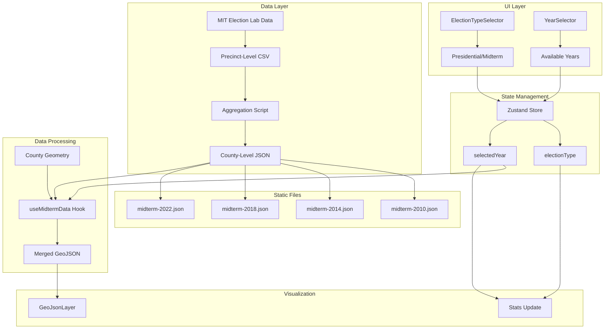

# Implementation Plan: Filter by Mid-term Election Year

## User Story

**As a** user
**I want to** filter counties by mid-term election year
**So that I** can focus on specific geographic areas

## Acceptance Criteria

- [ ] Election selector is available
- [ ] Map updates with counties' voting data for the selected year
- [ ] Fetch election data once and cache in the project and version control system to avoid redundant requests
- [ ] Match data shape that is already in place

## Approach

Mid-term elections (U.S. House and Senate races) present unique challenges compared to presidential elections:

1. **District-based races**: House races are per congressional district, not nationwide
2. **Varying candidates**: Each district has different candidates, unlike presidential races
3. **Data aggregation**: County-level totals require aggregating precinct or district data

The approach is to pre-download and transform mid-term election data from the MIT Election Data and Science Lab (MEDSL), aggregating results to show county-level party vote totals. Since mid-term races don't have uniform national candidates, the visualization will display aggregated Democratic vs Republican vote totals for all House races within each county.

### Key Differences from Presidential Election Filter

| Aspect      | Presidential               | Mid-term                 |
| ----------- | -------------------------- | ------------------------ |
| Race type   | Single nationwide race     | Multiple district races  |
| Candidates  | Same candidates everywhere | Different per district   |
| Data source | Direct county totals       | Precinct data aggregated |
| Display     | Candidate names            | Party totals only        |

## Architecture



## Data Sources

### Primary Source: MIT Election Data and Science Lab (MEDSL)

The [MIT Election Lab](https://electionlab.mit.edu/data) provides comprehensive election data:

- **2022 Midterm**: [MEDSL/2022-elections-official](https://github.com/MEDSL/2022-elections-official) - Precinct-level returns
- **2018 Midterm**: County-level unofficial returns available
- **Historical data**: Available through Harvard Dataverse

### Alternative Sources

- [Harvard Dataverse - U.S. House Elections](https://dataverse.harvard.edu/dataverse/medsl_house) - District-level returns
- [CISER Cornell Archive](https://archive.ciser.cornell.edu/studies/2846/data-and-documentation) - County & district level 2006-2022

## Data Caching Strategy

### Static Data Files

Mid-term election data will be cached as static JSON files:

```
public/
└── data/
    └── elections/
        ├── presidential/
        │   ├── 2008.json
        │   ├── 2012.json
        │   └── ...
        └── midterm/
            ├── 2010.json
            ├── 2014.json
            ├── 2018.json
            └── 2022.json
```

### Data Shape

Each JSON file contains county-level aggregated party totals:

```typescript
// public/data/elections/midterm/2022.json
[
  {
    fips: '01001',
    name: 'Autauga',
    state: 'AL',
    stateFips: '01',
    totalVotes: 24500,
    democratVotes: 5800,
    republicanVotes: 18200,
    otherVotes: 500,
    margin: -12400,
    marginPercent: -50.61,
    // Mid-term specific fields
    houseRaces: 1, // Number of House races in county
    senateRace: false, // Whether Senate race occurred
  },
  // ... ~3,100 counties
];
```

### Type Definitions

```typescript
// src/types/midterm.ts
import { z } from 'zod';

export type MidtermYear = 2010 | 2014 | 2018 | 2022;

export const MIDTERM_YEARS: MidtermYear[] = [2022, 2018, 2014, 2010];

export interface MidtermYearInfo {
  year: MidtermYear;
  label: string;
  description: string;
}

export const MIDTERM_YEAR_INFO: Record<MidtermYear, MidtermYearInfo> = {
  2022: { year: 2022, label: '2022', description: 'House & Senate' },
  2018: { year: 2018, label: '2018', description: 'House & Senate' },
  2014: { year: 2014, label: '2014', description: 'House & Senate' },
  2010: { year: 2010, label: '2010', description: 'House & Senate' },
};

// Extended county voting schema for midterm data
export const MidtermCountyVotingSchema = z.object({
  fips: z.string(),
  name: z.string(),
  state: z.string(),
  stateFips: z.string(),
  totalVotes: z.number(),
  democratVotes: z.number(),
  republicanVotes: z.number(),
  otherVotes: z.number(),
  margin: z.number(),
  marginPercent: z.number(),
  houseRaces: z.number().optional(),
  senateRace: z.boolean().optional(),
});

export type MidtermCountyVoting = z.infer<typeof MidtermCountyVotingSchema>;
```

## Implementation Steps

### 1. Create Mid-term Data Download Script

```typescript
// scripts/download-midterm-data.ts
import { writeFileSync, mkdirSync } from 'fs';
import { dirname, join } from 'path';
import { fileURLToPath } from 'url';

const __dirname = dirname(fileURLToPath(import.meta.url));

const MIDTERM_YEARS = [2010, 2014, 2018, 2022] as const;

// MIT Election Lab data URLs (precinct-level, needs aggregation)
const DATA_SOURCES: Record<number, string> = {
  2022: 'https://raw.githubusercontent.com/MEDSL/2022-elections-official/main/...',
  2018: '...',
  // Historical data sources
};

interface PrecinctRow {
  state: string;
  county_fips: string;
  county_name: string;
  office: string;
  party: string;
  votes: string;
}

interface AggregatedCounty {
  fips: string;
  name: string;
  state: string;
  stateFips: string;
  totalVotes: number;
  democratVotes: number;
  republicanVotes: number;
  otherVotes: number;
  margin: number;
  marginPercent: number;
  houseRaces: number;
  senateRace: boolean;
}

function aggregateToCounty(precinctData: PrecinctRow[]): AggregatedCounty[] {
  const countyMap = new Map<string, AggregatedCounty>();

  for (const row of precinctData) {
    // Filter to House races only
    if (
      !row.office.includes('US HOUSE') &&
      !row.office.includes('US REPRESENTATIVE')
    ) {
      continue;
    }

    const fips = row.county_fips.padStart(5, '0');
    const existing = countyMap.get(fips) || {
      fips,
      name: row.county_name,
      state: row.state,
      stateFips: fips.slice(0, 2),
      totalVotes: 0,
      democratVotes: 0,
      republicanVotes: 0,
      otherVotes: 0,
      margin: 0,
      marginPercent: 0,
      houseRaces: 0,
      senateRace: false,
    };

    const votes = parseInt(row.votes, 10) || 0;
    existing.totalVotes += votes;

    if (row.party === 'DEMOCRAT' || row.party === 'DEM') {
      existing.democratVotes += votes;
    } else if (row.party === 'REPUBLICAN' || row.party === 'REP') {
      existing.republicanVotes += votes;
    } else {
      existing.otherVotes += votes;
    }

    countyMap.set(fips, existing);
  }

  // Calculate margins
  return Array.from(countyMap.values()).map((county) => ({
    ...county,
    margin: county.democratVotes - county.republicanVotes,
    marginPercent:
      county.totalVotes > 0
        ? ((county.democratVotes - county.republicanVotes) /
            county.totalVotes) *
          100
        : 0,
  }));
}

async function downloadAndTransform(year: number): Promise<void> {
  console.log(`Processing ${year} midterm data...`);

  // Fetch and parse precinct data
  // Aggregate to county level
  // Save as JSON

  const outputDir = join(
    __dirname,
    '..',
    'public',
    'data',
    'elections',
    'midterm'
  );
  mkdirSync(outputDir, { recursive: true });

  // const data = await fetchAndAggregate(year);
  // writeFileSync(join(outputDir, `${year}.json`), JSON.stringify(data));
}

async function main() {
  console.log('Downloading midterm election data...\n');

  for (const year of MIDTERM_YEARS) {
    await downloadAndTransform(year);
  }

  console.log('\nAll midterm data downloaded successfully!');
}

main();
```

### 2. Create Election Type Selector

```typescript
// src/types/electionType.ts
export type ElectionType = 'presidential' | 'midterm';

export interface ElectionTypeInfo {
  type: ElectionType;
  label: string;
  description: string;
}

export const ELECTION_TYPES: ElectionTypeInfo[] = [
  { type: 'presidential', label: 'Presidential', description: 'Every 4 years' },
  { type: 'midterm', label: 'Midterm', description: 'House & Senate' },
];
```

### 3. Update Filter Store

```typescript
// src/stores/countyFilterStore.ts (extended)
import { create } from 'zustand';
import type { ElectionYear } from '../types/election';
import type { MidtermYear } from '../types/midterm';
import type { ElectionType } from '../types/electionType';

interface CountyFilterStore {
  selectedState: string | null;
  electionType: ElectionType;
  selectedPresidentialYear: ElectionYear;
  selectedMidtermYear: MidtermYear;

  setSelectedState: (stateFips: string | null) => void;
  setElectionType: (type: ElectionType) => void;
  setSelectedPresidentialYear: (year: ElectionYear) => void;
  setSelectedMidtermYear: (year: MidtermYear) => void;
  reset: () => void;
}

export const useCountyFilterStore = create<CountyFilterStore>((set) => ({
  selectedState: null,
  electionType: 'presidential',
  selectedPresidentialYear: 2024,
  selectedMidtermYear: 2022,

  setSelectedState: (stateFips) => set({ selectedState: stateFips }),
  setElectionType: (type) => set({ electionType: type }),
  setSelectedPresidentialYear: (year) =>
    set({ selectedPresidentialYear: year }),
  setSelectedMidtermYear: (year) => set({ selectedMidtermYear: year }),

  reset: () =>
    set({
      selectedState: null,
      electionType: 'presidential',
      selectedPresidentialYear: 2024,
      selectedMidtermYear: 2022,
    }),
}));
```

### 4. Create Mid-term Data Hook

```typescript
// src/hooks/useMidtermData.ts
import { useState, useEffect } from 'react';
import type { MidtermYear } from '../types/midterm';
import type { MidtermCountyVoting } from '../types/midterm';
import { MidtermCountyVotingSchema } from '../types/midterm';
import { z } from 'zod';

const midtermDataCache = new Map<MidtermYear, MidtermCountyVoting[]>();

async function loadMidtermData(
  year: MidtermYear
): Promise<MidtermCountyVoting[]> {
  const cached = midtermDataCache.get(year);
  if (cached) return cached;

  const response = await fetch(`/data/elections/midterm/${year}.json`);
  if (!response.ok) {
    throw new Error(`Failed to load ${year} midterm data`);
  }

  const data = await response.json();
  const validated = z.array(MidtermCountyVotingSchema).parse(data);

  midtermDataCache.set(year, validated);
  return validated;
}

export function useMidtermData(year: MidtermYear) {
  const [data, setData] = useState<MidtermCountyVoting[] | null>(null);
  const [loading, setLoading] = useState(true);
  const [error, setError] = useState<Error | null>(null);

  useEffect(() => {
    let cancelled = false;

    async function load() {
      setLoading(true);
      setError(null);

      try {
        const midtermData = await loadMidtermData(year);
        if (!cancelled) {
          setData(midtermData);
          setLoading(false);
        }
      } catch (err) {
        if (!cancelled) {
          setError(err instanceof Error ? err : new Error('Failed to load'));
          setLoading(false);
        }
      }
    }

    load();
    return () => {
      cancelled = true;
    };
  }, [year]);

  return { data, loading, error };
}
```

### 5. Create Election Type Selector Component

```typescript
// src/components/CountyVotingMap/Filters/ElectionTypeSelector.tsx
import { useCallback } from 'react';
import { useCountyFilterStore } from '../../../stores/countyFilterStore';
import { ELECTION_TYPES } from '../../../types/electionType';
import type { ElectionType } from '../../../types/electionType';

export function ElectionTypeSelector() {
  const electionType = useCountyFilterStore((state) => state.electionType);
  const setElectionType = useCountyFilterStore((state) => state.setElectionType);

  const handleTypeChange = useCallback(
    (event: React.ChangeEvent<HTMLSelectElement>) => {
      setElectionType(event.target.value as ElectionType);
    },
    [setElectionType]
  );

  return (
    <div className="bg-gray-900/80 backdrop-blur-md rounded-lg p-3 shadow-lg border border-white/10">
      <label
        htmlFor="election-type-selector"
        className="block text-xs font-medium text-gray-400 mb-1.5"
      >
        Election Type
      </label>

      <select
        id="election-type-selector"
        value={electionType}
        onChange={handleTypeChange}
        className="w-full bg-gray-800 text-white border border-gray-600 rounded-md
                   px-2.5 py-1.5 text-sm focus:outline-none focus:ring-2
                   focus:ring-blue-500 focus:border-transparent cursor-pointer"
      >
        {ELECTION_TYPES.map((type) => (
          <option key={type.type} value={type.type}>
            {type.label}
          </option>
        ))}
      </select>
    </div>
  );
}
```

### 6. Create Midterm Year Selector Component

```typescript
// src/components/CountyVotingMap/Filters/MidtermYearSelector.tsx
import { useCallback } from 'react';
import { useCountyFilterStore } from '../../../stores/countyFilterStore';
import { MIDTERM_YEARS, MIDTERM_YEAR_INFO } from '../../../types/midterm';
import type { MidtermYear } from '../../../types/midterm';

export function MidtermYearSelector() {
  const selectedYear = useCountyFilterStore((state) => state.selectedMidtermYear);
  const setSelectedYear = useCountyFilterStore((state) => state.setSelectedMidtermYear);

  const handleYearChange = useCallback(
    (event: React.ChangeEvent<HTMLSelectElement>) => {
      const year = parseInt(event.target.value, 10) as MidtermYear;
      setSelectedYear(year);
    },
    [setSelectedYear]
  );

  return (
    <div className="bg-gray-900/80 backdrop-blur-md rounded-lg p-3 shadow-lg border border-white/10">
      <label
        htmlFor="midterm-year-selector"
        className="block text-xs font-medium text-gray-400 mb-1.5"
      >
        Midterm Year
      </label>

      <select
        id="midterm-year-selector"
        value={selectedYear}
        onChange={handleYearChange}
        className="w-full bg-gray-800 text-white border border-gray-600 rounded-md
                   px-2.5 py-1.5 text-sm focus:outline-none focus:ring-2
                   focus:ring-blue-500 focus:border-transparent cursor-pointer"
      >
        {MIDTERM_YEARS.map((year) => (
          <option key={year} value={year}>
            {MIDTERM_YEAR_INFO[year].label} - {MIDTERM_YEAR_INFO[year].description}
          </option>
        ))}
      </select>
    </div>
  );
}
```

### 7. Update Map Component

```typescript
// src/components/CountyVotingMap/CountyVotingMap.tsx (updated)
import { useMemo } from 'react';
import { ElectionTypeSelector, MidtermYearSelector, YearSelector } from './Filters';
import { useCountyFilterStore } from '../../stores/countyFilterStore';
import { useCountyVotingData } from '../../hooks/useCountyVotingData';
import { useMidtermVotingData } from '../../hooks/useMidtermVotingData';

export function CountyVotingMap() {
  const electionType = useCountyFilterStore((state) => state.electionType);
  const selectedPresidentialYear = useCountyFilterStore((state) => state.selectedPresidentialYear);
  const selectedMidtermYear = useCountyFilterStore((state) => state.selectedMidtermYear);

  // Conditionally fetch data based on election type
  const presidentialData = useCountyVotingData(selectedPresidentialYear);
  const midtermData = useMidtermVotingData(selectedMidtermYear);

  // Select active data based on election type
  const { data, loading, error } = useMemo(() => {
    return electionType === 'presidential' ? presidentialData : midtermData;
  }, [electionType, presidentialData, midtermData]);

  // ... rest of component

  return (
    <div className="w-full h-full relative">
      {/* Filter controls */}
      {!loading && !error && data && (
        <div className="absolute top-4 left-4 z-10 space-y-2 w-48">
          <ElectionTypeSelector />
          {electionType === 'presidential' ? (
            <YearSelector />
          ) : (
            <MidtermYearSelector />
          )}
          <StateSelector />
          <FilterStats
            stats={stats}
            isFiltered={isFiltered}
            stateName={selectedStateName}
            electionType={electionType}
            year={electionType === 'presidential' ? selectedPresidentialYear : selectedMidtermYear}
          />
        </div>
      )}
      {/* ... rest of JSX */}
    </div>
  );
}
```

### 8. Update FilterStats for Midterm

```typescript
// src/components/CountyVotingMap/Filters/FilterStats.tsx (updated)
import type { ElectionType } from '../../../types/electionType';

interface FilterStatsProps {
  stats: FilterStatsType | null;
  isFiltered: boolean;
  stateName?: string;
  electionType: ElectionType;
  year: number;
}

export function FilterStats({
  stats,
  isFiltered,
  stateName,
  electionType,
  year,
}: FilterStatsProps) {
  if (!stats) return null;

  const getDescription = () => {
    if (electionType === 'presidential') {
      return ELECTION_YEAR_INFO[year as ElectionYear]?.description || '';
    }
    return 'House & Senate Races';
  };

  return (
    <div className="bg-gray-900/80 backdrop-blur-md rounded-lg p-3 shadow-lg border border-white/10">
      <h3 className="text-white text-sm font-medium mb-1">
        {isFiltered ? stateName : 'National'} Summary
      </h3>
      <p className="text-gray-400 text-xs mb-2">
        {year} {electionType === 'midterm' ? 'Midterm' : ''} - {getDescription()}
      </p>
      {/* ... rest of stats */}
    </div>
  );
}
```

## Performance Considerations

### Efficient Data Loading

```typescript
// Only load data when election type matches
const presidentialData = useCountyVotingData(
  electionType === 'presidential' ? selectedPresidentialYear : null
);
const midtermData = useMidtermVotingData(
  electionType === 'midterm' ? selectedMidtermYear : null
);
```

### Shared Geometry Cache

```typescript
// Geometry is shared across all election types and years
let geometryCache: FeatureCollection | null = null;

// Both hooks reuse the same geometry
export function useCountyVotingData(year: ElectionYear | null) {
  // Uses geometryCache
}

export function useMidtermVotingData(year: MidtermYear | null) {
  // Uses same geometryCache
}
```

### Lazy Loading Years

```typescript
// Preload adjacent years when switching
function preloadAdjacentYears(currentYear: MidtermYear) {
  const index = MIDTERM_YEARS.indexOf(currentYear);
  const adjacent = [MIDTERM_YEARS[index - 1], MIDTERM_YEARS[index + 1]];

  adjacent.filter(Boolean).forEach((year) => {
    if (!midtermDataCache.has(year)) {
      loadMidtermData(year); // Fire and forget
    }
  });
}
```

## Responsiveness

### Compact Mode for Mobile

```typescript
// Combined election type + year selector on mobile
function MobileElectionSelector() {
  const electionType = useCountyFilterStore((state) => state.electionType);
  const presidentialYear = useCountyFilterStore((state) => state.selectedPresidentialYear);
  const midtermYear = useCountyFilterStore((state) => state.selectedMidtermYear);

  const allOptions = [
    ...ELECTION_YEARS.map(y => ({ value: `presidential-${y}`, label: `${y} Presidential` })),
    ...MIDTERM_YEARS.map(y => ({ value: `midterm-${y}`, label: `${y} Midterm` })),
  ];

  return (
    <select className="md:hidden ...">
      {allOptions.map(opt => (
        <option key={opt.value} value={opt.value}>{opt.label}</option>
      ))}
    </select>
  );
}
```

## Testing

### Unit Tests

```typescript
// src/types/midterm.test.ts
describe('midterm types', () => {
  describe('MIDTERM_YEARS', () => {
    it('should contain all valid midterm years', () => {
      expect(MIDTERM_YEARS).toContain(2022);
      expect(MIDTERM_YEARS).toContain(2018);
      expect(MIDTERM_YEARS).toContain(2014);
      expect(MIDTERM_YEARS).toContain(2010);
    });
  });
});

// src/stores/countyFilterStore.test.ts
describe('midterm election state', () => {
  it('should have 2022 as initial midterm year', () => {
    expect(useCountyFilterStore.getState().selectedMidtermYear).toBe(2022);
  });

  it('should switch between election types', () => {
    useCountyFilterStore.getState().setElectionType('midterm');
    expect(useCountyFilterStore.getState().electionType).toBe('midterm');
  });
});

// src/components/CountyVotingMap/Filters/MidtermYearSelector.test.tsx
describe('MidtermYearSelector', () => {
  it('should render all midterm year options', () => {
    render(<MidtermYearSelector />);
    expect(screen.getByText(/2022/)).toBeInTheDocument();
    expect(screen.getByText(/2018/)).toBeInTheDocument();
  });

  it('should update store when year changes', async () => {
    render(<MidtermYearSelector />);
    await userEvent.selectOptions(screen.getByRole('combobox'), '2018');
    expect(useCountyFilterStore.getState().selectedMidtermYear).toBe(2018);
  });
});
```

### Acceptance Tests

```gherkin
Feature: Filter by Mid-term Election Year

  Scenario: Select a midterm election year
    Given I am on the county voting page
    And the map has loaded with presidential 2024 data
    When I select "Midterm" from the election type selector
    Then the map should update to show 2022 midterm data
    And the year selector should show midterm years

  Scenario: Switch between election types
    Given I am viewing 2022 midterm data
    When I select "Presidential" from the election type selector
    Then the map should update to show presidential data
    And the year selector should show presidential years

  Scenario: Midterm stats show party totals
    Given I am viewing 2022 midterm data
    Then the stats panel should show "House & Senate Races"
    And the stats should display party vote totals

  Scenario: Filtering works with midterm data
    Given I am viewing 2022 midterm data
    When I select "California" from the state filter
    Then only California counties should be visible
    And the data should be from the 2022 midterm election
```

## NPM Scripts

Add to `package.json`:

```json
{
  "scripts": {
    "data:download": "tsx scripts/download-election-data.ts",
    "data:download:midterm": "tsx scripts/download-midterm-data.ts",
    "data:download:all": "npm run data:download && npm run data:download:midterm"
  }
}
```

## Data Source Attribution

Include attribution in the UI:

```typescript
<footer className="absolute bottom-2 right-2 text-xs text-gray-500">
  Data: MIT Election Data + Science Lab, US Census Bureau
</footer>
```

## Known Limitations

1. **Data availability**: Precinct-level data may not be complete for all counties in all years
2. **District boundaries**: Counties spanning multiple congressional districts will show aggregated totals
3. **Special elections**: Not included in standard midterm data
4. **Third parties**: Aggregated as "other" votes for simplicity

## Future Enhancements

1. **Senate-only view**: Filter to show only counties with Senate races
2. **District overlay**: Show congressional district boundaries on map
3. **Incumbent tracking**: Indicate which party held the seat previously
4. **Turnout comparison**: Compare midterm vs presidential turnout
