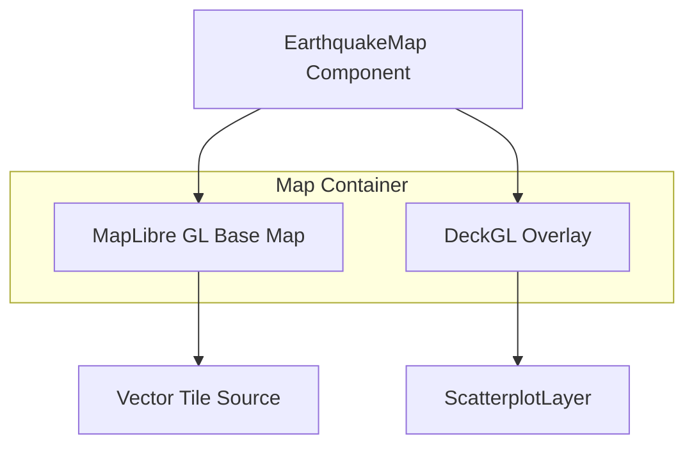

# Implementation Plan: Map Base Layer with Geographic Context

## Acceptance Criterion
> Map displays with a base layer showing geographic context

## Approach

Integrate MapLibre GL JS as the base map provider with deck.gl overlay. MapLibre provides free, open-source vector tile rendering with customizable styles.

## Architecture



## Libraries

| Library | Version | Purpose |
|---------|---------|---------|
| `maplibre-gl` | ^4.x | Base map rendering |
| `@deck.gl/core` | ^9.x | Visualization framework |
| `@deck.gl/mapbox` | ^9.x | MapLibre/Mapbox integration |
| `react-map-gl` | ^7.x | React wrapper for MapLibre |

## Implementation Steps

### 1. Install Dependencies

```bash
npm install maplibre-gl @deck.gl/core @deck.gl/layers @deck.gl/mapbox react-map-gl
```

### 2. Create Map Container Component

```tsx
// src/components/EarthquakeMap/EarthquakeMap.tsx
import { useState, useCallback } from 'react';
import Map from 'react-map-gl/maplibre';
import DeckGL from '@deck.gl/react';
import 'maplibre-gl/dist/maplibre-gl.css';

const INITIAL_VIEW_STATE = {
  longitude: 0,
  latitude: 20,
  zoom: 1.5,
  pitch: 0,
  bearing: 0,
};

// Free OpenStreetMap-based style
const MAP_STYLE = 'https://basemaps.cartocdn.com/gl/positron-gl-style/style.json';

export function EarthquakeMap() {
  const [viewState, setViewState] = useState(INITIAL_VIEW_STATE);

  const onViewStateChange = useCallback(({ viewState }) => {
    setViewState(viewState);
  }, []);

  return (
    <div className="w-full h-full relative">
      <DeckGL
        viewState={viewState}
        onViewStateChange={onViewStateChange}
        controller={true}
        layers={[]}
      >
        <Map mapStyle={MAP_STYLE} />
      </DeckGL>
    </div>
  );
}
```

### 3. Create Responsive Container

```tsx
// src/components/EarthquakeMap/MapContainer.tsx
export function MapContainer({ children }: { children: React.ReactNode }) {
  return (
    <div className="w-full h-screen min-h-[400px] md:min-h-[600px]">
      {children}
    </div>
  );
}
```

## Performance Considerations

- Use vector tiles instead of raster for faster rendering and lower bandwidth
- Lazy load map styles to reduce initial bundle size
- Consider using `preserveDrawingBuffer: false` for better WebGL performance

## Responsiveness

- Container uses `w-full h-screen` for full viewport coverage
- Minimum heights ensure usability on small screens
- Touch events enabled by default in deck.gl controller

## Free Map Style Options

| Provider | Style URL | Notes |
|----------|-----------|-------|
| CARTO Positron | `basemaps.cartocdn.com/gl/positron-gl-style/style.json` | Light, minimal |
| CARTO Dark Matter | `basemaps.cartocdn.com/gl/dark-matter-gl-style/style.json` | Dark theme |
| OpenFreeMap | `tiles.openfreemap.org/styles/liberty/style.json` | OSM-based |
