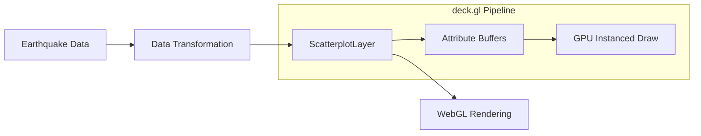

# Implementation Plan: Earthquake Points Rendering

## Acceptance Criterion
> Earthquake events are rendered as points on the map

## Approach

Use deck.gl's `ScatterplotLayer` to render earthquake data as circular points. This layer is optimized for rendering large numbers of points with WebGL instanced rendering.

## Architecture



## Libraries

| Library | Purpose |
|---------|---------|
| `@deck.gl/layers` | ScatterplotLayer for point rendering |

## Data Structure

```typescript
// src/types/earthquake.ts
export interface Earthquake {
  id: string;
  longitude: number;
  latitude: number;
  depth: number;        // km
  magnitude: number;    // Richter scale
  timestamp: string;    // ISO 8601
  location: string;     // Human-readable location
}
```

## Implementation Steps

### 1. Create Earthquake Layer Factory

```tsx
// src/components/EarthquakeMap/layers/earthquakeLayer.ts
import { ScatterplotLayer } from '@deck.gl/layers';
import type { Earthquake } from '../../../types/earthquake';

export function createEarthquakeLayer(data: Earthquake[]) {
  return new ScatterplotLayer<Earthquake>({
    id: 'earthquake-layer',
    data,
    pickable: true,
    opacity: 0.6,
    stroked: true,
    filled: true,
    radiusScale: 1,
    radiusMinPixels: 2,
    radiusMaxPixels: 100,
    lineWidthMinPixels: 1,
    getPosition: (d) => [d.longitude, d.latitude],
    getRadius: (d) => Math.pow(2, d.magnitude) * 1000,
    getFillColor: (d) => getDepthColor(d.depth),
    getLineColor: [0, 0, 0, 50],

    // Performance optimizations
    updateTriggers: {
      getRadius: data.length,
      getFillColor: data.length,
    },
  });
}

function getDepthColor(depth: number): [number, number, number, number] {
  // Yellow (shallow) to Red (deep)
  const t = Math.min(depth / 700, 1); // Normalize to 0-700km range
  return [
    255,
    Math.round(255 * (1 - t)),
    0,
    180,
  ];
}
```

### 2. Integrate Layer with Map

```tsx
// src/components/EarthquakeMap/EarthquakeMap.tsx
import { useMemo } from 'react';
import { createEarthquakeLayer } from './layers/earthquakeLayer';

export function EarthquakeMap({ earthquakes }: { earthquakes: Earthquake[] }) {
  const layers = useMemo(
    () => [createEarthquakeLayer(earthquakes)],
    [earthquakes]
  );

  return (
    <DeckGL
      viewState={viewState}
      onViewStateChange={onViewStateChange}
      controller={true}
      layers={layers}
    >
      <Map mapStyle={MAP_STYLE} />
    </DeckGL>
  );
}
```

## Performance Considerations

### Large Dataset Optimization

```typescript
// For datasets > 100k points, use binary data format
import { ScatterplotLayer } from '@deck.gl/layers';

const layer = new ScatterplotLayer({
  // ... other props

  // Use binary attributes for large datasets
  data: {
    length: earthquakes.length,
    attributes: {
      getPosition: { value: positionBuffer, size: 2 },
      getRadius: { value: radiusBuffer, size: 1 },
      getFillColor: { value: colorBuffer, size: 4 },
    },
  },
});
```

### Memory-Efficient Data Loading

```typescript
// src/hooks/useEarthquakeData.ts
export function useEarthquakeData(url: string) {
  const [data, setData] = useState<Earthquake[]>([]);
  const [loading, setLoading] = useState(true);

  useEffect(() => {
    async function fetchData() {
      const response = await fetch(url);
      const json = await response.json();

      // Stream processing for large datasets
      const earthquakes = json.features.map((f: GeoJSONFeature) => ({
        id: f.id,
        longitude: f.geometry.coordinates[0],
        latitude: f.geometry.coordinates[1],
        depth: f.geometry.coordinates[2],
        magnitude: f.properties.mag,
        timestamp: f.properties.time,
        location: f.properties.place,
      }));

      setData(earthquakes);
      setLoading(false);
    }

    fetchData();
  }, [url]);

  return { data, loading };
}
```

## Responsiveness

- `radiusMinPixels` ensures visibility on small screens
- `radiusMaxPixels` prevents oversized points on large displays
- Opacity at 0.6 allows overlapping points to remain visible
