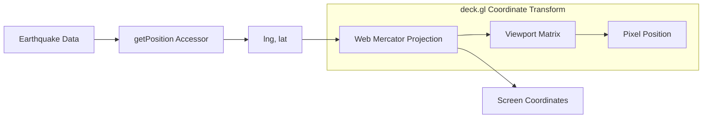

# Implementation Plan: Point Positioning by Latitude/Longitude

## Acceptance Criterion

> Each point is positioned at the earthquake's latitude/longitude

## Approach

Use deck.gl's built-in coordinate system with the `getPosition` accessor to map earthquake coordinates to screen positions. deck.gl handles the Web Mercator projection automatically.

## Architecture



## Implementation Steps

### 1. Define Position Accessor

```typescript
// The getPosition accessor extracts [longitude, latitude] from each data point
getPosition: (d: Earthquake) => [d.longitude, d.latitude];
```

### 2. Coordinate System Configuration

```tsx
// src/components/EarthquakeMap/EarthquakeMap.tsx
import { COORDINATE_SYSTEM } from '@deck.gl/core';

const layer = new ScatterplotLayer({
  // Default is COORDINATE_SYSTEM.LNGLAT (Web Mercator)
  coordinateSystem: COORDINATE_SYSTEM.LNGLAT,

  // Position format: [longitude, latitude] or [longitude, latitude, altitude]
  getPosition: (d) => [d.longitude, d.latitude],

  // Optional: include altitude for 3D visualization
  // getPosition: (d) => [d.longitude, d.latitude, -d.depth * 1000],
});
```

### 3. Data Validation

```typescript
// src/utils/validateCoordinates.ts
export function isValidCoordinate(lng: number, lat: number): boolean {
  return (
    typeof lng === 'number' &&
    typeof lat === 'number' &&
    lng >= -180 &&
    lng <= 180 &&
    lat >= -90 &&
    lat <= 90 &&
    !Number.isNaN(lng) &&
    !Number.isNaN(lat)
  );
}

export function filterValidEarthquakes(
  earthquakes: Earthquake[]
): Earthquake[] {
  return earthquakes.filter((eq) =>
    isValidCoordinate(eq.longitude, eq.latitude)
  );
}
```

### 4. Handle Antimeridian Crossing

```typescript
// For earthquakes near the antimeridian (±180°), ensure proper rendering
export function normalizeCoordinates(earthquakes: Earthquake[]): Earthquake[] {
  return earthquakes.map((eq) => ({
    ...eq,
    // Normalize longitude to [-180, 180] range
    longitude: ((eq.longitude + 540) % 360) - 180,
  }));
}
```

## Performance Considerations

### Pre-compute Position Arrays

```typescript
// For large datasets, pre-compute Float32Array for positions
export function createPositionBuffer(earthquakes: Earthquake[]): Float32Array {
  const positions = new Float32Array(earthquakes.length * 2);

  earthquakes.forEach((eq, i) => {
    positions[i * 2] = eq.longitude;
    positions[i * 2 + 1] = eq.latitude;
  });

  return positions;
}

// Use with binary attributes
const layer = new ScatterplotLayer({
  data: {
    length: earthquakes.length,
    attributes: {
      getPosition: { value: positionBuffer, size: 2 },
    },
  },
});
```

### Viewport Culling

deck.gl automatically culls points outside the visible viewport, improving performance for global datasets when zoomed in.

## Coordinate Reference

| Earthquake Data Source | Coordinate Order  | Notes                  |
| ---------------------- | ----------------- | ---------------------- |
| USGS GeoJSON           | [lng, lat, depth] | Standard GeoJSON       |
| CSV formats            | Varies            | Check header for order |
| ISO 6709               | lat, lng          | Convert to [lng, lat]  |

## Testing

### Unit Tests

Unit tests must be added for all new code.

```typescript
// src/utils/validateCoordinates.test.ts
describe('isValidCoordinate', () => {
  it('accepts valid coordinates', () => {
    expect(isValidCoordinate(-122.4194, 37.7749)).toBe(true); // San Francisco
    expect(isValidCoordinate(139.6917, 35.6895)).toBe(true);  // Tokyo
  });

  it('rejects invalid coordinates', () => {
    expect(isValidCoordinate(181, 0)).toBe(false);
    expect(isValidCoordinate(0, 91)).toBe(false);
    expect(isValidCoordinate(NaN, 0)).toBe(false);
  });
});

describe('filterValidEarthquakes', () => {
  - Test filters out earthquakes with invalid coordinates
  - Test keeps earthquakes with valid coordinates
  - Test handles empty array
});

describe('normalizeCoordinates', () => {
  - Test normalizes longitude values to [-180, 180]
  - Test handles antimeridian crossing
  - Test preserves other earthquake properties
});

describe('createPositionBuffer', () => {
  - Test returns Float32Array with correct length
  - Test positions are correctly interleaved [lng, lat, lng, lat, ...]
});
```

### Acceptance Tests

```gherkin
# features/earthquake-map.feature
Scenario: Points positioned at correct coordinates
  Given I am on the home page
  And earthquake data has loaded
  When I hover over an earthquake point
  Then the tooltip should show coordinates matching the point position
```
