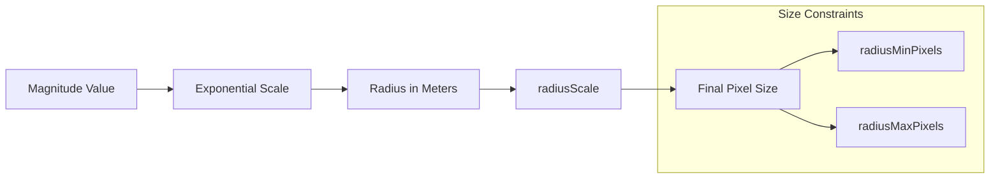

# Implementation Plan: Point Size by Magnitude

## Acceptance Criterion
> Point size corresponds to earthquake magnitude

## Approach

Use an exponential scale for the `getRadius` accessor to visually represent the logarithmic nature of the Richter scale. The Richter scale is logarithmic—each whole number increase represents a 10x increase in amplitude.

## Architecture



## Scale Design

| Magnitude | Energy Release | Visual Radius | Description |
|-----------|----------------|---------------|-------------|
| 2.0 | Minor | 4km → ~4px | Micro |
| 4.0 | Light | 16km → ~8px | Minor |
| 5.0 | Moderate | 32km → ~12px | Light |
| 6.0 | Strong | 64km → ~20px | Moderate |
| 7.0 | Major | 128km → ~35px | Strong |
| 8.0+ | Great | 256km → ~50px | Major/Great |

## Implementation Steps

### 1. Define Magnitude-to-Radius Scale

```typescript
// src/components/EarthquakeMap/layers/magnitudeScale.ts

/**
 * Convert magnitude to radius using exponential scale.
 * Base formula: radius = baseSize * 2^magnitude
 *
 * This reflects the logarithmic nature of the Richter scale
 * where each unit increase = 10x amplitude increase.
 */
export function magnitudeToRadius(magnitude: number): number {
  const baseSize = 1000; // Base size in meters
  const exponent = Math.max(0, magnitude - 2); // Start scaling at magnitude 2
  return baseSize * Math.pow(2, exponent);
}

// Alternative: Power scale for more gradual size increase
export function magnitudeToRadiusPower(magnitude: number): number {
  const minMag = 2;
  const maxMag = 9;
  const minRadius = 2000;
  const maxRadius = 200000;

  const normalized = (magnitude - minMag) / (maxMag - minMag);
  const clamped = Math.max(0, Math.min(1, normalized));

  return minRadius + Math.pow(clamped, 2) * (maxRadius - minRadius);
}
```

### 2. Configure ScatterplotLayer

```typescript
// src/components/EarthquakeMap/layers/earthquakeLayer.ts
import { ScatterplotLayer } from '@deck.gl/layers';
import { magnitudeToRadius } from './magnitudeScale';

export function createEarthquakeLayer(data: Earthquake[]) {
  return new ScatterplotLayer<Earthquake>({
    id: 'earthquake-layer',
    data,

    // Size configuration
    getRadius: (d) => magnitudeToRadius(d.magnitude),
    radiusScale: 1,
    radiusMinPixels: 3,    // Minimum visibility
    radiusMaxPixels: 50,   // Prevent visual clutter
    radiusUnits: 'meters', // Radius in world coordinates

    // Update triggers for React re-renders
    updateTriggers: {
      getRadius: [data.length],
    },
  });
}
```

### 3. Create Size Legend Component

```tsx
// src/components/EarthquakeMap/Legend/SizeLegend.tsx
const MAGNITUDE_SAMPLES = [3, 5, 7, 9];

export function SizeLegend() {
  return (
    <div className="absolute bottom-4 left-4 bg-white/90 p-3 rounded-lg shadow">
      <h4 className="text-sm font-semibold mb-2">Magnitude</h4>
      <div className="flex items-end gap-3">
        {MAGNITUDE_SAMPLES.map((mag) => {
          const size = Math.min(40, 4 + (mag - 3) * 6);
          return (
            <div key={mag} className="flex flex-col items-center">
              <div
                className="rounded-full bg-orange-500/60 border border-orange-600"
                style={{ width: size, height: size }}
              />
              <span className="text-xs mt-1">{mag}</span>
            </div>
          );
        })}
      </div>
    </div>
  );
}
```

## Performance Considerations

### Pre-compute Radii for Large Datasets

```typescript
// Pre-compute radius values to avoid repeated calculations
export function createRadiusBuffer(earthquakes: Earthquake[]): Float32Array {
  const radii = new Float32Array(earthquakes.length);

  earthquakes.forEach((eq, i) => {
    radii[i] = magnitudeToRadius(eq.magnitude);
  });

  return radii;
}

// Use binary attribute
const layer = new ScatterplotLayer({
  data: {
    length: earthquakes.length,
    attributes: {
      getRadius: { value: radiusBuffer, size: 1 },
    },
  },
});
```

### Radius Units Trade-offs

| Unit | Behavior | Use Case |
|------|----------|----------|
| `meters` | Scales with zoom | Geographic accuracy |
| `pixels` | Fixed screen size | Consistent visibility |
| `common` | Hybrid scaling | Balanced approach |

## Responsiveness

```typescript
// Adjust size constraints based on screen size
function getResponsiveSizeConfig() {
  const isMobile = window.innerWidth < 768;

  return {
    radiusMinPixels: isMobile ? 2 : 3,
    radiusMaxPixels: isMobile ? 30 : 50,
    radiusScale: isMobile ? 0.8 : 1,
  };
}
```

## Visual Accessibility

- Ensure minimum size of 3px for touch targets
- Combine size with color for redundant encoding
- Add legend to explain size mapping

## Testing

### Unit Tests

Unit tests must be added for all new code.

```typescript
// src/components/EarthquakeMap/layers/magnitudeScale.test.ts
describe('magnitudeToRadius', () => {
  - Test returns larger radius for larger magnitudes
  - Test exponential scaling (magnitude 5 should be ~2x magnitude 4)
  - Test handles edge cases (negative, zero, very large magnitudes)
  - Test minimum magnitude threshold
});

describe('magnitudeToRadiusPower', () => {
  - Test returns value within [minRadius, maxRadius] bounds
  - Test normalized scaling across magnitude range
});

describe('createRadiusBuffer', () => {
  - Test returns Float32Array with correct length
  - Test values match magnitudeToRadius output
});

// src/components/EarthquakeMap/Legend/SizeLegend.test.tsx
describe('SizeLegend', () => {
  - Test renders all magnitude samples
  - Test displays correct magnitude labels
  - Test circle sizes increase with magnitude
});
```

### Acceptance Tests

```gherkin
# features/earthquake-map.feature
Scenario: Point sizes reflect magnitude
  Given I am on the home page
  And earthquake data has loaded
  Then larger earthquakes should have visibly larger points
  And the size legend should be visible
```
