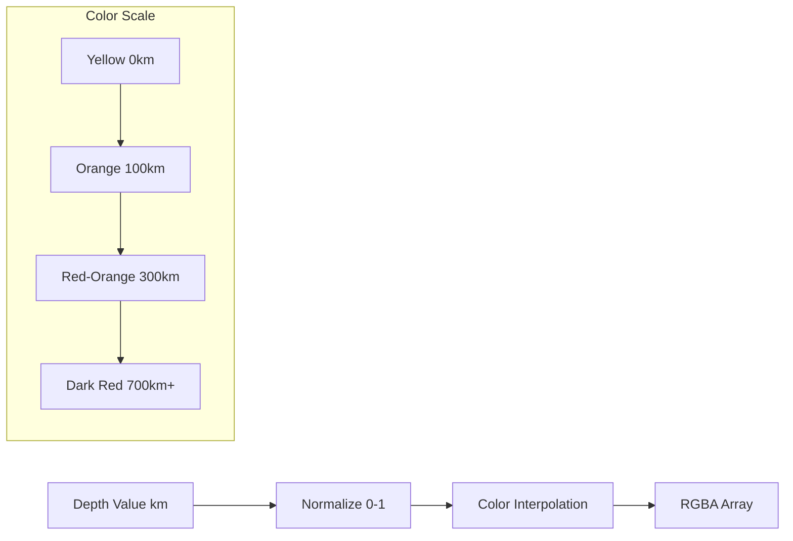

# Implementation Plan: Point Color by Depth

## Acceptance Criterion
> Point color indicates earthquake depth

## Approach

Implement a continuous color scale from yellow (shallow earthquakes) to red (deep earthquakes). Use a perceptually uniform color interpolation for accurate depth representation.

## Architecture



## Depth Classification

| Depth Range | Classification | Color | Hex |
|-------------|---------------|-------|-----|
| 0-70 km | Shallow | Yellow | `#FFFF00` |
| 70-300 km | Intermediate | Orange | `#FF8800` |
| 300-700 km | Deep | Red | `#FF0000` |
| 700+ km | Very Deep | Dark Red | `#8B0000` |

## Implementation Steps

### 1. Create Color Scale Utility

```typescript
// src/components/EarthquakeMap/layers/depthColorScale.ts

// Maximum depth for scaling (deepest earthquakes ~700km)
const MAX_DEPTH = 700;

/**
 * Convert depth to RGBA color array.
 * Yellow (shallow) → Orange → Red (deep)
 */
export function depthToColor(depth: number): [number, number, number, number] {
  const normalizedDepth = Math.min(depth / MAX_DEPTH, 1);

  // Yellow to Red interpolation
  // R: stays at 255
  // G: 255 → 0 as depth increases
  // B: 0
  // A: 180 (semi-transparent)

  return [
    255,
    Math.round(255 * (1 - normalizedDepth)),
    0,
    180,
  ];
}

/**
 * Multi-stop color scale for more nuanced visualization
 */
export function depthToColorMultiStop(depth: number): [number, number, number, number] {
  const stops = [
    { depth: 0, color: [255, 255, 0] },    // Yellow
    { depth: 70, color: [255, 200, 0] },   // Gold
    { depth: 150, color: [255, 140, 0] },  // Orange
    { depth: 300, color: [255, 69, 0] },   // Red-Orange
    { depth: 500, color: [255, 0, 0] },    // Red
    { depth: 700, color: [139, 0, 0] },    // Dark Red
  ];

  // Find the two stops to interpolate between
  let lower = stops[0];
  let upper = stops[stops.length - 1];

  for (let i = 0; i < stops.length - 1; i++) {
    if (depth >= stops[i].depth && depth < stops[i + 1].depth) {
      lower = stops[i];
      upper = stops[i + 1];
      break;
    }
  }

  // Linear interpolation between stops
  const range = upper.depth - lower.depth;
  const t = range > 0 ? (depth - lower.depth) / range : 0;

  return [
    Math.round(lower.color[0] + t * (upper.color[0] - lower.color[0])),
    Math.round(lower.color[1] + t * (upper.color[1] - lower.color[1])),
    Math.round(lower.color[2] + t * (upper.color[2] - lower.color[2])),
    180, // Alpha
  ];
}
```

### 2. Configure ScatterplotLayer

```typescript
// src/components/EarthquakeMap/layers/earthquakeLayer.ts
import { depthToColor } from './depthColorScale';

export function createEarthquakeLayer(data: Earthquake[]) {
  return new ScatterplotLayer<Earthquake>({
    id: 'earthquake-layer',
    data,

    // Color configuration
    getFillColor: (d) => depthToColor(d.depth),
    getLineColor: [0, 0, 0, 80], // Subtle dark outline

    // Ensure color updates when data changes
    updateTriggers: {
      getFillColor: [data.length],
    },
  });
}
```

### 3. Create Color Legend Component

```tsx
// src/components/EarthquakeMap/Legend/ColorLegend.tsx

const DEPTH_STOPS = [
  { depth: 0, label: '0 km', color: 'rgb(255, 255, 0)' },
  { depth: 70, label: '70 km', color: 'rgb(255, 200, 0)' },
  { depth: 300, label: '300 km', color: 'rgb(255, 69, 0)' },
  { depth: 700, label: '700+ km', color: 'rgb(139, 0, 0)' },
];

export function ColorLegend() {
  return (
    <div className="absolute bottom-4 right-4 bg-white/90 p-3 rounded-lg shadow">
      <h4 className="text-sm font-semibold mb-2">Depth</h4>
      <div className="flex flex-col gap-1">
        {/* Gradient bar */}
        <div
          className="h-4 w-32 rounded"
          style={{
            background: 'linear-gradient(to right, #FFFF00, #FFC800, #FF4500, #8B0000)',
          }}
        />
        {/* Labels */}
        <div className="flex justify-between text-xs">
          <span>Shallow</span>
          <span>Deep</span>
        </div>
        {/* Depth markers */}
        <div className="flex justify-between text-xs text-gray-600">
          <span>0</span>
          <span>700 km</span>
        </div>
      </div>
    </div>
  );
}
```

## Performance Considerations

### Pre-compute Color Buffer

```typescript
// For large datasets, pre-compute colors as Uint8ClampedArray
export function createColorBuffer(earthquakes: Earthquake[]): Uint8ClampedArray {
  const colors = new Uint8ClampedArray(earthquakes.length * 4);

  earthquakes.forEach((eq, i) => {
    const [r, g, b, a] = depthToColor(eq.depth);
    colors[i * 4] = r;
    colors[i * 4 + 1] = g;
    colors[i * 4 + 2] = b;
    colors[i * 4 + 3] = a;
  });

  return colors;
}

// Use with binary attribute
const layer = new ScatterplotLayer({
  data: {
    length: earthquakes.length,
    attributes: {
      getFillColor: { value: colorBuffer, size: 4, normalized: true },
    },
  },
});
```

## Accessibility Considerations

- Color scale avoids red-green only distinction
- Combine color with size for redundant encoding
- Provide legend with depth values
- Consider colorblind-safe alternative palette:

```typescript
// Colorblind-safe alternative (Blue → Purple → Magenta)
export function depthToColorAccessible(depth: number): [number, number, number, number] {
  const t = Math.min(depth / 700, 1);
  return [
    Math.round(100 + 155 * t),  // 100 → 255
    Math.round(149 * (1 - t)),  // 149 → 0
    Math.round(237 - 37 * t),   // 237 → 200
    180,
  ];
}
```
