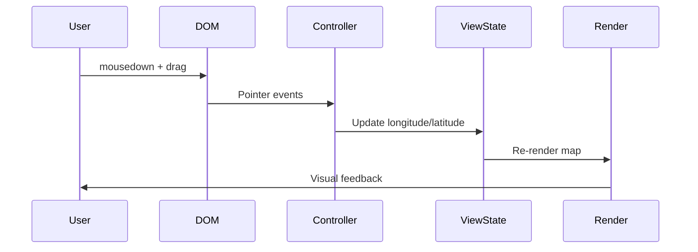

# Implementation Plan: Map Panning Interaction

## Acceptance Criterion
> Map supports click-and-drag panning

## Approach

Use deck.gl's built-in `MapController` which provides pan functionality out of the box. The controller handles mouse/touch events and updates the view state accordingly.

## Architecture



## Implementation Steps

### 1. Enable Controller

```tsx
// src/components/EarthquakeMap/EarthquakeMap.tsx
import DeckGL from '@deck.gl/react';
import { MapController } from '@deck.gl/core';

export function EarthquakeMap() {
  const [viewState, setViewState] = useState(INITIAL_VIEW_STATE);

  return (
    <DeckGL
      viewState={viewState}
      onViewStateChange={({ viewState }) => setViewState(viewState)}
      controller={true} // Enables MapController with default settings
      layers={layers}
    >
      <Map mapStyle={MAP_STYLE} />
    </DeckGL>
  );
}
```

### 2. Custom Controller Configuration

```tsx
// Fine-grained control over pan behavior
<DeckGL
  controller={{
    type: MapController,
    dragPan: true,           // Enable panning
    dragRotate: false,       // Disable rotation for 2D map
    scrollZoom: true,        // Enable zoom
    touchZoom: true,         // Enable pinch zoom
    touchRotate: false,      // Disable touch rotation
    keyboard: true,          // Enable keyboard navigation
    doubleClickZoom: true,   // Enable double-click zoom
    inertia: 300,            // Momentum after drag (ms)
  }}
/>
```

### 3. Handle View State Updates

```tsx
// src/components/EarthquakeMap/useMapViewState.ts
import { useState, useCallback } from 'react';
import type { ViewState } from '@deck.gl/core';

const INITIAL_VIEW_STATE: ViewState = {
  longitude: 0,
  latitude: 20,
  zoom: 1.5,
  pitch: 0,
  bearing: 0,
};

export function useMapViewState() {
  const [viewState, setViewState] = useState(INITIAL_VIEW_STATE);

  const onViewStateChange = useCallback(
    ({ viewState: newViewState }: { viewState: ViewState }) => {
      setViewState(newViewState);
    },
    []
  );

  const resetView = useCallback(() => {
    setViewState(INITIAL_VIEW_STATE);
  }, []);

  return { viewState, onViewStateChange, resetView };
}
```

### 4. Add Pan Constraints (Optional)

```tsx
// Limit panning to prevent users from getting lost
const BOUNDS = {
  minLongitude: -180,
  maxLongitude: 180,
  minLatitude: -85,
  maxLatitude: 85,
};

function constrainViewState(viewState: ViewState): ViewState {
  return {
    ...viewState,
    longitude: Math.max(
      BOUNDS.minLongitude,
      Math.min(BOUNDS.maxLongitude, viewState.longitude)
    ),
    latitude: Math.max(
      BOUNDS.minLatitude,
      Math.min(BOUNDS.maxLatitude, viewState.latitude)
    ),
  };
}

const onViewStateChange = useCallback(
  ({ viewState }) => {
    setViewState(constrainViewState(viewState));
  },
  []
);
```

## Touch Device Support

```tsx
// Additional touch event handling for mobile
<DeckGL
  controller={{
    touchZoom: true,
    touchRotate: false,
    dragMode: 'pan', // Ensure single finger drag is pan, not rotate
  }}
  // Prevent default touch behaviors
  onTouchStart={(e) => e.preventDefault()}
/>
```

## Performance Considerations

### Debounce View State Updates

```typescript
// For heavy computations based on view state
import { useDebouncedCallback } from 'use-debounce';

const debouncedUpdate = useDebouncedCallback(
  (viewState: ViewState) => {
    // Expensive operations like fetching visible data
    fetchVisibleEarthquakes(viewState);
  },
  150
);
```

### Smooth Transitions

```tsx
// Enable smooth transitions for programmatic view changes
<DeckGL
  viewState={viewState}
  onViewStateChange={onViewStateChange}
  // Smooth transition duration
  transitionDuration={300}
  transitionInterpolator={new FlyToInterpolator()}
/>
```

## Responsiveness

- Touch events are enabled by default on mobile devices
- Inertia provides natural-feeling pan on all devices
- Consider increasing touch target sizes for mobile users

## Accessibility

```tsx
// Keyboard navigation support (included in controller)
// Arrow keys: Pan
// +/-: Zoom
// Shift + Arrow: Faster pan

// Add visual focus indicator
<div
  className="focus-visible:ring-2 focus-visible:ring-blue-500"
  tabIndex={0}
>
  <DeckGL ... />
</div>
```

## Testing

### Unit Tests

Unit tests must be added for all new code.

```typescript
// src/components/EarthquakeMap/useMapViewState.test.ts
describe('useMapViewState', () => {
  - Test initial view state values
  - Test onViewStateChange updates state correctly
  - Test resetView returns to initial state
});

describe('constrainViewState', () => {
  - Test constrains longitude to [-180, 180]
  - Test constrains latitude to [-85, 85]
  - Test preserves valid coordinates unchanged
});
```

### Acceptance Tests

```gherkin
# features/earthquake-map.feature
Scenario: Pan the map
  Given I am on the home page
  When I click and drag on the map
  Then the map should pan in the direction of the drag
  And earthquake points should maintain their geographic positions
```
