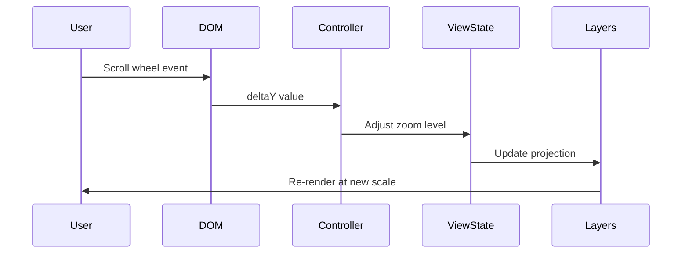

# Implementation Plan: Map Zooming Interaction

## Acceptance Criterion
> Map supports scroll wheel zooming

## Approach

Leverage deck.gl's `MapController` for scroll wheel zoom with smooth transitions. Configure zoom constraints to maintain usable map scale.

## Architecture



## Implementation Steps

### 1. Configure Zoom Behavior

```tsx
// src/components/EarthquakeMap/EarthquakeMap.tsx
import DeckGL from '@deck.gl/react';

const ZOOM_CONSTRAINTS = {
  minZoom: 0.5,  // Global view
  maxZoom: 12,   // Street level
};

export function EarthquakeMap() {
  return (
    <DeckGL
      controller={{
        scrollZoom: true,
        doubleClickZoom: true,
        touchZoom: true,
        minZoom: ZOOM_CONSTRAINTS.minZoom,
        maxZoom: ZOOM_CONSTRAINTS.maxZoom,
      }}
      viewState={viewState}
      onViewStateChange={onViewStateChange}
      layers={layers}
    >
      <Map mapStyle={MAP_STYLE} />
    </DeckGL>
  );
}
```

### 2. Zoom Speed Configuration

```tsx
// Customize zoom sensitivity
<DeckGL
  controller={{
    scrollZoom: {
      speed: 0.01,    // Zoom speed multiplier (default: 0.01)
      smooth: true,   // Enable smooth zooming
    },
  }}
/>
```

### 3. Zoom to Point of Interest

```tsx
// src/components/EarthquakeMap/useMapNavigation.ts
import { FlyToInterpolator } from '@deck.gl/core';

export function useMapNavigation(setViewState: (vs: ViewState) => void) {
  const zoomToLocation = useCallback(
    (longitude: number, latitude: number, zoom: number = 8) => {
      setViewState((prev) => ({
        ...prev,
        longitude,
        latitude,
        zoom,
        transitionDuration: 1000,
        transitionInterpolator: new FlyToInterpolator(),
      }));
    },
    [setViewState]
  );

  const zoomIn = useCallback(() => {
    setViewState((prev) => ({
      ...prev,
      zoom: Math.min(prev.zoom + 1, ZOOM_CONSTRAINTS.maxZoom),
      transitionDuration: 300,
    }));
  }, [setViewState]);

  const zoomOut = useCallback(() => {
    setViewState((prev) => ({
      ...prev,
      zoom: Math.max(prev.zoom - 1, ZOOM_CONSTRAINTS.minZoom),
      transitionDuration: 300,
    }));
  }, [setViewState]);

  return { zoomToLocation, zoomIn, zoomOut };
}
```

### 4. Zoom Controls UI

```tsx
// src/components/EarthquakeMap/ZoomControls.tsx
interface ZoomControlsProps {
  onZoomIn: () => void;
  onZoomOut: () => void;
  onResetView: () => void;
}

export function ZoomControls({ onZoomIn, onZoomOut, onResetView }: ZoomControlsProps) {
  return (
    <div className="absolute top-4 right-4 flex flex-col gap-1">
      <button
        onClick={onZoomIn}
        className="w-8 h-8 bg-white rounded shadow hover:bg-gray-100 flex items-center justify-center"
        aria-label="Zoom in"
      >
        +
      </button>
      <button
        onClick={onZoomOut}
        className="w-8 h-8 bg-white rounded shadow hover:bg-gray-100 flex items-center justify-center"
        aria-label="Zoom out"
      >
        −
      </button>
      <button
        onClick={onResetView}
        className="w-8 h-8 bg-white rounded shadow hover:bg-gray-100 flex items-center justify-center text-xs"
        aria-label="Reset view"
      >
        ⌂
      </button>
    </div>
  );
}
```

### 5. Handle Zoom Events for Layer Updates

```tsx
// Update layer properties based on zoom level
const getRadiusScale = (zoom: number): number => {
  // Reduce point size at higher zoom levels
  return Math.max(0.1, 2 - zoom * 0.1);
};

const layers = useMemo(
  () => [
    new ScatterplotLayer({
      ...baseConfig,
      radiusScale: getRadiusScale(viewState.zoom),
      updateTriggers: {
        radiusScale: viewState.zoom,
      },
    }),
  ],
  [data, viewState.zoom]
);
```

## Performance Considerations

### Throttle Zoom Updates

```typescript
// Throttle expensive operations during zoom
import { useThrottle } from '@uidotdev/usehooks';

const throttledZoom = useThrottle(viewState.zoom, 100);

useEffect(() => {
  // Only update data visibility based on throttled zoom
  updateVisibleData(throttledZoom);
}, [throttledZoom]);
```

### Level of Detail (LOD)

```typescript
// Show different data at different zoom levels
function getLayersForZoom(zoom: number, data: Earthquake[]) {
  if (zoom < 3) {
    // Cluster points at low zoom
    return [createClusteredLayer(data)];
  }
  // Show individual points at higher zoom
  return [createEarthquakeLayer(data)];
}
```

## Responsiveness

### Touch Zoom (Pinch Gesture)

```tsx
<DeckGL
  controller={{
    touchZoom: true,
    touchRotate: false, // Disable rotation for cleaner mobile UX
  }}
/>
```

### Mobile-Friendly Controls

```tsx
// Larger touch targets on mobile
<button
  className="w-8 h-8 md:w-10 md:h-10 touch-manipulation"
  // touch-manipulation prevents 300ms delay
>
```

## Accessibility

- Keyboard: `+`/`-` keys for zoom
- Screen readers: Announce zoom level changes
- Zoom controls have clear aria-labels

## Testing

### Unit Tests

Unit tests must be added for all new code.

```typescript
// src/components/EarthquakeMap/useMapNavigation.test.ts
describe('useMapNavigation', () => {
  - Test zoomToLocation updates view state with correct coordinates
  - Test zoomToLocation sets transition properties
  - Test zoomIn increases zoom level
  - Test zoomIn respects maxZoom constraint
  - Test zoomOut decreases zoom level
  - Test zoomOut respects minZoom constraint
});

describe('getRadiusScale', () => {
  - Test returns smaller scale at higher zoom levels
  - Test returns minimum scale threshold
});

// src/components/EarthquakeMap/ZoomControls.test.tsx
describe('ZoomControls', () => {
  - Test renders zoom in button
  - Test renders zoom out button
  - Test renders reset view button
  - Test calls onZoomIn when + clicked
  - Test calls onZoomOut when - clicked
  - Test calls onResetView when reset clicked
  - Test buttons have correct aria-labels
});
```

### Acceptance Tests

```gherkin
# features/earthquake-map.feature
Scenario: Zoom the map with scroll wheel
  Given I am on the home page
  When I scroll up on the map
  Then the map should zoom in

Scenario: Zoom the map with controls
  Given I am on the home page
  When I click the zoom in button
  Then the map should zoom in
```
