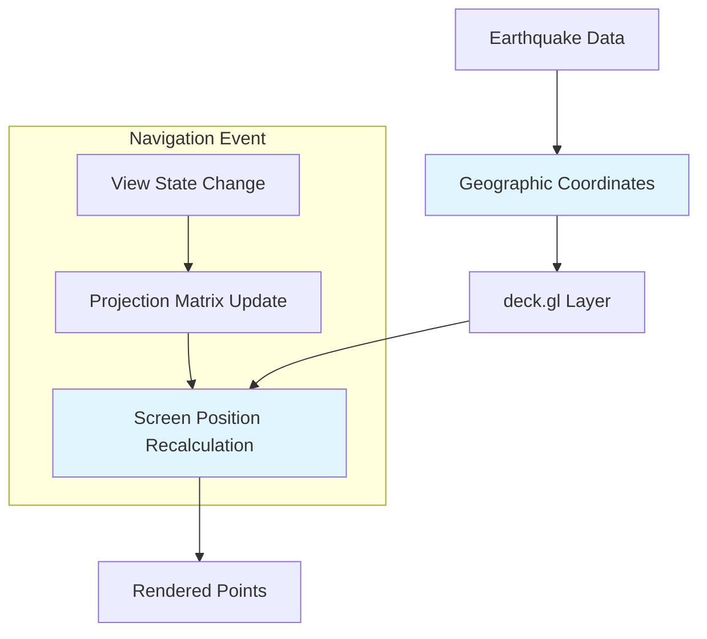

# Implementation Plan: Maintain Point Positions During Navigation

## Acceptance Criterion
> Map maintains earthquake point positions during navigation

## Approach

deck.gl automatically maintains geographic point positions during pan/zoom operations through its coordinate projection system. The key is ensuring proper layer configuration and avoiding unnecessary re-renders.

## Architecture



## How deck.gl Handles This

1. **Data remains in geographic coordinates** (longitude, latitude)
2. **View state changes update the projection matrix**
3. **GPU recalculates screen positions** using the new matrix
4. **Data array is NOT re-processed** - only the view transform changes

## Implementation Steps

### 1. Stable Data Reference

```tsx
// src/components/EarthquakeMap/EarthquakeMap.tsx
import { useMemo } from 'react';

export function EarthquakeMap({ earthquakes }: Props) {
  // Memoize layer to prevent unnecessary recreation
  const layers = useMemo(
    () => [createEarthquakeLayer(earthquakes)],
    [earthquakes] // Only recreate when data changes, NOT on view changes
  );

  // View state changes do NOT affect layers array
  return (
    <DeckGL
      viewState={viewState}
      onViewStateChange={onViewStateChange}
      layers={layers} // Stable reference during navigation
    >
      <Map mapStyle={MAP_STYLE} />
    </DeckGL>
  );
}
```

### 2. Proper Update Triggers

```typescript
// src/components/EarthquakeMap/layers/earthquakeLayer.ts

export function createEarthquakeLayer(data: Earthquake[]) {
  return new ScatterplotLayer<Earthquake>({
    id: 'earthquake-layer',
    data,

    // These accessors use geographic coordinates
    getPosition: (d) => [d.longitude, d.latitude],
    getRadius: (d) => magnitudeToRadius(d.magnitude),
    getFillColor: (d) => depthToColor(d.depth),

    // Update triggers tell deck.gl when to recalculate attributes
    // Importantly, these do NOT include viewState properties
    updateTriggers: {
      getPosition: [data.length],
      getRadius: [data.length],
      getFillColor: [data.length],
    },
  });
}
```

### 3. Avoid Anti-Patterns

```tsx
// ❌ BAD: Creating new layer on every view change
function EarthquakeMap({ earthquakes }) {
  const [viewState, setViewState] = useState(INITIAL_VIEW_STATE);

  // This creates a new layer array on every render!
  const layers = [createEarthquakeLayer(earthquakes)];

  return <DeckGL layers={layers} viewState={viewState} ... />;
}

// ✅ GOOD: Memoized layers, separate from view state
function EarthquakeMap({ earthquakes }) {
  const [viewState, setViewState] = useState(INITIAL_VIEW_STATE);

  // Only recreates when earthquakes change
  const layers = useMemo(
    () => [createEarthquakeLayer(earthquakes)],
    [earthquakes]
  );

  return <DeckGL layers={layers} viewState={viewState} ... />;
}
```

### 4. Coordinate System Verification

```typescript
// Ensure correct coordinate system is used
const layer = new ScatterplotLayer({
  // Default coordinate system - geographic coordinates
  coordinateSystem: COORDINATE_SYSTEM.LNGLAT,

  // Position accessor returns [longitude, latitude]
  getPosition: (d) => [d.longitude, d.latitude],

  // Optional: coordinate origin for relative coordinates
  // coordinateOrigin: [0, 0, 0], // Not needed for LNGLAT
});
```

## Performance Considerations

### Immutable Data Pattern

```typescript
// Use immutable updates to help React detect changes
const [earthquakes, setEarthquakes] = useState<Earthquake[]>([]);

// When updating data, create new array reference
const handleNewData = (newData: Earthquake[]) => {
  setEarthquakes([...newData]); // New array reference
};
```

### Binary Data for Large Datasets

```typescript
// For 100k+ points, use binary attributes
// These are stored on GPU and don't need recalculation during navigation
const layer = new ScatterplotLayer({
  data: {
    length: earthquakes.length,
    attributes: {
      getPosition: { value: positionBuffer, size: 2 },
      getRadius: { value: radiusBuffer, size: 1 },
      getFillColor: { value: colorBuffer, size: 4, normalized: true },
    },
  },
});
```

## Testing

```typescript
// src/components/EarthquakeMap/__tests__/positionStability.test.tsx
import { render, screen, fireEvent } from '@testing-library/react';

describe('Point Position Stability', () => {
  it('maintains point positions during pan', () => {
    const earthquakes = [
      { id: '1', longitude: -122.4, latitude: 37.8, magnitude: 5, depth: 10 },
    ];

    render(<EarthquakeMap earthquakes={earthquakes} />);

    // Get initial point position (would need deck.gl test utils)
    const initialPosition = getPointScreenPosition('1');

    // Simulate pan
    simulatePan({ deltaX: 100, deltaY: 50 });

    // Point should have moved by the same delta
    const newPosition = getPointScreenPosition('1');
    expect(newPosition.x - initialPosition.x).toBeCloseTo(100);
    expect(newPosition.y - initialPosition.y).toBeCloseTo(50);
  });
});
```

## Summary

The key points for maintaining position stability:

1. **Memoize layers** - Don't recreate on view state changes
2. **Separate concerns** - Data state vs. view state
3. **Use geographic coordinates** - Let deck.gl handle projection
4. **Proper update triggers** - Only trigger on data changes
