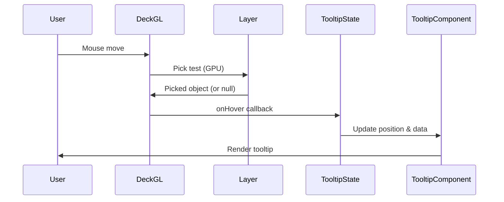

# Implementation Plan: Tooltip on Hover

## Acceptance Criterion

> Tooltip appears on point hover

## Approach

Use deck.gl's `pickable` layer property combined with `onHover` callback to detect when the cursor is over an earthquake point. Render a custom React tooltip component at the cursor position.

## Architecture



## Implementation Steps

### 1. Enable Picking on Layer

```typescript
// src/components/EarthquakeMap/layers/earthquakeLayer.ts

export function createEarthquakeLayer(data: Earthquake[]) {
  return new ScatterplotLayer<Earthquake>({
    id: 'earthquake-layer',
    data,
    pickable: true, // Enable GPU-based picking

    // ... other props
  });
}
```

### 2. Create Tooltip State Hook

```tsx
// src/components/EarthquakeMap/hooks/useTooltip.ts
import { useState, useCallback } from 'react';
import type { PickingInfo } from '@deck.gl/core';
import type { Earthquake } from '../../../types/earthquake';

interface TooltipState {
  object: Earthquake | null;
  x: number;
  y: number;
}

export function useTooltip() {
  const [tooltip, setTooltip] = useState<TooltipState | null>(null);

  const onHover = useCallback((info: PickingInfo<Earthquake>) => {
    if (info.object) {
      setTooltip({
        object: info.object,
        x: info.x,
        y: info.y,
      });
    } else {
      setTooltip(null);
    }
  }, []);

  return { tooltip, onHover };
}
```

### 3. Create Tooltip Component

```tsx
// src/components/EarthquakeMap/Tooltip/EarthquakeTooltip.tsx
import type { Earthquake } from '../../../types/earthquake';

interface TooltipProps {
  earthquake: Earthquake;
  x: number;
  y: number;
}

export function EarthquakeTooltip({ earthquake, x, y }: TooltipProps) {
  // Offset tooltip from cursor
  const offsetX = 10;
  const offsetY = 10;

  return (
    <div
      className="absolute pointer-events-none z-50 bg-white/95 px-3 py-2 rounded-lg shadow-lg border border-gray-200 text-sm"
      style={{
        left: x + offsetX,
        top: y + offsetY,
        transform: 'translate(0, -50%)',
      }}
    >
      <div className="font-semibold text-gray-900">
        M{earthquake.magnitude.toFixed(1)}
      </div>
      <div className="text-gray-600">{earthquake.location}</div>
    </div>
  );
}
```

### 4. Integrate with Map Component

```tsx
// src/components/EarthquakeMap/EarthquakeMap.tsx
import { useTooltip } from './hooks/useTooltip';
import { EarthquakeTooltip } from './Tooltip/EarthquakeTooltip';

export function EarthquakeMap({ earthquakes }: Props) {
  const { tooltip, onHover } = useTooltip();

  const layers = useMemo(
    () => [createEarthquakeLayer(earthquakes)],
    [earthquakes]
  );

  return (
    <div className="relative w-full h-full">
      <DeckGL
        viewState={viewState}
        onViewStateChange={onViewStateChange}
        controller={true}
        layers={layers}
        onHover={onHover}
        getTooltip={null} // Disable built-in tooltip, use custom
      >
        <Map mapStyle={MAP_STYLE} />
      </DeckGL>

      {tooltip && (
        <EarthquakeTooltip
          earthquake={tooltip.object}
          x={tooltip.x}
          y={tooltip.y}
        />
      )}
    </div>
  );
}
```

### 5. Handle Viewport Edge Cases

```tsx
// src/components/EarthquakeMap/Tooltip/EarthquakeTooltip.tsx
import { useRef, useEffect, useState } from 'react';

export function EarthquakeTooltip({ earthquake, x, y }: TooltipProps) {
  const tooltipRef = useRef<HTMLDivElement>(null);
  const [position, setPosition] = useState({ left: x, top: y });

  useEffect(() => {
    if (!tooltipRef.current) return;

    const tooltip = tooltipRef.current;
    const rect = tooltip.getBoundingClientRect();
    const viewport = {
      width: window.innerWidth,
      height: window.innerHeight,
    };

    let left = x + 10;
    let top = y + 10;

    // Flip horizontally if tooltip would overflow right edge
    if (left + rect.width > viewport.width - 10) {
      left = x - rect.width - 10;
    }

    // Flip vertically if tooltip would overflow bottom edge
    if (top + rect.height > viewport.height - 10) {
      top = y - rect.height - 10;
    }

    setPosition({ left, top });
  }, [x, y]);

  return (
    <div
      ref={tooltipRef}
      className="absolute pointer-events-none z-50 bg-white/95 px-3 py-2 rounded-lg shadow-lg"
      style={{ left: position.left, top: position.top }}
    >
      {/* Content */}
    </div>
  );
}
```

## Performance Considerations

### Debounce Rapid Hover Events

```typescript
// Optional: debounce for very dense point clusters
import { useDebouncedCallback } from 'use-debounce';

const debouncedOnHover = useDebouncedCallback(
  (info: PickingInfo<Earthquake>) => {
    if (info.object) {
      setTooltip({ object: info.object, x: info.x, y: info.y });
    } else {
      setTooltip(null);
    }
  },
  16 // ~60fps
);
```

### Pick Radius for Touch Devices

```typescript
// Increase pick radius on touch devices
<DeckGL
  pickingRadius={isTouchDevice ? 10 : 2}
/>
```

## Responsiveness

### Touch-Friendly Alternative

```tsx
// On touch devices, use click instead of hover
const handleInteraction = useCallback((info: PickingInfo<Earthquake>) => {
  if (info.object) {
    setTooltip({ object: info.object, x: info.x, y: info.y });
  }
}, []);

<DeckGL
  onHover={!isTouchDevice ? onHover : undefined}
  onClick={isTouchDevice ? handleInteraction : undefined}
/>;
```

## Accessibility

```tsx
// Add ARIA attributes for screen readers
<div role="tooltip" aria-live="polite" className="...">
  <span className="sr-only">Earthquake details:</span>
  {/* Tooltip content */}
</div>
```

## Testing

### Unit Tests

Unit tests must be added for all new code.

```typescript
// src/components/EarthquakeMap/hooks/useTooltip.test.ts
describe('useTooltip', () => {
  - Test initial tooltip state is null
  - Test onHover with object sets tooltip state
  - Test onHover without object clears tooltip state
  - Test tooltip contains correct x, y coordinates
});

// src/components/EarthquakeMap/Tooltip/EarthquakeTooltip.test.tsx
describe('EarthquakeTooltip', () => {
  - Test renders earthquake magnitude
  - Test renders earthquake location
  - Test positions at correct x, y coordinates
  - Test has pointer-events-none class
  - Test has tooltip ARIA role
});
```

### Acceptance Tests

```gherkin
# features/earthquake-map.feature
Scenario: Tooltip appears on hover
  Given I am on the home page
  And earthquake data has loaded
  When I hover over an earthquake point
  Then a tooltip should appear near the cursor
```
