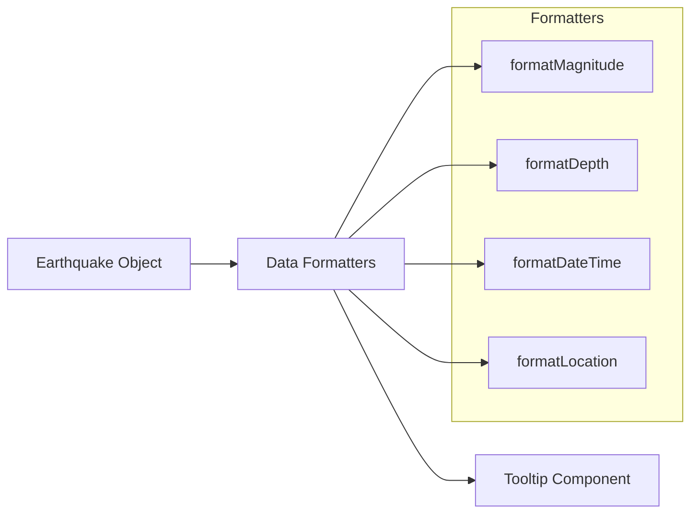

# Implementation Plan: Tooltip Content Display

## Acceptance Criterion
> Tooltip displays magnitude, depth, location, and date/time

## Approach

Create a structured tooltip component that formats and displays earthquake metadata in a readable, consistent format. Use proper formatting for numbers, dates, and geographic coordinates.

## Architecture



## Data Structure Reference

```typescript
interface Earthquake {
  id: string;
  longitude: number;
  latitude: number;
  depth: number;        // km below surface
  magnitude: number;    // Richter scale
  timestamp: string;    // ISO 8601 format
  location: string;     // Human-readable place name
}
```

## Implementation Steps

### 1. Create Formatting Utilities

```typescript
// src/utils/formatters.ts

/**
 * Format magnitude with appropriate precision and descriptor
 */
export function formatMagnitude(magnitude: number): {
  value: string;
  descriptor: string;
} {
  const value = magnitude.toFixed(1);

  let descriptor: string;
  if (magnitude < 3) descriptor = 'Minor';
  else if (magnitude < 4) descriptor = 'Light';
  else if (magnitude < 5) descriptor = 'Moderate';
  else if (magnitude < 6) descriptor = 'Strong';
  else if (magnitude < 7) descriptor = 'Major';
  else descriptor = 'Great';

  return { value, descriptor };
}

/**
 * Format depth with unit and classification
 */
export function formatDepth(depthKm: number): {
  value: string;
  classification: string;
} {
  const value = depthKm < 100
    ? `${depthKm.toFixed(1)} km`
    : `${Math.round(depthKm)} km`;

  let classification: string;
  if (depthKm < 70) classification = 'Shallow';
  else if (depthKm < 300) classification = 'Intermediate';
  else classification = 'Deep';

  return { value, classification };
}

/**
 * Format ISO timestamp to localized date/time
 */
export function formatDateTime(isoTimestamp: string): {
  date: string;
  time: string;
  relative: string;
} {
  const date = new Date(isoTimestamp);

  return {
    date: date.toLocaleDateString(undefined, {
      year: 'numeric',
      month: 'short',
      day: 'numeric',
    }),
    time: date.toLocaleTimeString(undefined, {
      hour: '2-digit',
      minute: '2-digit',
      timeZoneName: 'short',
    }),
    relative: getRelativeTime(date),
  };
}

/**
 * Get relative time string (e.g., "2 hours ago")
 */
function getRelativeTime(date: Date): string {
  const now = new Date();
  const diffMs = now.getTime() - date.getTime();
  const diffMins = Math.floor(diffMs / 60000);
  const diffHours = Math.floor(diffMins / 60);
  const diffDays = Math.floor(diffHours / 24);

  if (diffMins < 60) return `${diffMins} min ago`;
  if (diffHours < 24) return `${diffHours} hours ago`;
  if (diffDays < 7) return `${diffDays} days ago`;
  return '';
}

/**
 * Format coordinates for display
 */
export function formatCoordinates(lng: number, lat: number): string {
  const latDir = lat >= 0 ? 'N' : 'S';
  const lngDir = lng >= 0 ? 'E' : 'W';

  return `${Math.abs(lat).toFixed(3)}°${latDir}, ${Math.abs(lng).toFixed(3)}°${lngDir}`;
}
```

### 2. Create Tooltip Content Component

```tsx
// src/components/EarthquakeMap/Tooltip/TooltipContent.tsx
import type { Earthquake } from '../../../types/earthquake';
import {
  formatMagnitude,
  formatDepth,
  formatDateTime,
  formatCoordinates,
} from '../../../utils/formatters';

interface TooltipContentProps {
  earthquake: Earthquake;
}

export function TooltipContent({ earthquake }: TooltipContentProps) {
  const magnitude = formatMagnitude(earthquake.magnitude);
  const depth = formatDepth(earthquake.depth);
  const dateTime = formatDateTime(earthquake.timestamp);

  return (
    <div className="space-y-2">
      {/* Header: Magnitude */}
      <div className="flex items-baseline gap-2">
        <span className="text-2xl font-bold text-gray-900">
          M{magnitude.value}
        </span>
        <span className="text-sm text-gray-500">
          {magnitude.descriptor}
        </span>
      </div>

      {/* Location */}
      <div>
        <div className="font-medium text-gray-800">
          {earthquake.location}
        </div>
        <div className="text-xs text-gray-500">
          {formatCoordinates(earthquake.longitude, earthquake.latitude)}
        </div>
      </div>

      {/* Details Grid */}
      <div className="grid grid-cols-2 gap-x-4 gap-y-1 text-sm border-t pt-2">
        <div>
          <span className="text-gray-500">Depth:</span>
          <span className="ml-1 font-medium">{depth.value}</span>
          <span className="text-xs text-gray-400 ml-1">({depth.classification})</span>
        </div>

        <div>
          <span className="text-gray-500">Date:</span>
          <span className="ml-1 font-medium">{dateTime.date}</span>
        </div>

        <div className="col-span-2">
          <span className="text-gray-500">Time:</span>
          <span className="ml-1 font-medium">{dateTime.time}</span>
          {dateTime.relative && (
            <span className="text-xs text-gray-400 ml-2">
              ({dateTime.relative})
            </span>
          )}
        </div>
      </div>
    </div>
  );
}
```

### 3. Integrate with Tooltip Wrapper

```tsx
// src/components/EarthquakeMap/Tooltip/EarthquakeTooltip.tsx
import { TooltipContent } from './TooltipContent';

export function EarthquakeTooltip({ earthquake, x, y }: TooltipProps) {
  return (
    <div
      className="absolute pointer-events-none z-50 bg-white/95 backdrop-blur-sm px-4 py-3 rounded-lg shadow-lg border border-gray-200 min-w-[200px] max-w-[300px]"
      style={{ left: x + 15, top: y - 10 }}
    >
      <TooltipContent earthquake={earthquake} />
    </div>
  );
}
```

### 4. Visual Indicators

```tsx
// Add color indicator matching map point
export function TooltipContent({ earthquake }: TooltipContentProps) {
  const depthColor = getDepthColorCSS(earthquake.depth);

  return (
    <div className="space-y-2">
      {/* Color indicator bar */}
      <div
        className="h-1 w-full rounded-full"
        style={{ backgroundColor: depthColor }}
      />

      {/* ... rest of content */}
    </div>
  );
}

function getDepthColorCSS(depth: number): string {
  const t = Math.min(depth / 700, 1);
  const g = Math.round(255 * (1 - t));
  return `rgb(255, ${g}, 0)`;
}
```

## Performance Considerations

- Formatters are pure functions - can be memoized if needed
- Tooltip content is lightweight - no heavy computations
- Use `Intl` APIs for locale-aware formatting (browser-optimized)

## Responsiveness

```tsx
// Compact layout for smaller screens
<div className="space-y-1 md:space-y-2">
  {/* On mobile, use stacked layout */}
  <div className="md:grid md:grid-cols-2">
    {/* ... */}
  </div>
</div>
```

## Accessibility

```tsx
<div role="tooltip" aria-label={`Earthquake details: Magnitude ${earthquake.magnitude}`}>
  <span className="sr-only">
    Magnitude {magnitude.value} {magnitude.descriptor} earthquake.
    Location: {earthquake.location}.
    Depth: {depth.value}.
    Occurred on {dateTime.date} at {dateTime.time}.
  </span>
  {/* Visual content */}
</div>
```
