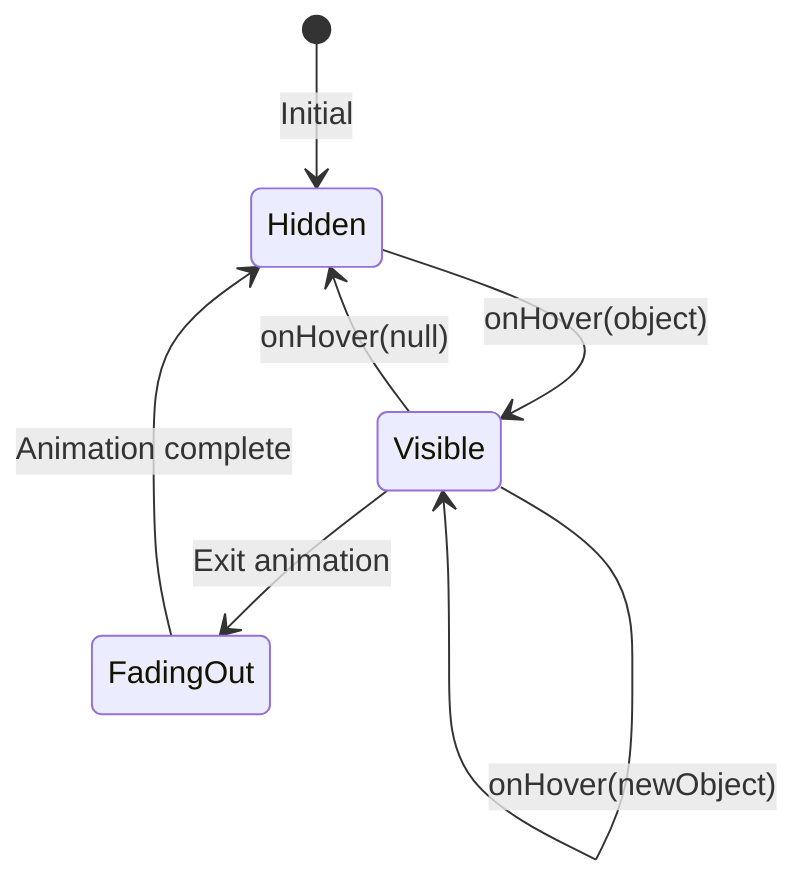

# Implementation Plan: Tooltip Dismiss Behavior

## Acceptance Criterion
> Tooltip dismisses when cursor moves away

## Approach

Leverage deck.gl's `onHover` callback which automatically fires with `object: null` when the cursor leaves a pickable object. Implement smooth dismiss transitions and handle edge cases.

## Architecture



## Implementation Steps

### 1. Basic Dismiss Logic

```tsx
// src/components/EarthquakeMap/hooks/useTooltip.ts
import { useState, useCallback } from 'react';
import type { PickingInfo } from '@deck.gl/core';
import type { Earthquake } from '../../../types/earthquake';

export function useTooltip() {
  const [tooltip, setTooltip] = useState<TooltipState | null>(null);

  const onHover = useCallback((info: PickingInfo<Earthquake>) => {
    if (info.object) {
      // Show tooltip
      setTooltip({
        object: info.object,
        x: info.x,
        y: info.y,
      });
    } else {
      // Dismiss tooltip when cursor leaves
      setTooltip(null);
    }
  }, []);

  return { tooltip, onHover };
}
```

### 2. Smooth Fade Transition

```tsx
// src/components/EarthquakeMap/Tooltip/EarthquakeTooltip.tsx
import { useState, useEffect } from 'react';
import type { Earthquake } from '../../../types/earthquake';

interface TooltipProps {
  earthquake: Earthquake | null;
  x: number;
  y: number;
}

export function EarthquakeTooltip({ earthquake, x, y }: TooltipProps) {
  const [visible, setVisible] = useState(false);
  const [displayData, setDisplayData] = useState<Earthquake | null>(null);
  const [position, setPosition] = useState({ x: 0, y: 0 });

  useEffect(() => {
    if (earthquake) {
      // Show immediately with new data
      setDisplayData(earthquake);
      setPosition({ x, y });
      setVisible(true);
    } else {
      // Start fade out
      setVisible(false);
      // Clear data after transition completes
      const timer = setTimeout(() => setDisplayData(null), 150);
      return () => clearTimeout(timer);
    }
  }, [earthquake, x, y]);

  if (!displayData) return null;

  return (
    <div
      className={`
        absolute pointer-events-none z-50
        bg-white/95 px-4 py-3 rounded-lg shadow-lg
        transition-opacity duration-150
        ${visible ? 'opacity-100' : 'opacity-0'}
      `}
      style={{
        left: position.x + 15,
        top: position.y - 10,
      }}
    >
      <TooltipContent earthquake={displayData} />
    </div>
  );
}
```

### 3. Delayed Dismiss (Prevents Flickering)

```tsx
// src/components/EarthquakeMap/hooks/useTooltip.ts
import { useState, useCallback, useRef } from 'react';

export function useTooltip() {
  const [tooltip, setTooltip] = useState<TooltipState | null>(null);
  const dismissTimerRef = useRef<number | null>(null);

  const onHover = useCallback((info: PickingInfo<Earthquake>) => {
    // Clear any pending dismiss
    if (dismissTimerRef.current) {
      clearTimeout(dismissTimerRef.current);
      dismissTimerRef.current = null;
    }

    if (info.object) {
      setTooltip({
        object: info.object,
        x: info.x,
        y: info.y,
      });
    } else {
      // Small delay before dismissing to prevent flicker
      // when moving between adjacent points
      dismissTimerRef.current = window.setTimeout(() => {
        setTooltip(null);
      }, 50);
    }
  }, []);

  return { tooltip, onHover };
}
```

### 4. Handle Map Pan/Zoom Dismiss

```tsx
// src/components/EarthquakeMap/EarthquakeMap.tsx
export function EarthquakeMap({ earthquakes }: Props) {
  const { tooltip, onHover, clearTooltip } = useTooltip();

  const onViewStateChange = useCallback(
    ({ viewState, interactionState }) => {
      setViewState(viewState);

      // Dismiss tooltip during pan/zoom
      if (interactionState?.isDragging || interactionState?.isZooming) {
        clearTooltip();
      }
    },
    [clearTooltip]
  );

  return (
    <DeckGL
      onViewStateChange={onViewStateChange}
      onHover={onHover}
      layers={layers}
    >
      {/* ... */}
    </DeckGL>
  );
}
```

### 5. Touch Device Dismiss

```tsx
// src/components/EarthquakeMap/hooks/useTooltip.ts
export function useTooltip(isTouchDevice: boolean) {
  const [tooltip, setTooltip] = useState<TooltipState | null>(null);

  // On touch devices, dismiss on tap anywhere else
  const onClick = useCallback((info: PickingInfo<Earthquake>) => {
    if (isTouchDevice) {
      if (info.object) {
        // Show tooltip on tap
        setTooltip({ object: info.object, x: info.x, y: info.y });
      } else {
        // Dismiss on tap elsewhere
        setTooltip(null);
      }
    }
  }, [isTouchDevice]);

  // Desktop: use hover
  const onHover = useCallback((info: PickingInfo<Earthquake>) => {
    if (!isTouchDevice) {
      if (info.object) {
        setTooltip({ object: info.object, x: info.x, y: info.y });
      } else {
        setTooltip(null);
      }
    }
  }, [isTouchDevice]);

  return { tooltip, onHover, onClick };
}
```

### 6. Escape Key Dismiss

```tsx
// src/components/EarthquakeMap/hooks/useTooltip.ts
import { useEffect } from 'react';

export function useTooltip() {
  const [tooltip, setTooltip] = useState<TooltipState | null>(null);

  // Dismiss on Escape key
  useEffect(() => {
    const handleKeyDown = (e: KeyboardEvent) => {
      if (e.key === 'Escape' && tooltip) {
        setTooltip(null);
      }
    };

    window.addEventListener('keydown', handleKeyDown);
    return () => window.removeEventListener('keydown', handleKeyDown);
  }, [tooltip]);

  // ... rest of hook
}
```

## Performance Considerations

### Debounce Rapid Hover Changes

```typescript
// Prevent excessive re-renders during fast cursor movement
const debouncedSetTooltip = useDebouncedCallback(setTooltip, 16);
```

### Avoid Layout Thrashing

```tsx
// Use transform instead of top/left for better performance
<div
  style={{
    transform: `translate(${x + 15}px, ${y - 10}px)`,
    willChange: visible ? 'transform, opacity' : 'auto',
  }}
/>
```

## Edge Cases

| Scenario | Behavior |
|----------|----------|
| Cursor moves to adjacent point | Update tooltip without dismiss |
| Rapid cursor movement | Debounce prevents flicker |
| Map pan during hover | Dismiss tooltip |
| Window loses focus | Keep tooltip visible |
| Touch device | Dismiss on tap outside |
| Escape key pressed | Dismiss tooltip |

## Accessibility

```tsx
// Allow keyboard users to dismiss
<div
  role="tooltip"
  aria-hidden={!visible}
  // ...
/>
```

## Testing

### Unit Tests

Unit tests must be added for all new code.

```typescript
// src/components/EarthquakeMap/hooks/useTooltip.test.ts
describe('useTooltip dismiss behavior', () => {
  - Test tooltip clears when onHover called with null object
  - Test dismiss delay prevents flickering
  - Test dismiss timer is cleared when new object hovered
  - Test clearTooltip function clears tooltip immediately
});

describe('useTooltip keyboard dismiss', () => {
  - Test Escape key dismisses tooltip
  - Test other keys do not dismiss tooltip
});

describe('useTooltip touch device behavior', () => {
  - Test tap on point shows tooltip
  - Test tap elsewhere dismisses tooltip
  - Test hover is ignored on touch devices
});

// src/components/EarthquakeMap/Tooltip/EarthquakeTooltip.test.tsx
describe('EarthquakeTooltip transitions', () => {
  - Test opacity is 1 when visible
  - Test opacity is 0 when not visible
  - Test transition class is applied
  - Test data persists during fade-out animation
});
```

### Acceptance Tests

```gherkin
# features/earthquake-map.feature
Scenario: Tooltip dismisses when moving away
  Given I am on the home page
  And earthquake data has loaded
  And I am hovering over an earthquake point
  When I move the cursor away from the point
  Then the tooltip should disappear

Scenario: Tooltip dismisses during map interaction
  Given I am on the home page
  And a tooltip is visible
  When I start panning the map
  Then the tooltip should disappear
```
