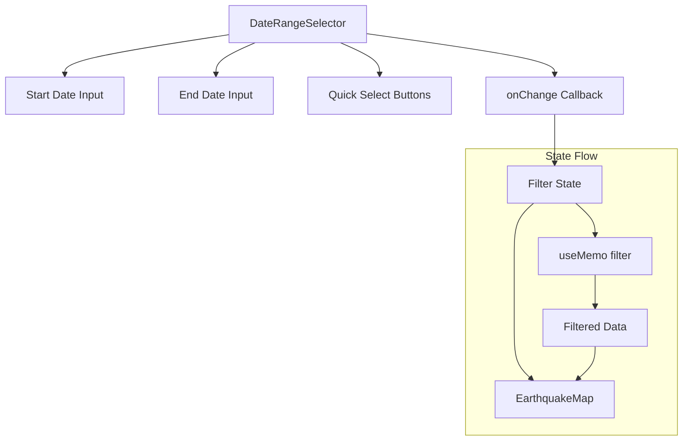

# Implementation Plan: Date Range Selector

## Acceptance Criterion

> Date range selector is available

## Approach

Create a date range picker component using native HTML date inputs for simplicity and browser compatibility. The component will manage start and end dates and communicate changes to parent components via callbacks.

## Architecture



## Implementation Steps

### 1. Create Date Range Type

```typescript
// src/types/filters.ts
export interface DateRange {
  startDate: Date | null;
  endDate: Date | null;
}

export interface FilterState {
  dateRange: DateRange;
  // Future: magnitude range, depth range, etc.
}
```

### 2. Create Date Range Selector Component

```tsx
// src/components/EarthquakeMap/Filters/DateRangeSelector.tsx
import { useCallback } from 'react';
import type { DateRange } from '../../../types/filters';

interface DateRangeSelectorProps {
  value: DateRange;
  onChange: (range: DateRange) => void;
  minDate?: Date;
  maxDate?: Date;
}

export function DateRangeSelector({
  value,
  onChange,
  minDate,
  maxDate,
}: DateRangeSelectorProps) {
  const handleStartChange = useCallback(
    (e: React.ChangeEvent<HTMLInputElement>) => {
      const date = e.target.value ? new Date(e.target.value) : null;
      onChange({ ...value, startDate: date });
    },
    [value, onChange]
  );

  const handleEndChange = useCallback(
    (e: React.ChangeEvent<HTMLInputElement>) => {
      const date = e.target.value ? new Date(e.target.value) : null;
      onChange({ ...value, endDate: date });
    },
    [value, onChange]
  );

  const formatDateForInput = (date: Date | null): string => {
    if (!date) return '';
    return date.toISOString().split('T')[0];
  };

  return (
    <div className="flex flex-col gap-2 p-3 bg-white/90 rounded-lg shadow">
      <label className="text-sm font-semibold text-gray-700">Time Period</label>

      <div className="flex flex-col sm:flex-row gap-2">
        <div className="flex-1">
          <label className="text-xs text-gray-500" htmlFor="start-date">
            From
          </label>
          <input
            id="start-date"
            type="date"
            value={formatDateForInput(value.startDate)}
            onChange={handleStartChange}
            min={minDate ? formatDateForInput(minDate) : undefined}
            max={formatDateForInput(value.endDate || maxDate || new Date())}
            className="w-full px-2 py-1 border rounded text-sm focus:ring-2 focus:ring-blue-500"
          />
        </div>

        <div className="flex-1">
          <label className="text-xs text-gray-500" htmlFor="end-date">
            To
          </label>
          <input
            id="end-date"
            type="date"
            value={formatDateForInput(value.endDate)}
            onChange={handleEndChange}
            min={formatDateForInput(value.startDate || minDate)}
            max={
              maxDate
                ? formatDateForInput(maxDate)
                : formatDateForInput(new Date())
            }
            className="w-full px-2 py-1 border rounded text-sm focus:ring-2 focus:ring-blue-500"
          />
        </div>
      </div>
    </div>
  );
}
```

### 3. Add Quick Select Presets

```tsx
// src/components/EarthquakeMap/Filters/DateRangeSelector.tsx

const PRESETS = [
  { label: '24h', days: 1 },
  { label: '7d', days: 7 },
  { label: '30d', days: 30 },
  { label: '1y', days: 365 },
  { label: 'All', days: null },
];

export function DateRangeSelector({
  value,
  onChange,
  minDate,
  maxDate,
}: Props) {
  const handlePresetClick = useCallback(
    (days: number | null) => {
      if (days === null) {
        onChange({ startDate: null, endDate: null });
      } else {
        const end = new Date();
        const start = new Date();
        start.setDate(end.getDate() - days);
        onChange({ startDate: start, endDate: end });
      }
    },
    [onChange]
  );

  return (
    <div className="flex flex-col gap-2 p-3 bg-white/90 rounded-lg shadow">
      {/* Quick presets */}
      <div className="flex gap-1 mb-2">
        {PRESETS.map(({ label, days }) => (
          <button
            key={label}
            onClick={() => handlePresetClick(days)}
            className={`
              px-2 py-1 text-xs rounded
              ${
                isPresetActive(value, days)
                  ? 'bg-blue-500 text-white'
                  : 'bg-gray-100 hover:bg-gray-200 text-gray-700'
              }
            `}
          >
            {label}
          </button>
        ))}
      </div>

      {/* Date inputs */}
      <div className="flex flex-col sm:flex-row gap-2">
        {/* ... date inputs from above */}
      </div>
    </div>
  );
}

function isPresetActive(value: DateRange, days: number | null): boolean {
  if (days === null) {
    return value.startDate === null && value.endDate === null;
  }
  if (!value.startDate || !value.endDate) return false;

  const expectedStart = new Date();
  expectedStart.setDate(expectedStart.getDate() - days);

  return (
    Math.abs(value.startDate.getTime() - expectedStart.getTime()) < 86400000 &&
    Math.abs(value.endDate.getTime() - Date.now()) < 86400000
  );
}
```

### 4. Create Filter State Hook

```tsx
// src/components/EarthquakeMap/hooks/useFilterState.ts
import { useState, useCallback } from 'react';
import type { DateRange, FilterState } from '../../../types/filters';

const INITIAL_FILTER_STATE: FilterState = {
  dateRange: {
    startDate: null,
    endDate: null,
  },
};

export function useFilterState() {
  const [filters, setFilters] = useState<FilterState>(INITIAL_FILTER_STATE);

  const setDateRange = useCallback((dateRange: DateRange) => {
    setFilters((prev) => ({ ...prev, dateRange }));
  }, []);

  const resetFilters = useCallback(() => {
    setFilters(INITIAL_FILTER_STATE);
  }, []);

  return {
    filters,
    setDateRange,
    resetFilters,
  };
}
```

### 5. Integrate with Map Component

```tsx
// src/components/EarthquakeMap/EarthquakeMap.tsx
import { DateRangeSelector } from './Filters/DateRangeSelector';
import { useFilterState } from './hooks/useFilterState';

export function EarthquakeMap({ earthquakes }: Props) {
  const { filters, setDateRange } = useFilterState();

  // Compute date bounds from data
  const dateBounds = useMemo(() => {
    if (earthquakes.length === 0) return { min: undefined, max: undefined };

    const timestamps = earthquakes.map((eq) => new Date(eq.timestamp).getTime());
    return {
      min: new Date(Math.min(...timestamps)),
      max: new Date(Math.max(...timestamps)),
    };
  }, [earthquakes]);

  return (
    <div className="relative w-full h-full">
      <DeckGL ...>
        <Map mapStyle={MAP_STYLE} />
      </DeckGL>

      {/* Filter Panel */}
      <div className="absolute top-4 left-4 z-10">
        <DateRangeSelector
          value={filters.dateRange}
          onChange={setDateRange}
          minDate={dateBounds.min}
          maxDate={dateBounds.max}
        />
      </div>
    </div>
  );
}
```

## Performance Considerations

### Memoize Date Bounds Calculation

```typescript
const dateBounds = useMemo(() => {
  // Only recalculate when data changes
}, [earthquakes]);
```

### Debounce Filter Changes

```typescript
// Prevent excessive filtering during rapid input
const debouncedSetDateRange = useDebouncedCallback(setDateRange, 300);
```

## Responsiveness

```tsx
// Mobile-friendly layout
<div className="flex flex-col sm:flex-row gap-2">
  {/* Stack vertically on mobile, horizontal on larger screens */}
</div>

// Collapsible on mobile
<details className="sm:hidden">
  <summary className="cursor-pointer p-2 bg-white rounded shadow">
    Filters
  </summary>
  <DateRangeSelector ... />
</details>
```

## Accessibility

```tsx
<div role="group" aria-labelledby="date-range-label">
  <span id="date-range-label" className="sr-only">
    Filter earthquakes by date range
  </span>

  <label htmlFor="start-date">Start date</label>
  <input id="start-date" type="date" aria-describedby="date-range-help" />

  <span id="date-range-help" className="sr-only">
    Select start and end dates to filter displayed earthquakes
  </span>
</div>
```

## Testing

### Unit Tests

Unit tests must be added for all new code.

```typescript
// src/components/EarthquakeMap/Filters/DateRangeSelector.test.tsx
describe('DateRangeSelector', () => {
  - Test renders start and end date inputs
  - Test calls onChange when start date changes
  - Test calls onChange when end date changes
  - Test formats dates correctly for input values
  - Test respects minDate and maxDate constraints
  - Test start date max is constrained by end date
  - Test end date min is constrained by start date
});

describe('DateRangeSelector presets', () => {
  - Test renders all preset buttons (24h, 7d, 30d, 1y, All)
  - Test clicking preset updates date range correctly
  - Test active preset is highlighted
  - Test "All" preset clears both dates
});

// src/components/EarthquakeMap/hooks/useFilterState.test.ts
describe('useFilterState', () => {
  - Test initial filter state
  - Test setDateRange updates date range
  - Test resetFilters returns to initial state
});

describe('isPresetActive', () => {
  - Test returns true when dates match preset range
  - Test returns false when dates don't match
  - Test handles null dates for "All" preset
});
```

### Acceptance Tests

```gherkin
# features/earthquake-map.feature
Scenario: Filter by date range
  Given I am on the home page
  And the date range selector is visible
  When I select a start date of "2024-01-01"
  And I select an end date of "2024-12-31"
  Then only earthquakes within that date range should be displayed

Scenario: Use date range preset
  Given I am on the home page
  When I click the "7d" preset button
  Then the date range should be set to the last 7 days
```
