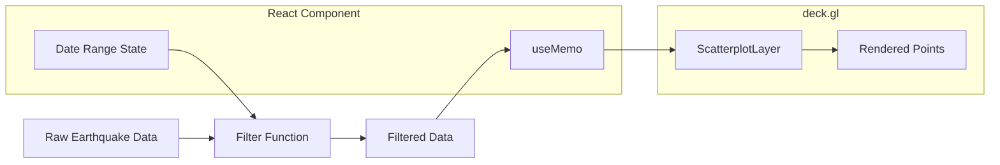

# Implementation Plan: Map Updates on Filter

## Acceptance Criterion
> Map updates to show only earthquakes within selected range

## Approach

Apply client-side filtering to the earthquake dataset based on the selected date range. Use `useMemo` to efficiently compute filtered data and pass it to the deck.gl layer.

## Architecture



## Implementation Steps

### 1. Create Filter Utility

```typescript
// src/utils/filterEarthquakes.ts
import type { Earthquake } from '../types/earthquake';
import type { DateRange } from '../types/filters';

/**
 * Filter earthquakes by date range.
 * Returns all earthquakes if range is null/undefined.
 */
export function filterByDateRange(
  earthquakes: Earthquake[],
  dateRange: DateRange
): Earthquake[] {
  const { startDate, endDate } = dateRange;

  // No filter applied
  if (!startDate && !endDate) {
    return earthquakes;
  }

  return earthquakes.filter((eq) => {
    const timestamp = new Date(eq.timestamp).getTime();

    if (startDate && timestamp < startDate.getTime()) {
      return false;
    }

    if (endDate) {
      // Include end date (end of day)
      const endOfDay = new Date(endDate);
      endOfDay.setHours(23, 59, 59, 999);
      if (timestamp > endOfDay.getTime()) {
        return false;
      }
    }

    return true;
  });
}
```

### 2. Create Combined Filter Hook

```typescript
// src/components/EarthquakeMap/hooks/useFilteredEarthquakes.ts
import { useMemo } from 'react';
import type { Earthquake } from '../../../types/earthquake';
import type { FilterState } from '../../../types/filters';
import { filterByDateRange } from '../../../utils/filterEarthquakes';

export function useFilteredEarthquakes(
  earthquakes: Earthquake[],
  filters: FilterState
): Earthquake[] {
  return useMemo(() => {
    let filtered = earthquakes;

    // Apply date range filter
    filtered = filterByDateRange(filtered, filters.dateRange);

    // Future: Apply additional filters
    // filtered = filterByMagnitude(filtered, filters.magnitudeRange);
    // filtered = filterByDepth(filtered, filters.depthRange);

    return filtered;
  }, [earthquakes, filters]);
}
```

### 3. Integrate with Map Component

```tsx
// src/components/EarthquakeMap/EarthquakeMap.tsx
import { useFilterState } from './hooks/useFilterState';
import { useFilteredEarthquakes } from './hooks/useFilteredEarthquakes';

export function EarthquakeMap({ earthquakes }: Props) {
  const { filters, setDateRange } = useFilterState();

  // Apply filters to get displayed earthquakes
  const filteredEarthquakes = useFilteredEarthquakes(earthquakes, filters);

  // Create layers with filtered data
  const layers = useMemo(
    () => [createEarthquakeLayer(filteredEarthquakes)],
    [filteredEarthquakes]
  );

  return (
    <div className="relative w-full h-full">
      <DeckGL
        viewState={viewState}
        onViewStateChange={onViewStateChange}
        layers={layers}
      >
        <Map mapStyle={MAP_STYLE} />
      </DeckGL>

      <div className="absolute top-4 left-4">
        <DateRangeSelector
          value={filters.dateRange}
          onChange={setDateRange}
        />
      </div>
    </div>
  );
}
```

### 4. Smooth Layer Transitions

```typescript
// src/components/EarthquakeMap/layers/earthquakeLayer.ts

export function createEarthquakeLayer(data: Earthquake[]) {
  return new ScatterplotLayer<Earthquake>({
    id: 'earthquake-layer',
    data,

    // Enable transitions for smooth filter updates
    transitions: {
      getPosition: 300,
      getRadius: 300,
      getFillColor: 300,
    },

    // ... other props
  });
}
```

### 5. Loading State During Filter

```tsx
// src/components/EarthquakeMap/EarthquakeMap.tsx
import { useTransition } from 'react';

export function EarthquakeMap({ earthquakes }: Props) {
  const [isPending, startTransition] = useTransition();
  const [filters, setFilters] = useState<FilterState>(INITIAL_FILTERS);

  const handleDateRangeChange = useCallback((dateRange: DateRange) => {
    startTransition(() => {
      setFilters((prev) => ({ ...prev, dateRange }));
    });
  }, []);

  return (
    <div className="relative w-full h-full">
      {isPending && (
        <div className="absolute inset-0 bg-white/30 z-20 flex items-center justify-center">
          <div className="animate-spin rounded-full h-8 w-8 border-b-2 border-blue-500" />
        </div>
      )}

      <DeckGL layers={layers} ...>
        {/* ... */}
      </DeckGL>
    </div>
  );
}
```

### 6. URL State Synchronization (Optional)

```typescript
// src/hooks/useFilterUrlState.ts
import { useSearchParams } from 'react-router-dom';

export function useFilterUrlState() {
  const [searchParams, setSearchParams] = useSearchParams();

  const filters = useMemo<FilterState>(() => {
    const start = searchParams.get('start');
    const end = searchParams.get('end');

    return {
      dateRange: {
        startDate: start ? new Date(start) : null,
        endDate: end ? new Date(end) : null,
      },
    };
  }, [searchParams]);

  const setDateRange = useCallback((dateRange: DateRange) => {
    setSearchParams((prev) => {
      if (dateRange.startDate) {
        prev.set('start', dateRange.startDate.toISOString().split('T')[0]);
      } else {
        prev.delete('start');
      }
      if (dateRange.endDate) {
        prev.set('end', dateRange.endDate.toISOString().split('T')[0]);
      } else {
        prev.delete('end');
      }
      return prev;
    });
  }, [setSearchParams]);

  return { filters, setDateRange };
}
```

## Performance Considerations

### Efficient Filtering for Large Datasets

```typescript
// Pre-sort data by timestamp for binary search
export function createFilteredDataset(earthquakes: Earthquake[]): {
  data: Earthquake[];
  filterByRange: (start: Date | null, end: Date | null) => Earthquake[];
} {
  // Sort once by timestamp
  const sorted = [...earthquakes].sort(
    (a, b) => new Date(a.timestamp).getTime() - new Date(b.timestamp).getTime()
  );

  return {
    data: sorted,
    filterByRange: (start, end) => {
      if (!start && !end) return sorted;

      // Binary search for start index
      const startIdx = start
        ? binarySearchLeft(sorted, start.getTime())
        : 0;

      // Binary search for end index
      const endIdx = end
        ? binarySearchRight(sorted, end.getTime())
        : sorted.length;

      return sorted.slice(startIdx, endIdx);
    },
  };
}
```

### Debounce Filter Updates

```typescript
const debouncedFilter = useDebouncedCallback(
  (dateRange: DateRange) => {
    setFilters((prev) => ({ ...prev, dateRange }));
  },
  200
);
```

## Testing

```typescript
// src/utils/__tests__/filterEarthquakes.test.ts
describe('filterByDateRange', () => {
  const earthquakes = [
    { id: '1', timestamp: '2024-01-15T00:00:00Z', ... },
    { id: '2', timestamp: '2024-01-20T00:00:00Z', ... },
    { id: '3', timestamp: '2024-01-25T00:00:00Z', ... },
  ];

  it('returns all earthquakes when no range specified', () => {
    const result = filterByDateRange(earthquakes, { startDate: null, endDate: null });
    expect(result).toHaveLength(3);
  });

  it('filters by start date only', () => {
    const result = filterByDateRange(earthquakes, {
      startDate: new Date('2024-01-18'),
      endDate: null,
    });
    expect(result).toHaveLength(2);
    expect(result.map(e => e.id)).toEqual(['2', '3']);
  });

  it('filters by end date only', () => {
    const result = filterByDateRange(earthquakes, {
      startDate: null,
      endDate: new Date('2024-01-20'),
    });
    expect(result).toHaveLength(2);
    expect(result.map(e => e.id)).toEqual(['1', '2']);
  });

  it('filters by date range', () => {
    const result = filterByDateRange(earthquakes, {
      startDate: new Date('2024-01-18'),
      endDate: new Date('2024-01-22'),
    });
    expect(result).toHaveLength(1);
    expect(result[0].id).toBe('2');
  });
});
```
