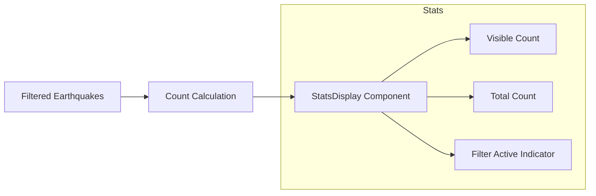

# Implementation Plan: Point Count Display

## Acceptance Criterion
> Point count reflects filtered results

## Approach

Create a statistics component that displays the count of visible earthquakes after filtering. Update in real-time as filters change, providing immediate feedback to users.

## Architecture



## Implementation Steps

### 1. Create Stats Component

```tsx
// src/components/EarthquakeMap/Stats/EarthquakeStats.tsx

interface EarthquakeStatsProps {
  totalCount: number;
  filteredCount: number;
  isFiltered: boolean;
}

export function EarthquakeStats({
  totalCount,
  filteredCount,
  isFiltered,
}: EarthquakeStatsProps) {
  return (
    <div className="bg-white/90 backdrop-blur-sm px-3 py-2 rounded-lg shadow text-sm">
      <div className="flex items-center gap-2">
        <span className="font-semibold text-gray-900">
          {filteredCount.toLocaleString()}
        </span>
        <span className="text-gray-600">
          earthquake{filteredCount !== 1 ? 's' : ''}
        </span>

        {isFiltered && (
          <span className="text-gray-400">
            of {totalCount.toLocaleString()}
          </span>
        )}
      </div>

      {isFiltered && (
        <div className="flex items-center gap-1 mt-1 text-xs text-blue-600">
          <FilterIcon className="w-3 h-3" />
          <span>Filter active</span>
        </div>
      )}
    </div>
  );
}

function FilterIcon({ className }: { className?: string }) {
  return (
    <svg
      className={className}
      viewBox="0 0 24 24"
      fill="none"
      stroke="currentColor"
      strokeWidth={2}
    >
      <path d="M22 3H2l8 9.46V19l4 2v-8.54L22 3z" />
    </svg>
  );
}
```

### 2. Animated Count Component

```tsx
// src/components/EarthquakeMap/Stats/AnimatedCount.tsx
import { useEffect, useState } from 'react';

interface AnimatedCountProps {
  value: number;
  duration?: number;
}

export function AnimatedCount({ value, duration = 300 }: AnimatedCountProps) {
  const [displayValue, setDisplayValue] = useState(value);

  useEffect(() => {
    const startValue = displayValue;
    const endValue = value;
    const startTime = performance.now();

    const animate = (currentTime: number) => {
      const elapsed = currentTime - startTime;
      const progress = Math.min(elapsed / duration, 1);

      // Ease out cubic
      const eased = 1 - Math.pow(1 - progress, 3);
      const current = Math.round(startValue + (endValue - startValue) * eased);

      setDisplayValue(current);

      if (progress < 1) {
        requestAnimationFrame(animate);
      }
    };

    requestAnimationFrame(animate);
  }, [value, duration]);

  return <>{displayValue.toLocaleString()}</>;
}

// Usage
<span className="font-semibold text-gray-900">
  <AnimatedCount value={filteredCount} />
</span>
```

### 3. Extended Stats with Summary

```tsx
// src/components/EarthquakeMap/Stats/EarthquakeStatsSummary.tsx
import type { Earthquake } from '../../../types/earthquake';

interface StatsSummaryProps {
  earthquakes: Earthquake[];
  isFiltered: boolean;
  totalCount: number;
}

export function EarthquakeStatsSummary({
  earthquakes,
  isFiltered,
  totalCount,
}: StatsSummaryProps) {
  const stats = useMemo(() => {
    if (earthquakes.length === 0) {
      return { count: 0, maxMag: null, avgMag: null, avgDepth: null };
    }

    const magnitudes = earthquakes.map((eq) => eq.magnitude);
    const depths = earthquakes.map((eq) => eq.depth);

    return {
      count: earthquakes.length,
      maxMag: Math.max(...magnitudes),
      avgMag: magnitudes.reduce((a, b) => a + b, 0) / magnitudes.length,
      avgDepth: depths.reduce((a, b) => a + b, 0) / depths.length,
    };
  }, [earthquakes]);

  return (
    <div className="bg-white/90 backdrop-blur-sm p-3 rounded-lg shadow">
      {/* Count */}
      <div className="text-center mb-3">
        <div className="text-3xl font-bold text-gray-900">
          <AnimatedCount value={stats.count} />
        </div>
        <div className="text-sm text-gray-500">
          earthquake{stats.count !== 1 ? 's' : ''}
          {isFiltered && ` (of ${totalCount.toLocaleString()})`}
        </div>
      </div>

      {/* Summary stats */}
      {stats.count > 0 && (
        <div className="grid grid-cols-3 gap-2 text-center text-xs border-t pt-2">
          <div>
            <div className="font-semibold text-gray-900">
              {stats.maxMag?.toFixed(1)}
            </div>
            <div className="text-gray-500">Max Mag</div>
          </div>
          <div>
            <div className="font-semibold text-gray-900">
              {stats.avgMag?.toFixed(1)}
            </div>
            <div className="text-gray-500">Avg Mag</div>
          </div>
          <div>
            <div className="font-semibold text-gray-900">
              {stats.avgDepth?.toFixed(0)} km
            </div>
            <div className="text-gray-500">Avg Depth</div>
          </div>
        </div>
      )}

      {/* Filter indicator */}
      {isFiltered && (
        <div className="flex items-center justify-center gap-1 mt-2 text-xs text-blue-600">
          <FilterIcon className="w-3 h-3" />
          <span>Filtered view</span>
        </div>
      )}
    </div>
  );
}
```

### 4. Integrate with Map Component

```tsx
// src/components/EarthquakeMap/EarthquakeMap.tsx
import { EarthquakeStats } from './Stats/EarthquakeStats';

export function EarthquakeMap({ earthquakes }: Props) {
  const { filters, setDateRange } = useFilterState();
  const filteredEarthquakes = useFilteredEarthquakes(earthquakes, filters);

  const isFiltered = filters.dateRange.startDate !== null ||
                     filters.dateRange.endDate !== null;

  return (
    <div className="relative w-full h-full">
      <DeckGL ...>
        <Map mapStyle={MAP_STYLE} />
      </DeckGL>

      {/* Filter controls - top left */}
      <div className="absolute top-4 left-4 z-10">
        <DateRangeSelector
          value={filters.dateRange}
          onChange={setDateRange}
        />
      </div>

      {/* Stats display - bottom left */}
      <div className="absolute bottom-4 left-4 z-10">
        <EarthquakeStats
          totalCount={earthquakes.length}
          filteredCount={filteredEarthquakes.length}
          isFiltered={isFiltered}
        />
      </div>

      {/* Legend - bottom right */}
      <div className="absolute bottom-4 right-4 z-10">
        <ColorLegend />
      </div>
    </div>
  );
}
```

### 5. No Results State

```tsx
// Handle empty filter results
{filteredEarthquakes.length === 0 && isFiltered ? (
  <div className="absolute inset-0 flex items-center justify-center pointer-events-none">
    <div className="bg-white/90 px-6 py-4 rounded-lg shadow text-center">
      <div className="text-gray-400 text-4xl mb-2">🔍</div>
      <div className="font-semibold text-gray-700">No earthquakes found</div>
      <div className="text-sm text-gray-500 mt-1">
        Try adjusting your date range
      </div>
      <button
        onClick={resetFilters}
        className="mt-3 px-4 py-1 bg-blue-500 text-white rounded hover:bg-blue-600 text-sm pointer-events-auto"
      >
        Clear filters
      </button>
    </div>
  </div>
) : null}
```

## Performance Considerations

### Memoize Statistics Calculation

```typescript
const stats = useMemo(() => {
  // Only recalculate when filtered data changes
  return calculateStats(filteredEarthquakes);
}, [filteredEarthquakes]);
```

### Throttle Animation Updates

```typescript
// For very large datasets, throttle count animation
const throttledCount = useThrottle(filteredCount, 100);
```

## Responsiveness

```tsx
// Compact stats for mobile
<div className="text-sm md:text-base">
  <span className="font-semibold">
    {filteredCount.toLocaleString()}
  </span>
  {/* Hide "of total" on mobile to save space */}
  <span className="hidden sm:inline text-gray-400">
    {isFiltered && ` of ${totalCount.toLocaleString()}`}
  </span>
</div>
```

## Accessibility

```tsx
<div
  role="status"
  aria-live="polite"
  aria-atomic="true"
>
  <span className="sr-only">
    Showing {filteredCount} of {totalCount} earthquakes
    {isFiltered ? ' (filtered)' : ''}
  </span>
  {/* Visual content */}
</div>
```

## Testing

### Unit Tests

Unit tests must be added for all new code.

```typescript
// src/components/EarthquakeMap/Stats/EarthquakeStats.test.tsx
describe('EarthquakeStats', () => {
  - Test renders filtered count
  - Test renders "earthquake" singular when count is 1
  - Test renders "earthquakes" plural when count is not 1
  - Test shows total count when filtered
  - Test hides total count when not filtered
  - Test shows filter indicator when isFiltered is true
  - Test hides filter indicator when isFiltered is false
});

// src/components/EarthquakeMap/Stats/AnimatedCount.test.tsx
describe('AnimatedCount', () => {
  - Test renders initial value immediately
  - Test animates to new value
  - Test formats number with locale string
});

// src/components/EarthquakeMap/Stats/EarthquakeStatsSummary.test.tsx
describe('EarthquakeStatsSummary', () => {
  - Test renders earthquake count
  - Test calculates and displays max magnitude
  - Test calculates and displays average magnitude
  - Test calculates and displays average depth
  - Test handles empty earthquake array
  - Test shows filter indicator when filtered
});

describe('calculateStats', () => {
  - Test returns correct count
  - Test calculates max magnitude correctly
  - Test calculates average magnitude correctly
  - Test calculates average depth correctly
  - Test handles single earthquake
});
```

### Acceptance Tests

```gherkin
# features/earthquake-map.feature
Scenario: Point count displays total earthquakes
  Given I am on the home page
  And earthquake data has loaded
  Then I should see the earthquake count displayed

Scenario: Point count updates with filter
  Given I am on the home page
  And earthquake data has loaded showing 100 earthquakes
  When I apply a filter that matches 25 earthquakes
  Then the count should show "25"
  And the count should indicate "of 100" total
  And a filter indicator should be visible
```
