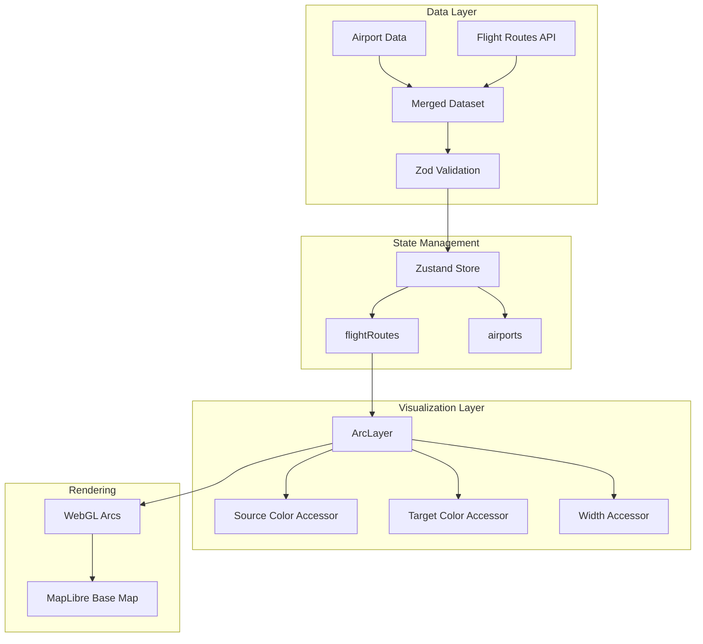

# Implementation Plan: View Flight Routes Map

## User Story

**As a** user
**I want to** see flight routes displayed as arcs on a map
**So that I** can visualize air travel connections between cities

## Acceptance Criteria

- [ ] Map displays with a base layer showing geographic context
- [ ] Flight routes are rendered as curved arcs connecting airports
- [ ] Arc source and destination points are clearly indicated
- [ ] Arc color gradient shows directionality (source to destination)
- [ ] Arc width reflects flight frequency or passenger volume

## Approach

Use deck.gl's `ArcLayer` to render flight routes as 3D arcs connecting origin and destination airports. The ArcLayer is optimized for rendering large numbers of arcs with WebGL and provides built-in support for:
- Source-to-target color gradients showing flight direction
- Width variation based on data attributes
- Great circle paths for accurate geographic representation

The map base layer will use MapLibre GL with a dark theme to provide contrast for the colored arcs.

## Architecture



## Libraries

| Library                 | Purpose                              |
| ----------------------- | ------------------------------------ |
| `@deck.gl/layers`       | ArcLayer for arc rendering           |
| `@deck.gl/react`        | React integration                    |
| `react-map-gl/maplibre` | MapLibre base map                    |
| `zod`                   | Runtime data validation              |
| `zustand`               | State management                     |

## Data Structures

```typescript
// src/types/flight.ts
import { z } from 'zod';

// Airport schema
export const AirportSchema = z.object({
  code: z.string(), // IATA code (e.g., 'LAX')
  name: z.string(), // Full airport name
  city: z.string(),
  country: z.string(),
  longitude: z.number().min(-180).max(180),
  latitude: z.number().min(-90).max(90),
});

export type Airport = z.infer<typeof AirportSchema>;

// Flight route schema
export const FlightRouteSchema = z.object({
  id: z.string(),
  origin: AirportSchema,
  destination: AirportSchema,
  frequency: z.number().min(0), // Flights per week
  passengerVolume: z.number().min(0).optional(), // Annual passengers
  airline: z.string().optional(),
  distance: z.number().min(0).optional(), // Distance in km
});

export type FlightRoute = z.infer<typeof FlightRouteSchema>;

// API response schema
export const FlightRoutesResponseSchema = z.object({
  routes: z.array(FlightRouteSchema),
  metadata: z.object({
    totalRoutes: z.number(),
    lastUpdated: z.string(),
  }),
});

export type FlightRoutesResponse = z.infer<typeof FlightRoutesResponseSchema>;
```

## Implementation Steps

### 1. Create Flight Types and Schemas

```typescript
// src/types/flight.ts
import { z } from 'zod';

export const AirportSchema = z.object({
  code: z.string(),
  name: z.string(),
  city: z.string(),
  country: z.string(),
  longitude: z.number().min(-180).max(180),
  latitude: z.number().min(-90).max(90),
});

export type Airport = z.infer<typeof AirportSchema>;

export const FlightRouteSchema = z.object({
  id: z.string(),
  origin: AirportSchema,
  destination: AirportSchema,
  frequency: z.number().min(0),
  passengerVolume: z.number().min(0).optional(),
  airline: z.string().optional(),
  distance: z.number().min(0).optional(),
});

export type FlightRoute = z.infer<typeof FlightRouteSchema>;
```

### 2. Create Flight Routes Store

```typescript
// src/stores/flightRoutesStore.ts
import { create } from 'zustand';
import type { FlightRoute, Airport } from '../types/flight';

interface FlightRoutesStore {
  routes: FlightRoute[];
  airports: Map<string, Airport>;
  loading: boolean;
  error: Error | null;

  setRoutes: (routes: FlightRoute[]) => void;
  setLoading: (loading: boolean) => void;
  setError: (error: Error | null) => void;
  reset: () => void;
}

const initialState = {
  routes: [],
  airports: new Map(),
  loading: false,
  error: null,
};

export const useFlightRoutesStore = create<FlightRoutesStore>((set) => ({
  ...initialState,

  setRoutes: (routes) => {
    // Extract unique airports from routes
    const airports = new Map<string, Airport>();
    routes.forEach((route) => {
      airports.set(route.origin.code, route.origin);
      airports.set(route.destination.code, route.destination);
    });
    set({ routes, airports });
  },

  setLoading: (loading) => set({ loading }),
  setError: (error) => set({ error }),
  reset: () => set(initialState),
}));
```

### 3. Create Arc Color Scale

```typescript
// src/components/FlightMap/layers/arcColorScale.ts

// Source color: cyan/teal (departure)
const SOURCE_COLOR: [number, number, number, number] = [0, 255, 255, 180];

// Target color: magenta/pink (arrival)
const TARGET_COLOR: [number, number, number, number] = [255, 0, 128, 180];

// Alternative: blue to orange for colorblind accessibility
const SOURCE_COLOR_ALT: [number, number, number, number] = [66, 133, 244, 180];
const TARGET_COLOR_ALT: [number, number, number, number] = [255, 152, 0, 180];

export function getSourceColor(
  frequency: number,
  maxFrequency: number,
  accessible = false
): [number, number, number, number] {
  const baseColor = accessible ? SOURCE_COLOR_ALT : SOURCE_COLOR;
  // Increase opacity for higher frequency routes
  const opacity = Math.round(100 + (frequency / maxFrequency) * 155);
  return [baseColor[0], baseColor[1], baseColor[2], opacity];
}

export function getTargetColor(
  frequency: number,
  maxFrequency: number,
  accessible = false
): [number, number, number, number] {
  const baseColor = accessible ? TARGET_COLOR_ALT : TARGET_COLOR;
  const opacity = Math.round(100 + (frequency / maxFrequency) * 155);
  return [baseColor[0], baseColor[1], baseColor[2], opacity];
}
```

### 4. Create Arc Width Scale

```typescript
// src/components/FlightMap/layers/arcWidthScale.ts

// Width range in pixels
const MIN_WIDTH = 1;
const MAX_WIDTH = 8;

export function frequencyToWidth(
  frequency: number,
  maxFrequency: number
): number {
  if (maxFrequency === 0) return MIN_WIDTH;

  // Logarithmic scale for better visual distribution
  const normalizedFreq = Math.log(frequency + 1) / Math.log(maxFrequency + 1);
  return MIN_WIDTH + normalizedFreq * (MAX_WIDTH - MIN_WIDTH);
}

export function passengerVolumeToWidth(
  volume: number,
  maxVolume: number
): number {
  if (maxVolume === 0) return MIN_WIDTH;

  // Square root scale for passenger volume
  const normalizedVol = Math.sqrt(volume) / Math.sqrt(maxVolume);
  return MIN_WIDTH + normalizedVol * (MAX_WIDTH - MIN_WIDTH);
}
```

### 5. Create Flight Routes Layer Factory

```typescript
// src/components/FlightMap/layers/flightRoutesLayer.ts
import { ArcLayer } from '@deck.gl/layers';
import type { FlightRoute } from '../../../types/flight';
import { getSourceColor, getTargetColor } from './arcColorScale';
import { frequencyToWidth } from './arcWidthScale';

interface FlightRoutesLayerOptions {
  data: FlightRoute[];
  highlightedRouteId?: string | null;
  onHover?: (info: { object?: FlightRoute; x: number; y: number }) => void;
  onClick?: (info: { object?: FlightRoute }) => void;
}

export function createFlightRoutesLayer({
  data,
  highlightedRouteId,
  onHover,
  onClick,
}: FlightRoutesLayerOptions) {
  // Calculate max frequency for normalization
  const maxFrequency = Math.max(...data.map((d) => d.frequency), 1);

  return new ArcLayer<FlightRoute>({
    id: 'flight-routes-layer',
    data,
    pickable: true,

    // Arc endpoints
    getSourcePosition: (d) => [d.origin.longitude, d.origin.latitude],
    getTargetPosition: (d) => [d.destination.longitude, d.destination.latitude],

    // Color gradient from source to target
    getSourceColor: (d) => {
      const isHighlighted = d.id === highlightedRouteId;
      const opacity = isHighlighted ? 255 : undefined;
      const color = getSourceColor(d.frequency, maxFrequency);
      return opacity ? [color[0], color[1], color[2], opacity] : color;
    },
    getTargetColor: (d) => {
      const isHighlighted = d.id === highlightedRouteId;
      const opacity = isHighlighted ? 255 : undefined;
      const color = getTargetColor(d.frequency, maxFrequency);
      return opacity ? [color[0], color[1], color[2], opacity] : color;
    },

    // Width based on frequency
    getWidth: (d) => {
      const isHighlighted = d.id === highlightedRouteId;
      const baseWidth = frequencyToWidth(d.frequency, maxFrequency);
      return isHighlighted ? baseWidth * 2 : baseWidth;
    },

    // Arc height proportional to distance
    getHeight: 0.5, // Default arc height ratio

    // Great circle paths for accurate geography
    greatCircle: true,

    // Interaction handlers
    onHover,
    onClick,

    // Performance optimizations
    updateTriggers: {
      getSourceColor: [highlightedRouteId, maxFrequency],
      getTargetColor: [highlightedRouteId, maxFrequency],
      getWidth: [highlightedRouteId, maxFrequency],
    },

    // Smooth transitions for filter changes
    transitions: {
      getSourcePosition: 300,
      getTargetPosition: 300,
      getWidth: 300,
    },
  });
}
```

### 6. Create Data Fetching Hook

```typescript
// src/hooks/useFlightRoutesData.ts
import { useEffect, useCallback } from 'react';
import { z } from 'zod';
import { useFlightRoutesStore } from '../stores/flightRoutesStore';
import { FlightRouteSchema, type FlightRoute } from '../types/flight';

const FLIGHT_ROUTES_URL = '/data/flight-routes.json';

export function useFlightRoutesData() {
  const routes = useFlightRoutesStore((state) => state.routes);
  const loading = useFlightRoutesStore((state) => state.loading);
  const error = useFlightRoutesStore((state) => state.error);
  const setRoutes = useFlightRoutesStore((state) => state.setRoutes);
  const setLoading = useFlightRoutesStore((state) => state.setLoading);
  const setError = useFlightRoutesStore((state) => state.setError);

  const fetchData = useCallback(async () => {
    setLoading(true);
    setError(null);

    try {
      const response = await fetch(FLIGHT_ROUTES_URL);

      if (!response.ok) {
        throw new Error(`Failed to fetch flight routes: ${response.status}`);
      }

      const json = await response.json();

      // Validate and filter routes
      const validRoutes: FlightRoute[] = [];
      const routesArray = json.routes || json;

      for (const route of routesArray) {
        try {
          const validated = FlightRouteSchema.parse(route);
          validRoutes.push(validated);
        } catch (err) {
          console.warn('Invalid flight route data:', route, err);
        }
      }

      setRoutes(validRoutes);
    } catch (err) {
      setError(err instanceof Error ? err : new Error('Unknown error'));
    } finally {
      setLoading(false);
    }
  }, [setRoutes, setLoading, setError]);

  useEffect(() => {
    if (routes.length === 0 && !loading) {
      fetchData();
    }
  }, [routes.length, loading, fetchData]);

  return { routes, loading, error, refetch: fetchData };
}
```

### 7. Create Main Flight Map Component

```typescript
// src/components/FlightMap/FlightMap.tsx
import { useMemo, useState, useCallback } from 'react';
import DeckGL from '@deck.gl/react';
import Map from 'react-map-gl/maplibre';
import 'maplibre-gl/dist/maplibre-gl.css';

import { useMapViewStore } from '../../stores/mapViewStore';
import { createFlightRoutesLayer } from './layers/flightRoutesLayer';
import { FlightTooltip } from './Tooltip/FlightTooltip';
import { ArcLegend } from './Legend/ArcLegend';
import type { FlightRoute } from '../../types/flight';

const MAP_STYLE = 'https://basemaps.cartocdn.com/gl/dark-matter-gl-style/style.json';

const INITIAL_VIEW_STATE = {
  longitude: -98.5795,
  latitude: 39.8283,
  zoom: 4,
  pitch: 30, // Tilted view to better see arc heights
  bearing: 0,
};

interface FlightMapProps {
  routes: FlightRoute[];
}

export function FlightMap({ routes }: FlightMapProps) {
  const viewState = useMapViewStore((state) => state.viewState);
  const setViewState = useMapViewStore((state) => state.setViewState);

  const [hoveredRoute, setHoveredRoute] = useState<FlightRoute | null>(null);
  const [tooltipPosition, setTooltipPosition] = useState({ x: 0, y: 0 });

  const handleHover = useCallback(
    (info: { object?: FlightRoute; x: number; y: number }) => {
      setHoveredRoute(info.object || null);
      setTooltipPosition({ x: info.x, y: info.y });
    },
    []
  );

  const layers = useMemo(
    () => [
      createFlightRoutesLayer({
        data: routes,
        highlightedRouteId: hoveredRoute?.id,
        onHover: handleHover,
      }),
    ],
    [routes, hoveredRoute, handleHover]
  );

  return (
    <div className="relative w-full h-full">
      <DeckGL
        viewState={viewState || INITIAL_VIEW_STATE}
        onViewStateChange={({ viewState }) => setViewState(viewState)}
        controller={true}
        layers={layers}
        getCursor={({ isHovering }) => (isHovering ? 'pointer' : 'grab')}
      >
        <Map mapStyle={MAP_STYLE} />
      </DeckGL>

      {hoveredRoute && (
        <FlightTooltip
          route={hoveredRoute}
          x={tooltipPosition.x}
          y={tooltipPosition.y}
        />
      )}

      <ArcLegend />
    </div>
  );
}
```

### 8. Create Arc Legend Component

```typescript
// src/components/FlightMap/Legend/ArcLegend.tsx

export function ArcLegend() {
  return (
    <div className="absolute bottom-4 left-4 bg-gray-800/90 backdrop-blur-sm rounded-lg p-4 shadow-lg">
      <h3 className="text-white text-sm font-medium mb-3">Flight Routes</h3>

      {/* Direction indicator */}
      <div className="mb-3">
        <span className="text-xs text-gray-400 block mb-1">Direction</span>
        <div className="flex items-center gap-2">
          <div className="w-4 h-4 rounded-full bg-cyan-400" />
          <div className="h-0.5 w-12 bg-gradient-to-r from-cyan-400 to-pink-500" />
          <div className="w-4 h-4 rounded-full bg-pink-500" />
        </div>
        <div className="flex justify-between mt-1 text-xs text-gray-400">
          <span>Origin</span>
          <span>Destination</span>
        </div>
      </div>

      {/* Width indicator */}
      <div>
        <span className="text-xs text-gray-400 block mb-1">Flight Frequency</span>
        <div className="flex items-center gap-2">
          <div className="h-0.5 w-8 bg-gray-400" />
          <span className="text-xs text-gray-500">Low</span>
          <div className="h-2 w-8 bg-gray-400" />
          <span className="text-xs text-gray-500">High</span>
        </div>
      </div>
    </div>
  );
}
```

### 9. Create Map Container with Responsive Wrapper

```typescript
// src/components/FlightMap/MapContainer.tsx
import { useFlightRoutesData } from '../../hooks/useFlightRoutesData';
import { FlightMap } from './FlightMap';

export function FlightMapContainer() {
  const { routes, loading, error } = useFlightRoutesData();

  if (loading) {
    return (
      <div className="flex items-center justify-center h-full bg-gray-900">
        <div className="text-white">Loading flight routes...</div>
      </div>
    );
  }

  if (error) {
    return (
      <div className="flex items-center justify-center h-full bg-gray-900">
        <div className="text-red-400">Error: {error.message}</div>
      </div>
    );
  }

  return <FlightMap routes={routes} />;
}
```

## Performance Considerations

### Large Dataset Optimization

For datasets with thousands of routes, use binary data format:

```typescript
// Pre-compute binary buffers for better GPU performance
import { ArcLayer } from '@deck.gl/layers';

const layer = new ArcLayer({
  data: {
    length: routes.length,
    attributes: {
      getSourcePosition: { value: sourcePositionBuffer, size: 2 },
      getTargetPosition: { value: targetPositionBuffer, size: 2 },
      getSourceColor: { value: sourceColorBuffer, size: 4, normalized: true },
      getTargetColor: { value: targetColorBuffer, size: 4, normalized: true },
      getWidth: { value: widthBuffer, size: 1 },
    },
  },
});
```

### Data Aggregation

For very dense route networks, aggregate routes between same city pairs:

```typescript
function aggregateRoutes(routes: FlightRoute[]): AggregatedRoute[] {
  const routeMap = new Map<string, AggregatedRoute>();

  routes.forEach((route) => {
    const key = `${route.origin.code}-${route.destination.code}`;
    const existing = routeMap.get(key);

    if (existing) {
      existing.frequency += route.frequency;
      existing.airlines.push(route.airline);
    } else {
      routeMap.set(key, {
        ...route,
        airlines: route.airline ? [route.airline] : [],
      });
    }
  });

  return Array.from(routeMap.values());
}
```

### Memoization

```typescript
// Memoize layer creation to prevent unnecessary re-renders
const layers = useMemo(
  () => [createFlightRoutesLayer({ data: routes, highlightedRouteId })],
  [routes, highlightedRouteId]
);

// Memoize max frequency calculation
const maxFrequency = useMemo(
  () => Math.max(...routes.map((r) => r.frequency), 1),
  [routes]
);
```

## Responsiveness

### Adaptive Arc Height

```typescript
// Reduce arc height on mobile for better visibility
const isMobile = window.innerWidth < 768;
const arcHeight = isMobile ? 0.3 : 0.5;
```

### Touch-Friendly Picking

```typescript
// Increase pick radius on touch devices
const pickingRadius = 'ontouchstart' in window ? 10 : 5;

new ArcLayer({
  // ...
  pickingRadius,
});
```

### Responsive Legend Position

```typescript
const legendPosition = useMediaQuery('(max-width: 768px)')
  ? 'bottom-20 left-4 right-4'
  : 'bottom-4 left-4';
```

## Testing

### Unit Tests

```typescript
// src/types/flight.test.ts
- Test AirportSchema validates valid airport data
- Test AirportSchema rejects invalid coordinates
- Test FlightRouteSchema validates valid route data
- Test FlightRouteSchema requires origin and destination

// src/components/FlightMap/layers/arcColorScale.test.ts
- Test getSourceColor returns cyan-based color
- Test getTargetColor returns magenta-based color
- Test opacity increases with frequency
- Test accessible colors are different from default

// src/components/FlightMap/layers/arcWidthScale.test.ts
- Test frequencyToWidth returns MIN_WIDTH for zero frequency
- Test frequencyToWidth returns MAX_WIDTH for max frequency
- Test logarithmic scaling produces expected distribution

// src/components/FlightMap/layers/flightRoutesLayer.test.ts
- Test createFlightRoutesLayer returns ArcLayer instance
- Test layer is pickable
- Test getSourcePosition returns origin coordinates
- Test getTargetPosition returns destination coordinates
- Test greatCircle is enabled

// src/hooks/useFlightRoutesData.test.ts
- Test loading state transitions
- Test routes are validated with Zod
- Test invalid routes are filtered out
- Test error handling for failed fetches

// src/stores/flightRoutesStore.test.ts
- Test initial state is empty
- Test setRoutes updates routes and extracts airports
- Test reset clears all state
```

### Acceptance Tests

```gherkin
Feature: Flight Routes Map Display
  Scenario: Display flight routes on map
    Given I am on the flight routes page
    When the route data has loaded
    Then I should see the base map layer
    And I should see flight routes rendered as arcs
    And arcs should connect origin and destination airports
    And I should see the arc legend

  Scenario: Arc color indicates direction
    Given I am on the flight routes page
    And the route data has loaded
    Then arc source points should be cyan colored
    And arc destination points should be pink/magenta colored
    And arcs should show a gradient from source to target

  Scenario: Arc width indicates frequency
    Given I am on the flight routes page
    And the route data has loaded
    Then high-frequency routes should have thicker arcs
    And low-frequency routes should have thinner arcs
```
