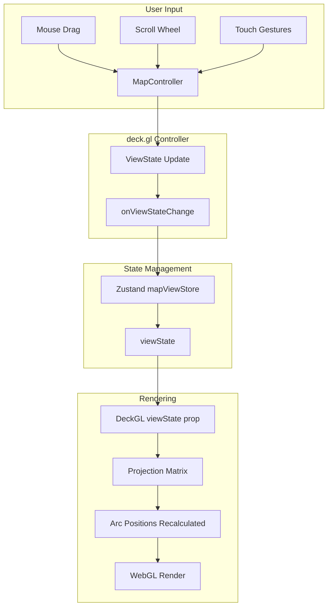

# Implementation Plan: Interact with Map

## User Story

**As a** user
**I want to** pan and zoom the map
**So that I** can explore different regions and route details

## Acceptance Criteria

- [ ] Map supports click-and-drag panning
- [ ] Map supports scroll wheel zooming
- [ ] Arcs maintain positions and curvature during navigation

## Approach

Leverage deck.gl's built-in `MapController` for intuitive map navigation. The controller provides pan, zoom, rotate, and tilt capabilities out of the box. View state is managed in Zustand for persistence across component re-renders and potential route changes. Arc positions are defined in geographic coordinates (longitude/latitude), ensuring they automatically update during map transformations.

## Architecture



## Libraries

| Library                 | Purpose                          |
| ----------------------- | -------------------------------- |
| `@deck.gl/core`         | MapController, view state        |
| `@deck.gl/react`        | React integration                |
| `react-map-gl/maplibre` | MapLibre GL JS wrapper           |
| `zustand`               | Persistent view state management |

## Data Structures

```typescript
// src/types/mapView.ts
export interface ViewState {
  longitude: number;
  latitude: number;
  zoom: number;
  pitch: number; // 0-60 degrees for tilted view
  bearing: number; // Rotation angle
  transitionDuration?: number;
  transitionInterpolator?: unknown;
}

export const INITIAL_VIEW_STATE: ViewState = {
  longitude: -98.5795, // Center of US
  latitude: 39.8283,
  zoom: 4,
  pitch: 30, // Tilted to show arc heights
  bearing: 0,
};
```

## Implementation Steps

### 1. Create Map View Store

```typescript
// src/stores/flightMapViewStore.ts
import { create } from 'zustand';
import { FlyToInterpolator } from '@deck.gl/core';
import type { ViewState } from '../types/mapView';

const INITIAL_VIEW_STATE: ViewState = {
  longitude: -98.5795,
  latitude: 39.8283,
  zoom: 4,
  pitch: 30,
  bearing: 0,
};

interface FlightMapViewStore {
  viewState: ViewState;
  setViewState: (viewState: ViewState) => void;
  flyTo: (target: Partial<ViewState>) => void;
  resetView: () => void;
  reset: () => void;
}

export const useFlightMapViewStore = create<FlightMapViewStore>((set, get) => ({
  viewState: INITIAL_VIEW_STATE,

  setViewState: (viewState) => set({ viewState }),

  flyTo: (target) => {
    const current = get().viewState;
    set({
      viewState: {
        ...current,
        ...target,
        transitionDuration: 1000,
        transitionInterpolator: new FlyToInterpolator(),
      },
    });
  },

  resetView: () => {
    set({
      viewState: {
        ...INITIAL_VIEW_STATE,
        transitionDuration: 1000,
        transitionInterpolator: new FlyToInterpolator(),
      },
    });
  },

  reset: () => set({ viewState: INITIAL_VIEW_STATE }),
}));
```

### 2. Configure DeckGL Controller

```typescript
// src/components/FlightMap/FlightMap.tsx
import { useMemo, useCallback } from 'react';
import DeckGL from '@deck.gl/react';
import Map from 'react-map-gl/maplibre';
import 'maplibre-gl/dist/maplibre-gl.css';

import { useFlightMapViewStore } from '../../stores/flightMapViewStore';
import { createFlightRoutesLayer } from './layers/flightRoutesLayer';
import type { FlightRoute } from '../../types/flight';

const MAP_STYLE = 'https://basemaps.cartocdn.com/gl/dark-matter-gl-style/style.json';

interface FlightMapProps {
  routes: FlightRoute[];
}

export function FlightMap({ routes }: FlightMapProps) {
  const viewState = useFlightMapViewStore((state) => state.viewState);
  const setViewState = useFlightMapViewStore((state) => state.setViewState);

  const handleViewStateChange = useCallback(
    ({ viewState }: { viewState: ViewState }) => {
      setViewState(viewState);
    },
    [setViewState]
  );

  const layers = useMemo(
    () => [createFlightRoutesLayer({ data: routes })],
    [routes]
  );

  return (
    <div className="relative w-full h-full">
      <DeckGL
        viewState={viewState}
        onViewStateChange={handleViewStateChange}
        controller={{
          // Enable all standard interactions
          dragPan: true,
          dragRotate: true, // Right-click or Ctrl+drag to rotate
          scrollZoom: true,
          doubleClickZoom: true,
          touchZoom: true,
          touchRotate: true,
          keyboard: true,

          // Constraints
          minZoom: 2,
          maxZoom: 12,
          minPitch: 0,
          maxPitch: 60,
        }}
        layers={layers}
        getCursor={({ isDragging, isHovering }) =>
          isDragging ? 'grabbing' : isHovering ? 'pointer' : 'grab'
        }
      >
        <Map mapStyle={MAP_STYLE} />
      </DeckGL>
    </div>
  );
}
```

### 3. Create Zoom Controls Component

```typescript
// src/components/FlightMap/ZoomControls.tsx
import { useCallback } from 'react';
import { useFlightMapViewStore } from '../../stores/flightMapViewStore';

export function ZoomControls() {
  const viewState = useFlightMapViewStore((state) => state.viewState);
  const setViewState = useFlightMapViewStore((state) => state.setViewState);
  const resetView = useFlightMapViewStore((state) => state.resetView);

  const handleZoomIn = useCallback(() => {
    setViewState({
      ...viewState,
      zoom: Math.min(viewState.zoom + 1, 12),
      transitionDuration: 300,
    });
  }, [viewState, setViewState]);

  const handleZoomOut = useCallback(() => {
    setViewState({
      ...viewState,
      zoom: Math.max(viewState.zoom - 1, 2),
      transitionDuration: 300,
    });
  }, [viewState, setViewState]);

  return (
    <div className="absolute top-4 right-4 flex flex-col gap-2">
      <button
        onClick={handleZoomIn}
        className="w-10 h-10 bg-gray-800/90 hover:bg-gray-700 text-white rounded-lg
                   flex items-center justify-center shadow-lg backdrop-blur-sm
                   transition-colors"
        aria-label="Zoom in"
      >
        <span className="text-xl font-light">+</span>
      </button>

      <button
        onClick={handleZoomOut}
        className="w-10 h-10 bg-gray-800/90 hover:bg-gray-700 text-white rounded-lg
                   flex items-center justify-center shadow-lg backdrop-blur-sm
                   transition-colors"
        aria-label="Zoom out"
      >
        <span className="text-xl font-light">−</span>
      </button>

      <button
        onClick={resetView}
        className="w-10 h-10 bg-gray-800/90 hover:bg-gray-700 text-white rounded-lg
                   flex items-center justify-center shadow-lg backdrop-blur-sm
                   transition-colors mt-2"
        aria-label="Reset view"
        title="Reset to initial view"
      >
        <svg
          className="w-5 h-5"
          fill="none"
          stroke="currentColor"
          viewBox="0 0 24 24"
        >
          <path
            strokeLinecap="round"
            strokeLinejoin="round"
            strokeWidth={2}
            d="M3 12l2-2m0 0l7-7 7 7M5 10v10a1 1 0 001 1h3m10-11l2 2m-2-2v10a1 1 0 01-1 1h-3m-6 0a1 1 0 001-1v-4a1 1 0 011-1h2a1 1 0 011 1v4a1 1 0 001 1m-6 0h6"
          />
        </svg>
      </button>
    </div>
  );
}
```

### 4. Ensure Arc Position Stability

Arc positions are defined using geographic coordinates, which deck.gl automatically projects to screen coordinates during rendering:

```typescript
// src/components/FlightMap/layers/flightRoutesLayer.ts
import { ArcLayer } from '@deck.gl/layers';
import { COORDINATE_SYSTEM } from '@deck.gl/core';

export function createFlightRoutesLayer({ data }) {
  return new ArcLayer({
    id: 'flight-routes-layer',
    data,

    // Use longitude/latitude coordinate system (default)
    coordinateSystem: COORDINATE_SYSTEM.LNGLAT,

    // Positions in [longitude, latitude] format
    getSourcePosition: (d) => [d.origin.longitude, d.origin.latitude],
    getTargetPosition: (d) => [d.destination.longitude, d.destination.latitude],

    // Great circle arcs maintain proper curvature during zoom
    greatCircle: true,

    // ... other props
  });
}
```

### 5. Add Keyboard Navigation

```typescript
// src/components/FlightMap/hooks/useKeyboardNavigation.ts
import { useEffect, useCallback } from 'react';
import { useFlightMapViewStore } from '../../../stores/flightMapViewStore';

export function useKeyboardNavigation() {
  const viewState = useFlightMapViewStore((state) => state.viewState);
  const setViewState = useFlightMapViewStore((state) => state.setViewState);
  const resetView = useFlightMapViewStore((state) => state.resetView);

  const handleKeyDown = useCallback(
    (event: KeyboardEvent) => {
      const PAN_STEP = 0.5; // Degrees
      const ZOOM_STEP = 0.5;

      switch (event.key) {
        case 'ArrowUp':
          setViewState({
            ...viewState,
            latitude: viewState.latitude + PAN_STEP,
            transitionDuration: 100,
          });
          break;
        case 'ArrowDown':
          setViewState({
            ...viewState,
            latitude: viewState.latitude - PAN_STEP,
            transitionDuration: 100,
          });
          break;
        case 'ArrowLeft':
          setViewState({
            ...viewState,
            longitude: viewState.longitude - PAN_STEP,
            transitionDuration: 100,
          });
          break;
        case 'ArrowRight':
          setViewState({
            ...viewState,
            longitude: viewState.longitude + PAN_STEP,
            transitionDuration: 100,
          });
          break;
        case '+':
        case '=':
          setViewState({
            ...viewState,
            zoom: Math.min(viewState.zoom + ZOOM_STEP, 12),
            transitionDuration: 100,
          });
          break;
        case '-':
        case '_':
          setViewState({
            ...viewState,
            zoom: Math.max(viewState.zoom - ZOOM_STEP, 2),
            transitionDuration: 100,
          });
          break;
        case 'Home':
          resetView();
          break;
      }
    },
    [viewState, setViewState, resetView]
  );

  useEffect(() => {
    window.addEventListener('keydown', handleKeyDown);
    return () => window.removeEventListener('keydown', handleKeyDown);
  }, [handleKeyDown]);
}
```

### 6. Integrate Controls with Main Component

```typescript
// src/components/FlightMap/FlightMap.tsx (updated)
import { useMemo, useCallback } from 'react';
import DeckGL from '@deck.gl/react';
import Map from 'react-map-gl/maplibre';
import 'maplibre-gl/dist/maplibre-gl.css';

import { useFlightMapViewStore } from '../../stores/flightMapViewStore';
import { useKeyboardNavigation } from './hooks/useKeyboardNavigation';
import { createFlightRoutesLayer } from './layers/flightRoutesLayer';
import { ZoomControls } from './ZoomControls';
import { ArcLegend } from './Legend/ArcLegend';
import type { FlightRoute } from '../../types/flight';

const MAP_STYLE = 'https://basemaps.cartocdn.com/gl/dark-matter-gl-style/style.json';

interface FlightMapProps {
  routes: FlightRoute[];
}

export function FlightMap({ routes }: FlightMapProps) {
  const viewState = useFlightMapViewStore((state) => state.viewState);
  const setViewState = useFlightMapViewStore((state) => state.setViewState);

  // Enable keyboard navigation
  useKeyboardNavigation();

  const handleViewStateChange = useCallback(
    ({ viewState }) => setViewState(viewState),
    [setViewState]
  );

  const layers = useMemo(
    () => [createFlightRoutesLayer({ data: routes })],
    [routes]
  );

  return (
    <div className="relative w-full h-full">
      <DeckGL
        viewState={viewState}
        onViewStateChange={handleViewStateChange}
        controller={{
          dragPan: true,
          dragRotate: true,
          scrollZoom: true,
          doubleClickZoom: true,
          touchZoom: true,
          touchRotate: true,
          keyboard: false, // We handle keyboard separately
          minZoom: 2,
          maxZoom: 12,
          minPitch: 0,
          maxPitch: 60,
        }}
        layers={layers}
        getCursor={({ isDragging, isHovering }) =>
          isDragging ? 'grabbing' : isHovering ? 'pointer' : 'grab'
        }
      >
        <Map mapStyle={MAP_STYLE} />
      </DeckGL>

      <ZoomControls />
      <ArcLegend />
    </div>
  );
}
```

## Performance Considerations

### Debounce View State Updates

For very frequent interactions, debounce store updates:

```typescript
import { useMemo } from 'react';
import { debounce } from 'lodash-es';

const debouncedSetViewState = useMemo(
  () => debounce(setViewState, 16), // ~60fps
  [setViewState]
);
```

### Transition Optimization

Use hardware-accelerated transitions:

```typescript
setViewState({
  ...viewState,
  zoom: newZoom,
  transitionDuration: 300,
  transitionEasing: (t) => t * (2 - t), // Ease out quad
});
```

### Layer Update Minimization

Arc layer does not need to update during pan/zoom since positions are in geographic coordinates:

```typescript
const layer = new ArcLayer({
  // Only update when data changes, not on view changes
  updateTriggers: {
    getSourcePosition: [data],
    getTargetPosition: [data],
  },
});
```

## Responsiveness

### Touch Gesture Support

deck.gl's MapController automatically supports:
- Single finger pan
- Pinch to zoom
- Two-finger rotation (when enabled)

### Mobile Control Sizing

```typescript
// Larger touch targets on mobile
const buttonSize = useMediaQuery('(max-width: 768px)')
  ? 'w-12 h-12'
  : 'w-10 h-10';
```

### Gesture Instructions Overlay

```typescript
// src/components/FlightMap/GestureHints.tsx
export function GestureHints() {
  const isMobile = 'ontouchstart' in window;

  return (
    <div className="absolute bottom-20 right-4 text-xs text-gray-400">
      {isMobile ? (
        <>
          <p>Drag to pan</p>
          <p>Pinch to zoom</p>
        </>
      ) : (
        <>
          <p>Drag to pan • Scroll to zoom</p>
          <p>Right-click drag to rotate</p>
        </>
      )}
    </div>
  );
}
```

## Testing

### Unit Tests

```typescript
// src/stores/flightMapViewStore.test.ts
- Test initial viewState matches INITIAL_VIEW_STATE
- Test setViewState updates viewState
- Test flyTo adds transition properties
- Test resetView returns to initial state with transition
- Test reset clears to initial state without transition

// src/components/FlightMap/ZoomControls.test.tsx
- Test zoom in increases zoom level
- Test zoom out decreases zoom level
- Test zoom in respects maxZoom
- Test zoom out respects minZoom
- Test reset button calls resetView

// src/components/FlightMap/hooks/useKeyboardNavigation.test.ts
- Test ArrowUp increases latitude
- Test ArrowDown decreases latitude
- Test ArrowLeft decreases longitude
- Test ArrowRight increases longitude
- Test + increases zoom
- Test - decreases zoom
- Test Home resets view
```

### Acceptance Tests

```gherkin
Feature: Map Interaction
  Scenario: Pan the map
    Given I am on the flight routes page
    And the map has loaded
    When I click and drag the map
    Then the map view should move
    And flight route arcs should maintain their positions

  Scenario: Zoom the map with scroll wheel
    Given I am on the flight routes page
    And the map has loaded
    When I scroll up on the map
    Then the map should zoom in
    And flight route arcs should remain visible

  Scenario: Zoom the map with buttons
    Given I am on the flight routes page
    When I click the zoom in button
    Then the map zoom level should increase
    When I click the zoom out button
    Then the map zoom level should decrease

  Scenario: Reset map view
    Given I am on the flight routes page
    And I have panned and zoomed the map
    When I click the reset view button
    Then the map should return to the initial view

  Scenario: Arc curvature during zoom
    Given I am on the flight routes page
    And flight routes are displayed as arcs
    When I zoom in on a specific region
    Then the arc curvature should adjust appropriately
    And arcs should not appear distorted
```
