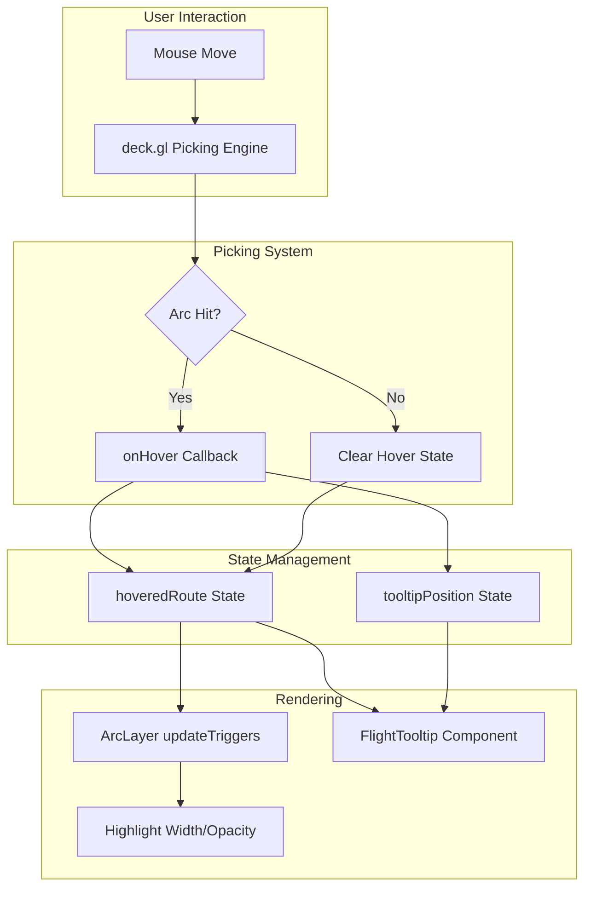

# Implementation Plan: View Route Details

## User Story

**As a** user
**I want to** see details when hovering over a flight route
**So that I** can learn about specific connections

## Acceptance Criteria

- [ ] Tooltip appears on arc hover
- [ ] Tooltip displays origin airport, destination airport, and route data
- [ ] Tooltip dismisses when cursor moves away
- [ ] Hovered arc is visually highlighted

## Approach

Use deck.gl's built-in picking system to detect hover events on arcs. When an arc is hovered, display a tooltip component positioned near the cursor showing route details. The hovered arc is highlighted by increasing its width and opacity through the layer's accessor functions with `updateTriggers`.

## Architecture



## Libraries

| Library             | Purpose                     |
| ------------------- | --------------------------- |
| `@deck.gl/core`     | Picking engine              |
| `@deck.gl/layers`   | ArcLayer pickable prop      |
| `react`             | useState for tooltip state  |

## Data Structures

```typescript
// Tooltip state
interface TooltipState {
  route: FlightRoute | null;
  x: number;
  y: number;
}

// Hover info from deck.gl
interface HoverInfo {
  object?: FlightRoute;
  x: number;
  y: number;
  picked: boolean;
}
```

## Implementation Steps

### 1. Create Tooltip Hook

```typescript
// src/components/FlightMap/hooks/useFlightTooltip.ts
import { useState, useCallback } from 'react';
import type { FlightRoute } from '../../../types/flight';

interface TooltipState {
  route: FlightRoute | null;
  x: number;
  y: number;
}

interface HoverInfo {
  object?: FlightRoute;
  x: number;
  y: number;
}

export function useFlightTooltip() {
  const [tooltip, setTooltip] = useState<TooltipState>({
    route: null,
    x: 0,
    y: 0,
  });

  const handleHover = useCallback((info: HoverInfo) => {
    if (info.object) {
      setTooltip({
        route: info.object,
        x: info.x,
        y: info.y,
      });
    } else {
      setTooltip((prev) => ({
        ...prev,
        route: null,
      }));
    }
  }, []);

  const clearTooltip = useCallback(() => {
    setTooltip((prev) => ({ ...prev, route: null }));
  }, []);

  return {
    tooltip,
    hoveredRouteId: tooltip.route?.id ?? null,
    handleHover,
    clearTooltip,
  };
}
```

### 2. Create Tooltip Content Component

```typescript
// src/components/FlightMap/Tooltip/TooltipContent.tsx
import type { FlightRoute } from '../../../types/flight';

interface TooltipContentProps {
  route: FlightRoute;
}

function formatNumber(num: number): string {
  return new Intl.NumberFormat('en-US').format(num);
}

function formatDistance(km: number): string {
  return `${formatNumber(Math.round(km))} km`;
}

export function TooltipContent({ route }: TooltipContentProps) {
  return (
    <div className="space-y-3">
      {/* Route Header */}
      <div className="flex items-center gap-2">
        <span className="text-lg font-semibold text-cyan-400">
          {route.origin.code}
        </span>
        <svg
          className="w-4 h-4 text-gray-400"
          fill="none"
          stroke="currentColor"
          viewBox="0 0 24 24"
        >
          <path
            strokeLinecap="round"
            strokeLinejoin="round"
            strokeWidth={2}
            d="M17 8l4 4m0 0l-4 4m4-4H3"
          />
        </svg>
        <span className="text-lg font-semibold text-pink-400">
          {route.destination.code}
        </span>
      </div>

      {/* Origin Airport */}
      <div>
        <div className="text-xs text-gray-500 uppercase tracking-wide">Origin</div>
        <div className="text-white font-medium">{route.origin.name}</div>
        <div className="text-gray-400 text-sm">
          {route.origin.city}, {route.origin.country}
        </div>
      </div>

      {/* Destination Airport */}
      <div>
        <div className="text-xs text-gray-500 uppercase tracking-wide">Destination</div>
        <div className="text-white font-medium">{route.destination.name}</div>
        <div className="text-gray-400 text-sm">
          {route.destination.city}, {route.destination.country}
        </div>
      </div>

      {/* Route Statistics */}
      <div className="pt-2 border-t border-gray-700 grid grid-cols-2 gap-2">
        <div>
          <div className="text-xs text-gray-500 uppercase tracking-wide">Frequency</div>
          <div className="text-white">
            {route.frequency} <span className="text-gray-400">flights/week</span>
          </div>
        </div>

        {route.distance && (
          <div>
            <div className="text-xs text-gray-500 uppercase tracking-wide">Distance</div>
            <div className="text-white">{formatDistance(route.distance)}</div>
          </div>
        )}

        {route.passengerVolume && (
          <div className="col-span-2">
            <div className="text-xs text-gray-500 uppercase tracking-wide">
              Annual Passengers
            </div>
            <div className="text-white">{formatNumber(route.passengerVolume)}</div>
          </div>
        )}

        {route.airline && (
          <div className="col-span-2">
            <div className="text-xs text-gray-500 uppercase tracking-wide">Airline</div>
            <div className="text-white">{route.airline}</div>
          </div>
        )}
      </div>
    </div>
  );
}
```

### 3. Create Tooltip Container Component

```typescript
// src/components/FlightMap/Tooltip/FlightTooltip.tsx
import { useMemo } from 'react';
import { TooltipContent } from './TooltipContent';
import type { FlightRoute } from '../../../types/flight';

interface FlightTooltipProps {
  route: FlightRoute;
  x: number;
  y: number;
}

export function FlightTooltip({ route, x, y }: FlightTooltipProps) {
  // Calculate tooltip position to keep it on screen
  const position = useMemo(() => {
    const TOOLTIP_WIDTH = 280;
    const TOOLTIP_HEIGHT = 250;
    const OFFSET = 15;
    const VIEWPORT_PADDING = 10;

    // Get viewport dimensions
    const viewportWidth = window.innerWidth;
    const viewportHeight = window.innerHeight;

    // Determine horizontal position
    let left = x + OFFSET;
    if (left + TOOLTIP_WIDTH > viewportWidth - VIEWPORT_PADDING) {
      left = x - TOOLTIP_WIDTH - OFFSET;
    }

    // Determine vertical position
    let top = y + OFFSET;
    if (top + TOOLTIP_HEIGHT > viewportHeight - VIEWPORT_PADDING) {
      top = y - TOOLTIP_HEIGHT - OFFSET;
    }

    // Ensure minimum bounds
    left = Math.max(VIEWPORT_PADDING, left);
    top = Math.max(VIEWPORT_PADDING, top);

    return { left, top };
  }, [x, y]);

  return (
    <div
      className="absolute pointer-events-none z-50"
      style={{
        left: position.left,
        top: position.top,
      }}
    >
      <div
        className="bg-gray-900/95 backdrop-blur-sm border border-gray-700 rounded-lg
                    shadow-xl p-4 min-w-[280px] animate-fade-in"
      >
        <TooltipContent route={route} />
      </div>
    </div>
  );
}
```

### 4. Add CSS Animation for Tooltip

```css
/* src/index.css or tailwind config */
@keyframes fade-in {
  from {
    opacity: 0;
    transform: translateY(4px);
  }
  to {
    opacity: 1;
    transform: translateY(0);
  }
}

.animate-fade-in {
  animation: fade-in 0.15s ease-out;
}
```

Or in Tailwind config:

```javascript
// tailwind.config.js
module.exports = {
  theme: {
    extend: {
      animation: {
        'fade-in': 'fade-in 0.15s ease-out',
      },
      keyframes: {
        'fade-in': {
          '0%': { opacity: '0', transform: 'translateY(4px)' },
          '100%': { opacity: '1', transform: 'translateY(0)' },
        },
      },
    },
  },
};
```

### 5. Update Arc Layer with Highlight Support

```typescript
// src/components/FlightMap/layers/flightRoutesLayer.ts
import { ArcLayer } from '@deck.gl/layers';
import type { FlightRoute } from '../../../types/flight';
import { getSourceColor, getTargetColor } from './arcColorScale';
import { frequencyToWidth } from './arcWidthScale';

interface FlightRoutesLayerOptions {
  data: FlightRoute[];
  highlightedRouteId?: string | null;
  onHover?: (info: { object?: FlightRoute; x: number; y: number }) => void;
}

export function createFlightRoutesLayer({
  data,
  highlightedRouteId,
  onHover,
}: FlightRoutesLayerOptions) {
  const maxFrequency = Math.max(...data.map((d) => d.frequency), 1);

  return new ArcLayer<FlightRoute>({
    id: 'flight-routes-layer',
    data,
    pickable: true,

    // Arc endpoints
    getSourcePosition: (d) => [d.origin.longitude, d.origin.latitude],
    getTargetPosition: (d) => [d.destination.longitude, d.destination.latitude],

    // Color with highlight support
    getSourceColor: (d) => {
      const isHighlighted = d.id === highlightedRouteId;
      const baseColor = getSourceColor(d.frequency, maxFrequency);

      if (isHighlighted) {
        return [baseColor[0], baseColor[1], baseColor[2], 255];
      }

      // Dim non-highlighted routes when something is highlighted
      if (highlightedRouteId && !isHighlighted) {
        return [baseColor[0], baseColor[1], baseColor[2], 80];
      }

      return baseColor;
    },

    getTargetColor: (d) => {
      const isHighlighted = d.id === highlightedRouteId;
      const baseColor = getTargetColor(d.frequency, maxFrequency);

      if (isHighlighted) {
        return [baseColor[0], baseColor[1], baseColor[2], 255];
      }

      if (highlightedRouteId && !isHighlighted) {
        return [baseColor[0], baseColor[1], baseColor[2], 80];
      }

      return baseColor;
    },

    // Width with highlight support
    getWidth: (d) => {
      const isHighlighted = d.id === highlightedRouteId;
      const baseWidth = frequencyToWidth(d.frequency, maxFrequency);
      return isHighlighted ? baseWidth * 2.5 : baseWidth;
    },

    greatCircle: true,

    // Hover handler
    onHover,

    // Update triggers for reactivity
    updateTriggers: {
      getSourceColor: [highlightedRouteId, maxFrequency],
      getTargetColor: [highlightedRouteId, maxFrequency],
      getWidth: [highlightedRouteId, maxFrequency],
    },

    // Smooth transitions for highlight changes
    transitions: {
      getSourceColor: 150,
      getTargetColor: 150,
      getWidth: 150,
    },
  });
}
```

### 6. Integrate Tooltip with Main Component

```typescript
// src/components/FlightMap/FlightMap.tsx
import { useMemo } from 'react';
import DeckGL from '@deck.gl/react';
import Map from 'react-map-gl/maplibre';
import 'maplibre-gl/dist/maplibre-gl.css';

import { useFlightMapViewStore } from '../../stores/flightMapViewStore';
import { useFlightTooltip } from './hooks/useFlightTooltip';
import { createFlightRoutesLayer } from './layers/flightRoutesLayer';
import { FlightTooltip } from './Tooltip/FlightTooltip';
import { ZoomControls } from './ZoomControls';
import { ArcLegend } from './Legend/ArcLegend';
import type { FlightRoute } from '../../types/flight';

const MAP_STYLE = 'https://basemaps.cartocdn.com/gl/dark-matter-gl-style/style.json';

interface FlightMapProps {
  routes: FlightRoute[];
}

export function FlightMap({ routes }: FlightMapProps) {
  const viewState = useFlightMapViewStore((state) => state.viewState);
  const setViewState = useFlightMapViewStore((state) => state.setViewState);

  const { tooltip, hoveredRouteId, handleHover } = useFlightTooltip();

  const layers = useMemo(
    () => [
      createFlightRoutesLayer({
        data: routes,
        highlightedRouteId: hoveredRouteId,
        onHover: handleHover,
      }),
    ],
    [routes, hoveredRouteId, handleHover]
  );

  return (
    <div className="relative w-full h-full">
      <DeckGL
        viewState={viewState}
        onViewStateChange={({ viewState }) => setViewState(viewState)}
        controller={true}
        layers={layers}
        getCursor={({ isHovering }) => (isHovering ? 'pointer' : 'grab')}
      >
        <Map mapStyle={MAP_STYLE} />
      </DeckGL>

      {/* Tooltip */}
      {tooltip.route && (
        <FlightTooltip
          route={tooltip.route}
          x={tooltip.x}
          y={tooltip.y}
        />
      )}

      <ZoomControls />
      <ArcLegend />
    </div>
  );
}
```

## Performance Considerations

### Picking Optimization

Configure picking radius for better performance:

```typescript
new ArcLayer({
  // Smaller picking radius for denser routes
  pickingRadius: 5,

  // Use shader-based picking (default, faster)
  autoHighlight: false,
});
```

### Debounce Hover Updates

For very frequent mouse movements:

```typescript
import { useMemo } from 'react';
import { throttle } from 'lodash-es';

const throttledHandleHover = useMemo(
  () => throttle(handleHover, 16), // ~60fps
  [handleHover]
);
```

### Memoize Tooltip Position

```typescript
const position = useMemo(() => {
  // Position calculation...
}, [x, y]); // Only recalculate when cursor moves
```

## Responsiveness

### Touch-Friendly Tooltips

On touch devices, show tooltip on tap instead of hover:

```typescript
// src/components/FlightMap/hooks/useFlightTooltip.ts
export function useFlightTooltip() {
  const isTouchDevice = 'ontouchstart' in window;

  const handleClick = useCallback((info: HoverInfo) => {
    if (isTouchDevice && info.object) {
      setTooltip({
        route: info.object,
        x: info.x,
        y: info.y,
      });
    }
  }, [isTouchDevice]);

  // Return click handler for touch devices
  return {
    tooltip,
    hoveredRouteId: tooltip.route?.id ?? null,
    handleHover: isTouchDevice ? undefined : handleHover,
    handleClick: isTouchDevice ? handleClick : undefined,
    clearTooltip,
  };
}
```

### Mobile Tooltip Position

```typescript
// Full-width tooltip at bottom on mobile
const isMobile = window.innerWidth < 768;

if (isMobile) {
  return {
    left: 0,
    right: 0,
    bottom: 0,
    top: 'auto',
  };
}
```

### Responsive Tooltip Content

```typescript
// src/components/FlightMap/Tooltip/FlightTooltip.tsx
export function FlightTooltip({ route, x, y }: FlightTooltipProps) {
  const isMobile = window.innerWidth < 768;

  if (isMobile) {
    return (
      <div className="fixed bottom-0 left-0 right-0 z-50 animate-slide-up">
        <div className="bg-gray-900 border-t border-gray-700 p-4">
          <TooltipContent route={route} />
        </div>
      </div>
    );
  }

  // Desktop tooltip positioning...
}
```

## Testing

### Unit Tests

```typescript
// src/components/FlightMap/hooks/useFlightTooltip.test.ts
- Test initial tooltip state is null
- Test handleHover sets route and position
- Test handleHover with no object clears route
- Test clearTooltip clears route
- Test hoveredRouteId returns correct id

// src/components/FlightMap/Tooltip/TooltipContent.test.tsx
- Test renders origin airport code
- Test renders destination airport code
- Test renders origin city and country
- Test renders destination city and country
- Test renders frequency
- Test renders distance when provided
- Test renders passenger volume when provided
- Test renders airline when provided

// src/components/FlightMap/Tooltip/FlightTooltip.test.tsx
- Test tooltip renders at correct position
- Test tooltip stays within viewport bounds
- Test tooltip flips position when near edge
- Test tooltip has correct CSS classes

// src/components/FlightMap/layers/flightRoutesLayer.test.ts
- Test highlighted route has increased opacity
- Test non-highlighted routes are dimmed when highlight active
- Test highlighted route has increased width
- Test updateTriggers include highlightedRouteId
```

### Acceptance Tests

```gherkin
Feature: View Route Details
  Scenario: Display tooltip on hover
    Given I am on the flight routes page
    And flight routes are displayed
    When I hover over a flight route arc
    Then a tooltip should appear near my cursor
    And the tooltip should display the origin airport
    And the tooltip should display the destination airport
    And the tooltip should display route statistics

  Scenario: Tooltip dismisses on mouse leave
    Given I am hovering over a flight route
    And a tooltip is displayed
    When I move my cursor away from the route
    Then the tooltip should disappear

  Scenario: Hovered arc is highlighted
    Given I am on the flight routes page
    And flight routes are displayed
    When I hover over a flight route arc
    Then the hovered arc should be visually highlighted
    And other arcs should be dimmed
    When I move my cursor away
    Then all arcs should return to normal appearance

  Scenario: Tooltip stays on screen
    Given I am on the flight routes page
    When I hover over a route near the edge of the screen
    Then the tooltip should reposition to stay visible
    And the tooltip should not be cut off
```
