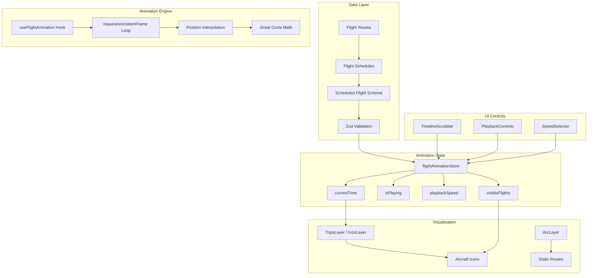

# Implementation Plan: Animate Route Flights Over Time

## User Story

**As a** user
**I want to** see actual flight paths animated over time
**So that I** can understand flight patterns throughout the day

## Acceptance Criteria

- [ ] Provide timeline scrubber to control animation
- [ ] Animate arcs to show flights taking off and landing over time
- [ ] Option to pause and resume animation
- [ ] Allow airport filtering during animation

## Approach

Use deck.gl's `TripsLayer` combined with a custom animation system to show individual flights moving along their routes over time. The TripsLayer is specifically designed for animating paths over time and is optimized for WebGL rendering of time-based data.

The animation system will:

1. **Model flight schedules** with departure/arrival times throughout a 24-hour period
2. **Interpolate aircraft positions** along great circle paths based on current animation time
3. **Render moving aircraft icons** using deck.gl's IconLayer on top of static route arcs
4. **Provide playback controls** (play/pause, speed, timeline scrubber) for user interaction

## Architecture



## Libraries

| Library                 | Purpose                                     |
| ----------------------- | ------------------------------------------- |
| `@deck.gl/layers`       | IconLayer for aircraft rendering            |
| `@deck.gl/geo-layers`   | TripsLayer for animated paths (alternative) |
| `@deck.gl/react`        | React integration                           |
| `react-map-gl/maplibre` | MapLibre base map                           |
| `zod`                   | Runtime data validation                     |
| `zustand`               | Animation state management                  |
| `d3-interpolate`        | Smooth position interpolation (optional)    |

## Data Structures

### Flight Schedule Schema

```typescript
// src/types/flightSchedule.ts
import { z } from 'zod';
import { AirportSchema } from './flight';

// Individual scheduled flight
export const ScheduledFlightSchema = z.object({
  id: z.string(),
  flightNumber: z.string(), // e.g., 'AA123'
  origin: AirportSchema,
  destination: AirportSchema,
  departureTime: z.number().min(0).max(1440), // Minutes from midnight (0-1440)
  arrivalTime: z.number().min(0).max(1440),
  airline: z.string().optional(),
  aircraftType: z.string().optional(), // e.g., 'B737', 'A320'
});

export type ScheduledFlight = z.infer<typeof ScheduledFlightSchema>;

// Flight position at a given time (computed)
export interface FlightPosition {
  flightId: string;
  flightNumber: string;
  longitude: number;
  latitude: number;
  bearing: number; // Heading in degrees
  progress: number; // 0-1 completion
  altitude: number; // Estimated altitude
  origin: string;
  destination: string;
}

// Animation state
export interface AnimationState {
  currentTime: number; // Minutes from midnight (0-1440)
  isPlaying: boolean;
  playbackSpeed: number; // 1 = real-time, 60 = 1 hour per minute
  loopEnabled: boolean;
}
```

### Animation Store

```typescript
// src/stores/flightAnimationStore.ts
import { create } from 'zustand';
import type { AnimationState, ScheduledFlight } from '../types/flightSchedule';

interface FlightAnimationState extends AnimationState {
  scheduledFlights: ScheduledFlight[];

  // Actions
  setCurrentTime: (time: number) => void;
  setIsPlaying: (playing: boolean) => void;
  togglePlayback: () => void;
  setPlaybackSpeed: (speed: number) => void;
  setLoopEnabled: (enabled: boolean) => void;
  setScheduledFlights: (flights: ScheduledFlight[]) => void;
  reset: () => void;
}

const initialState: AnimationState & { scheduledFlights: ScheduledFlight[] } = {
  currentTime: 0, // Start at midnight
  isPlaying: false,
  playbackSpeed: 60, // 1 hour per minute by default
  loopEnabled: true,
  scheduledFlights: [],
};

export const useFlightAnimationStore = create<FlightAnimationState>((set) => ({
  ...initialState,

  setCurrentTime: (time) => set({ currentTime: time % 1440 }), // Wrap at 24 hours
  setIsPlaying: (isPlaying) => set({ isPlaying }),
  togglePlayback: () => set((state) => ({ isPlaying: !state.isPlaying })),
  setPlaybackSpeed: (playbackSpeed) => set({ playbackSpeed }),
  setLoopEnabled: (loopEnabled) => set({ loopEnabled }),
  setScheduledFlights: (scheduledFlights) => set({ scheduledFlights }),
  reset: () => set(initialState),
}));
```

## Implementation Steps

### 1. Create Flight Schedule Types

```typescript
// src/types/flightSchedule.ts
import { z } from 'zod';
import { AirportSchema } from './flight';

export const ScheduledFlightSchema = z.object({
  id: z.string(),
  flightNumber: z.string(),
  origin: AirportSchema,
  destination: AirportSchema,
  departureTime: z.number().min(0).max(1440),
  arrivalTime: z.number().min(0).max(1440),
  airline: z.string().optional(),
  aircraftType: z.string().optional(),
});

export type ScheduledFlight = z.infer<typeof ScheduledFlightSchema>;

export interface FlightPosition {
  flightId: string;
  flightNumber: string;
  longitude: number;
  latitude: number;
  bearing: number;
  progress: number;
  altitude: number;
  origin: string;
  destination: string;
}

export const ScheduledFlightsResponseSchema = z.object({
  flights: z.array(ScheduledFlightSchema),
  metadata: z
    .object({
      totalFlights: z.number(),
      timezone: z.string(),
    })
    .optional(),
});

export type ScheduledFlightsResponse = z.infer<
  typeof ScheduledFlightsResponseSchema
>;
```

### 2. Create Great Circle Interpolation Utilities

```typescript
// src/utils/greatCircle.ts

/**
 * Convert degrees to radians
 */
export function toRadians(degrees: number): number {
  return (degrees * Math.PI) / 180;
}

/**
 * Convert radians to degrees
 */
export function toDegrees(radians: number): number {
  return (radians * 180) / Math.PI;
}

/**
 * Calculate intermediate point on a great circle path
 * @param lat1 - Start latitude in degrees
 * @param lon1 - Start longitude in degrees
 * @param lat2 - End latitude in degrees
 * @param lon2 - End longitude in degrees
 * @param fraction - Progress along path (0-1)
 * @returns [longitude, latitude] in degrees
 */
export function interpolateGreatCircle(
  lat1: number,
  lon1: number,
  lat2: number,
  lon2: number,
  fraction: number
): [number, number] {
  const φ1 = toRadians(lat1);
  const λ1 = toRadians(lon1);
  const φ2 = toRadians(lat2);
  const λ2 = toRadians(lon2);

  // Calculate angular distance
  const d =
    2 *
    Math.asin(
      Math.sqrt(
        Math.pow(Math.sin((φ2 - φ1) / 2), 2) +
          Math.cos(φ1) * Math.cos(φ2) * Math.pow(Math.sin((λ2 - λ1) / 2), 2)
      )
    );

  if (d === 0) return [lon1, lat1];

  const a = Math.sin((1 - fraction) * d) / Math.sin(d);
  const b = Math.sin(fraction * d) / Math.sin(d);

  const x = a * Math.cos(φ1) * Math.cos(λ1) + b * Math.cos(φ2) * Math.cos(λ2);
  const y = a * Math.cos(φ1) * Math.sin(λ1) + b * Math.cos(φ2) * Math.sin(λ2);
  const z = a * Math.sin(φ1) + b * Math.sin(φ2);

  const φ = Math.atan2(z, Math.sqrt(x * x + y * y));
  const λ = Math.atan2(y, x);

  return [toDegrees(λ), toDegrees(φ)];
}

/**
 * Calculate bearing from point 1 to point 2
 * @returns Bearing in degrees (0-360)
 */
export function calculateBearing(
  lat1: number,
  lon1: number,
  lat2: number,
  lon2: number
): number {
  const φ1 = toRadians(lat1);
  const φ2 = toRadians(lat2);
  const Δλ = toRadians(lon2 - lon1);

  const y = Math.sin(Δλ) * Math.cos(φ2);
  const x =
    Math.cos(φ1) * Math.sin(φ2) - Math.sin(φ1) * Math.cos(φ2) * Math.cos(Δλ);

  const θ = Math.atan2(y, x);
  return (toDegrees(θ) + 360) % 360;
}

/**
 * Estimate flight altitude based on progress (simplified cruise profile)
 * @param progress - Flight progress (0-1)
 * @param cruiseAltitude - Maximum cruise altitude in feet
 * @returns Altitude in feet
 */
export function estimateAltitude(
  progress: number,
  cruiseAltitude: number = 35000
): number {
  // Simple climb/cruise/descent profile
  if (progress < 0.15) {
    // Climb phase (0-15%)
    return (progress / 0.15) * cruiseAltitude;
  } else if (progress > 0.85) {
    // Descent phase (85-100%)
    return ((1 - progress) / 0.15) * cruiseAltitude;
  }
  // Cruise phase
  return cruiseAltitude;
}
```

### 3. Create Flight Position Calculator

```typescript
// src/components/FlightMap/utils/flightPositionCalculator.ts
import type {
  ScheduledFlight,
  FlightPosition,
} from '../../../types/flightSchedule';
import {
  interpolateGreatCircle,
  calculateBearing,
  estimateAltitude,
} from '../../../utils/greatCircle';

/**
 * Calculate the current position of a flight based on animation time
 */
export function calculateFlightPosition(
  flight: ScheduledFlight,
  currentTime: number // Minutes from midnight
): FlightPosition | null {
  let departureTime = flight.departureTime;
  let arrivalTime = flight.arrivalTime;

  // Handle overnight flights (arrival before departure in 24h time)
  if (arrivalTime < departureTime) {
    arrivalTime += 1440; // Add 24 hours
  }

  // Adjust current time for overnight comparison
  let adjustedCurrentTime = currentTime;
  if (currentTime < departureTime && arrivalTime > 1440) {
    adjustedCurrentTime += 1440;
  }

  // Check if flight is currently in the air
  if (
    adjustedCurrentTime < departureTime ||
    adjustedCurrentTime > arrivalTime
  ) {
    return null;
  }

  // Calculate progress (0-1)
  const flightDuration = arrivalTime - departureTime;
  const elapsed = adjustedCurrentTime - departureTime;
  const progress = Math.min(Math.max(elapsed / flightDuration, 0), 1);

  // Interpolate position along great circle path
  const [longitude, latitude] = interpolateGreatCircle(
    flight.origin.latitude,
    flight.origin.longitude,
    flight.destination.latitude,
    flight.destination.longitude,
    progress
  );

  // Calculate bearing for aircraft icon rotation
  const bearing = calculateBearing(
    flight.origin.latitude,
    flight.origin.longitude,
    flight.destination.latitude,
    flight.destination.longitude
  );

  // Estimate altitude
  const altitude = estimateAltitude(progress);

  return {
    flightId: flight.id,
    flightNumber: flight.flightNumber,
    longitude,
    latitude,
    bearing,
    progress,
    altitude,
    origin: flight.origin.code,
    destination: flight.destination.code,
  };
}

/**
 * Calculate positions for all active flights at a given time
 */
export function calculateActiveFlightPositions(
  flights: ScheduledFlight[],
  currentTime: number,
  airportFilter?: string // Optional airport code to filter by
): FlightPosition[] {
  const positions: FlightPosition[] = [];

  for (const flight of flights) {
    // Apply airport filter if specified
    if (airportFilter) {
      const isOrigin = flight.origin.code === airportFilter;
      const isDestination = flight.destination.code === airportFilter;
      if (!isOrigin && !isDestination) continue;
    }

    const position = calculateFlightPosition(flight, currentTime);
    if (position) {
      positions.push(position);
    }
  }

  return positions;
}
```

### 4. Create Animation Hook

```typescript
// src/components/FlightMap/hooks/useFlightAnimation.ts
import { useEffect, useRef, useCallback } from 'react';
import { useFlightAnimationStore } from '../../../stores/flightAnimationStore';

export function useFlightAnimation() {
  const animationRef = useRef<number | null>(null);
  const lastTimeRef = useRef<number>(0);

  const currentTime = useFlightAnimationStore((state) => state.currentTime);
  const isPlaying = useFlightAnimationStore((state) => state.isPlaying);
  const playbackSpeed = useFlightAnimationStore((state) => state.playbackSpeed);
  const loopEnabled = useFlightAnimationStore((state) => state.loopEnabled);
  const setCurrentTime = useFlightAnimationStore(
    (state) => state.setCurrentTime
  );

  const animate = useCallback(
    (timestamp: number) => {
      if (lastTimeRef.current === 0) {
        lastTimeRef.current = timestamp;
      }

      const deltaTime = timestamp - lastTimeRef.current;
      lastTimeRef.current = timestamp;

      // Convert delta time (ms) to simulation minutes
      // playbackSpeed of 60 means 1 hour of simulation per 1 minute of real time
      const deltaMinutes = (deltaTime / 1000) * (playbackSpeed / 60);

      setCurrentTime(currentTime + deltaMinutes);

      // Handle loop or stop at end of day
      if (currentTime >= 1440) {
        if (loopEnabled) {
          setCurrentTime(0);
        } else {
          useFlightAnimationStore.getState().setIsPlaying(false);
          return;
        }
      }

      animationRef.current = requestAnimationFrame(animate);
    },
    [currentTime, playbackSpeed, loopEnabled, setCurrentTime]
  );

  useEffect(() => {
    if (isPlaying) {
      lastTimeRef.current = 0;
      animationRef.current = requestAnimationFrame(animate);
    } else {
      if (animationRef.current) {
        cancelAnimationFrame(animationRef.current);
        animationRef.current = null;
      }
    }

    return () => {
      if (animationRef.current) {
        cancelAnimationFrame(animationRef.current);
      }
    };
  }, [isPlaying, animate]);

  return {
    currentTime,
    isPlaying,
    playbackSpeed,
  };
}
```

### 5. Create Aircraft Icon Layer

```typescript
// src/components/FlightMap/layers/aircraftLayer.ts
import { IconLayer } from '@deck.gl/layers';
import type { FlightPosition } from '../../../types/flightSchedule';

// Aircraft icon as SVG data URL
const AIRCRAFT_ICON = `data:image/svg+xml;base64,${btoa(`
  <svg width="32" height="32" viewBox="0 0 32 32" xmlns="http://www.w3.org/2000/svg">
    <path d="M16 2L20 14L30 16L20 18L16 30L12 18L2 16L12 14Z" fill="#fff"/>
  </svg>
`)}`;

// Icon mapping for deck.gl
const ICON_MAPPING = {
  aircraft: { x: 0, y: 0, width: 32, height: 32, anchorY: 16 },
};

interface AircraftLayerOptions {
  data: FlightPosition[];
  onHover?: (info: { object?: FlightPosition; x: number; y: number }) => void;
}

export function createAircraftLayer({ data, onHover }: AircraftLayerOptions) {
  return new IconLayer<FlightPosition>({
    id: 'aircraft-layer',
    data,
    pickable: true,

    // Icon configuration
    iconAtlas: AIRCRAFT_ICON,
    iconMapping: ICON_MAPPING,
    getIcon: () => 'aircraft',

    // Position and size
    getPosition: (d) => [d.longitude, d.latitude, d.altitude / 100], // Slight z elevation
    getSize: 24,
    sizeScale: 1,
    sizeMinPixels: 12,
    sizeMaxPixels: 48,

    // Rotation (bearing)
    getAngle: (d) => 360 - d.bearing, // Invert for correct icon orientation

    // Color based on altitude (optional visual feedback)
    getColor: (d) => {
      const altitudeRatio = d.altitude / 35000;
      return [
        255,
        Math.round(255 * (1 - altitudeRatio * 0.5)),
        Math.round(255 * (1 - altitudeRatio)),
        220,
      ];
    },

    // Interaction
    onHover,

    // Smooth transitions
    transitions: {
      getPosition: {
        duration: 100, // Short duration for smooth animation
        easing: (t: number) => t, // Linear interpolation
      },
    },
  });
}
```

### 6. Create Timeline Scrubber Component

```typescript
// src/components/FlightMap/Animation/TimelineScrubber.tsx
import { useCallback, useRef } from 'react';
import { useFlightAnimationStore } from '../../../stores/flightAnimationStore';

function formatTime(minutes: number): string {
  const hours = Math.floor(minutes / 60);
  const mins = Math.floor(minutes % 60);
  const ampm = hours >= 12 ? 'PM' : 'AM';
  const displayHours = hours % 12 || 12;
  return `${displayHours}:${mins.toString().padStart(2, '0')} ${ampm}`;
}

export function TimelineScrubber() {
  const currentTime = useFlightAnimationStore((state) => state.currentTime);
  const setCurrentTime = useFlightAnimationStore((state) => state.setCurrentTime);
  const isPlaying = useFlightAnimationStore((state) => state.isPlaying);
  const setIsPlaying = useFlightAnimationStore((state) => state.setIsPlaying);

  const scrubberRef = useRef<HTMLDivElement>(null);
  const isDragging = useRef(false);

  const handleScrubberClick = useCallback((e: React.MouseEvent<HTMLDivElement>) => {
    if (!scrubberRef.current) return;

    const rect = scrubberRef.current.getBoundingClientRect();
    const x = e.clientX - rect.left;
    const percentage = x / rect.width;
    const newTime = percentage * 1440;

    setCurrentTime(Math.max(0, Math.min(1440, newTime)));
  }, [setCurrentTime]);

  const handleMouseDown = useCallback(() => {
    isDragging.current = true;
    // Pause while scrubbing
    if (isPlaying) {
      setIsPlaying(false);
    }
  }, [isPlaying, setIsPlaying]);

  const handleMouseMove = useCallback((e: React.MouseEvent<HTMLDivElement>) => {
    if (!isDragging.current || !scrubberRef.current) return;

    const rect = scrubberRef.current.getBoundingClientRect();
    const x = e.clientX - rect.left;
    const percentage = Math.max(0, Math.min(1, x / rect.width));
    const newTime = percentage * 1440;

    setCurrentTime(newTime);
  }, [setCurrentTime]);

  const handleMouseUp = useCallback(() => {
    isDragging.current = false;
  }, []);

  const progress = (currentTime / 1440) * 100;

  return (
    <div className="bg-gray-800/90 backdrop-blur-sm rounded-lg p-4 shadow-lg">
      {/* Time display */}
      <div className="flex justify-between items-center mb-2">
        <span className="text-xs text-gray-400">12:00 AM</span>
        <span className="text-white font-mono text-lg">{formatTime(currentTime)}</span>
        <span className="text-xs text-gray-400">11:59 PM</span>
      </div>

      {/* Scrubber track */}
      <div
        ref={scrubberRef}
        className="relative h-4 bg-gray-700 rounded-full cursor-pointer"
        onClick={handleScrubberClick}
        onMouseDown={handleMouseDown}
        onMouseMove={handleMouseMove}
        onMouseUp={handleMouseUp}
        onMouseLeave={handleMouseUp}
      >
        {/* Progress fill */}
        <div
          className="absolute h-full bg-gradient-to-r from-cyan-500 to-pink-500 rounded-full transition-all"
          style={{ width: `${progress}%` }}
        />

        {/* Scrubber handle */}
        <div
          className="absolute top-1/2 -translate-y-1/2 w-5 h-5 bg-white rounded-full shadow-lg
                     border-2 border-cyan-400 cursor-grab active:cursor-grabbing"
          style={{ left: `calc(${progress}% - 10px)` }}
        />

        {/* Hour markers */}
        <div className="absolute inset-0 flex justify-between px-1 pointer-events-none">
          {[...Array(24)].map((_, i) => (
            <div
              key={i}
              className={`w-px h-2 ${i % 6 === 0 ? 'bg-gray-500' : 'bg-gray-600'}`}
              style={{ marginTop: i % 6 === 0 ? '4px' : '6px' }}
            />
          ))}
        </div>
      </div>

      {/* Hour labels */}
      <div className="flex justify-between mt-1 text-xs text-gray-500">
        <span>0</span>
        <span>6</span>
        <span>12</span>
        <span>18</span>
        <span>24</span>
      </div>
    </div>
  );
}
```

### 7. Create Playback Controls Component

```typescript
// src/components/FlightMap/Animation/PlaybackControls.tsx
import { useFlightAnimationStore } from '../../../stores/flightAnimationStore';

const SPEED_OPTIONS = [
  { value: 1, label: '1x' },
  { value: 30, label: '30x' },
  { value: 60, label: '60x' },
  { value: 120, label: '120x' },
  { value: 300, label: '300x' },
];

export function PlaybackControls() {
  const isPlaying = useFlightAnimationStore((state) => state.isPlaying);
  const togglePlayback = useFlightAnimationStore((state) => state.togglePlayback);
  const playbackSpeed = useFlightAnimationStore((state) => state.playbackSpeed);
  const setPlaybackSpeed = useFlightAnimationStore((state) => state.setPlaybackSpeed);
  const loopEnabled = useFlightAnimationStore((state) => state.loopEnabled);
  const setLoopEnabled = useFlightAnimationStore((state) => state.setLoopEnabled);
  const setCurrentTime = useFlightAnimationStore((state) => state.setCurrentTime);

  return (
    <div className="flex items-center gap-3 bg-gray-800/90 backdrop-blur-sm rounded-lg px-4 py-2 shadow-lg">
      {/* Reset button */}
      <button
        onClick={() => setCurrentTime(0)}
        className="w-8 h-8 flex items-center justify-center text-gray-400 hover:text-white
                   hover:bg-gray-700 rounded-lg transition-colors"
        aria-label="Reset to midnight"
        title="Reset to midnight"
      >
        <svg className="w-4 h-4" fill="none" stroke="currentColor" viewBox="0 0 24 24">
          <path strokeLinecap="round" strokeLinejoin="round" strokeWidth={2}
                d="M12.066 11.2a1 1 0 000 1.6l5.334 4A1 1 0 0019 16V8a1 1 0 00-1.6-.8l-5.333 4z" />
          <path strokeLinecap="round" strokeLinejoin="round" strokeWidth={2}
                d="M4.066 11.2a1 1 0 000 1.6l5.334 4A1 1 0 0011 16V8a1 1 0 00-1.6-.8l-5.334 4z" />
        </svg>
      </button>

      {/* Play/Pause button */}
      <button
        onClick={togglePlayback}
        className="w-12 h-12 flex items-center justify-center bg-cyan-600 hover:bg-cyan-500
                   text-white rounded-full transition-colors shadow-lg"
        aria-label={isPlaying ? 'Pause' : 'Play'}
      >
        {isPlaying ? (
          <svg className="w-6 h-6" fill="none" stroke="currentColor" viewBox="0 0 24 24">
            <path strokeLinecap="round" strokeLinejoin="round" strokeWidth={2}
                  d="M10 9v6m4-6v6" />
          </svg>
        ) : (
          <svg className="w-6 h-6 ml-1" fill="currentColor" viewBox="0 0 24 24">
            <path d="M8 5v14l11-7z" />
          </svg>
        )}
      </button>

      {/* Speed selector */}
      <div className="flex items-center gap-1">
        {SPEED_OPTIONS.map(({ value, label }) => (
          <button
            key={value}
            onClick={() => setPlaybackSpeed(value)}
            className={`px-2 py-1 text-xs rounded transition-colors ${
              playbackSpeed === value
                ? 'bg-cyan-600 text-white'
                : 'bg-gray-700 text-gray-300 hover:bg-gray-600'
            }`}
          >
            {label}
          </button>
        ))}
      </div>

      {/* Loop toggle */}
      <button
        onClick={() => setLoopEnabled(!loopEnabled)}
        className={`w-8 h-8 flex items-center justify-center rounded-lg transition-colors ${
          loopEnabled
            ? 'bg-cyan-600 text-white'
            : 'bg-gray-700 text-gray-400 hover:bg-gray-600'
        }`}
        aria-label={loopEnabled ? 'Loop enabled' : 'Loop disabled'}
        title={loopEnabled ? 'Loop enabled' : 'Loop disabled'}
      >
        <svg className="w-4 h-4" fill="none" stroke="currentColor" viewBox="0 0 24 24">
          <path strokeLinecap="round" strokeLinejoin="round" strokeWidth={2}
                d="M4 4v5h.582m15.356 2A8.001 8.001 0 004.582 9m0 0H9m11 11v-5h-.581m0 0a8.003 8.003 0 01-15.357-2m15.357 2H15" />
        </svg>
      </button>
    </div>
  );
}
```

### 8. Create Animation Panel Component

```typescript
// src/components/FlightMap/Animation/AnimationPanel.tsx
import { TimelineScrubber } from './TimelineScrubber';
import { PlaybackControls } from './PlaybackControls';
import { useFlightAnimationStore } from '../../../stores/flightAnimationStore';

interface AnimationPanelProps {
  activeFlightCount: number;
}

export function AnimationPanel({ activeFlightCount }: AnimationPanelProps) {
  const currentTime = useFlightAnimationStore((state) => state.currentTime);

  return (
    <div className="absolute bottom-4 left-4 right-4 md:left-auto md:right-4 md:w-[400px]
                    flex flex-col gap-3 z-20">
      {/* Flight count indicator */}
      <div className="bg-gray-800/90 backdrop-blur-sm rounded-lg px-4 py-2 shadow-lg
                      flex items-center justify-between">
        <span className="text-gray-400 text-sm">Active Flights</span>
        <span className="text-white font-mono text-lg">{activeFlightCount}</span>
      </div>

      {/* Timeline scrubber */}
      <TimelineScrubber />

      {/* Playback controls */}
      <div className="flex justify-center">
        <PlaybackControls />
      </div>
    </div>
  );
}

export { TimelineScrubber, PlaybackControls };
```

### 9. Update FlightMap Component with Animation

```typescript
// src/components/FlightMap/FlightMap.tsx (updated)
import { useMemo, useCallback } from 'react';
import Map from 'react-map-gl/maplibre';
import DeckGL from '@deck.gl/react';
import 'maplibre-gl/dist/maplibre-gl.css';

import { createFlightRoutesLayer } from './layers/flightRoutesLayer';
import { createAircraftLayer } from './layers/aircraftLayer';
import { ArcLegend } from './Legend/ArcLegend';
import { ZoomControls } from './ZoomControls';
import { FlightTooltip } from './Tooltip/FlightTooltip';
import { AnimationPanel } from './Animation/AnimationPanel';
import { useFlightTooltip } from './hooks/useFlightTooltip';
import { useFilteredRoutes } from './hooks/useFilteredRoutes';
import { useFlightAnimation } from './hooks/useFlightAnimation';
import { calculateActiveFlightPositions } from './utils/flightPositionCalculator';
import {
  useFlightMapViewStore,
  useFlightRoutesStore,
  useFlightAnimationStore,
} from '../../stores';
import type { FlightRoute } from '../../types/flight';

const MAP_STYLE = 'https://basemaps.cartocdn.com/gl/dark-matter-gl-style/style.json';

interface FlightMapProps {
  routes: FlightRoute[];
  animationEnabled?: boolean;
}

export function FlightMap({ routes, animationEnabled = false }: FlightMapProps) {
  const viewState = useFlightMapViewStore((state) => state.viewState);
  const setViewState = useFlightMapViewStore((state) => state.setViewState);

  const scheduledFlights = useFlightAnimationStore((state) => state.scheduledFlights);
  const { currentTime } = useFlightAnimation();

  const { tooltip, hoveredRouteId, handleHover } = useFlightTooltip();
  const { filteredRoutes, selectedAirportData } = useFilteredRoutes(routes);

  // Calculate active flight positions for animation
  const activeFlightPositions = useMemo(() => {
    if (!animationEnabled || scheduledFlights.length === 0) return [];
    return calculateActiveFlightPositions(
      scheduledFlights,
      currentTime,
      selectedAirportData?.code
    );
  }, [animationEnabled, scheduledFlights, currentTime, selectedAirportData?.code]);

  const layers = useMemo(() => {
    const layerList = [
      // Static route arcs (dimmed when animation is active)
      createFlightRoutesLayer({
        data: filteredRoutes,
        highlightedRouteId: hoveredRouteId,
        onHover: handleHover,
        opacity: animationEnabled ? 0.3 : 1, // Dim routes during animation
      }),
    ];

    // Add aircraft layer when animation is enabled
    if (animationEnabled && activeFlightPositions.length > 0) {
      layerList.push(createAircraftLayer({ data: activeFlightPositions }) as never);
    }

    return layerList;
  }, [filteredRoutes, hoveredRouteId, handleHover, animationEnabled, activeFlightPositions]);

  const handleViewStateChange = useCallback(
    (params: { viewState: any }) => {
      setViewState(params.viewState);
    },
    [setViewState]
  );

  return (
    <div className="w-full h-full relative">
      <DeckGL
        viewState={viewState}
        onViewStateChange={handleViewStateChange}
        controller={true}
        layers={layers}
        getCursor={({ isHovering }) => (isHovering ? 'pointer' : 'grab')}
      >
        <Map mapStyle={MAP_STYLE} />
      </DeckGL>

      {/* Existing controls */}
      <ZoomControls />
      <ArcLegend />

      {/* Tooltip */}
      {tooltip.route && (
        <FlightTooltip route={tooltip.route} x={tooltip.x} y={tooltip.y} />
      )}

      {/* Animation controls */}
      {animationEnabled && (
        <AnimationPanel activeFlightCount={activeFlightPositions.length} />
      )}
    </div>
  );
}
```

### 10. Create Animation Toggle in Filter Panel

```typescript
// src/components/FlightMap/Filters/AnimationToggle.tsx
import { useFlightAnimationStore } from '../../../stores/flightAnimationStore';

interface AnimationToggleProps {
  enabled: boolean;
  onToggle: (enabled: boolean) => void;
}

export function AnimationToggle({ enabled, onToggle }: AnimationToggleProps) {
  const isPlaying = useFlightAnimationStore((state) => state.isPlaying);
  const setIsPlaying = useFlightAnimationStore((state) => state.setIsPlaying);

  const handleToggle = () => {
    const newEnabled = !enabled;
    onToggle(newEnabled);

    // Stop playback when disabling animation
    if (!newEnabled && isPlaying) {
      setIsPlaying(false);
    }
  };

  return (
    <div className="bg-gray-800/90 backdrop-blur-sm rounded-lg p-4 shadow-lg">
      <div className="flex items-center justify-between">
        <div>
          <h3 className="text-white font-medium">Flight Animation</h3>
          <p className="text-gray-400 text-xs mt-1">
            Watch flights throughout the day
          </p>
        </div>

        <button
          onClick={handleToggle}
          className={`relative w-12 h-6 rounded-full transition-colors ${
            enabled ? 'bg-cyan-600' : 'bg-gray-600'
          }`}
          role="switch"
          aria-checked={enabled}
        >
          <span
            className={`absolute top-1 w-4 h-4 bg-white rounded-full transition-transform ${
              enabled ? 'translate-x-7' : 'translate-x-1'
            }`}
          />
        </button>
      </div>
    </div>
  );
}
```

## Performance Considerations

### Efficient Position Updates

```typescript
// Throttle position calculations to ~60fps max
const ANIMATION_FRAME_RATE = 60;
const FRAME_INTERVAL = 1000 / ANIMATION_FRAME_RATE;

let lastFrameTime = 0;

function animate(timestamp: number) {
  if (timestamp - lastFrameTime < FRAME_INTERVAL) {
    requestAnimationFrame(animate);
    return;
  }
  lastFrameTime = timestamp;

  // Calculate positions...
}
```

### Batch Position Calculations

```typescript
// Use Web Workers for heavy calculations with large datasets
// src/workers/flightPositionWorker.ts
self.onmessage = (e) => {
  const { flights, currentTime, airportFilter } = e.data;
  const positions = calculateActiveFlightPositions(
    flights,
    currentTime,
    airportFilter
  );
  self.postMessage(positions);
};
```

### Level of Detail (LOD)

```typescript
// Reduce detail at lower zoom levels
function getIconSize(zoom: number): number {
  if (zoom < 4) return 8;
  if (zoom < 6) return 16;
  return 24;
}

// Skip rendering distant flights at low zoom
function shouldRenderFlight(flight: FlightPosition, zoom: number): boolean {
  if (zoom > 6) return true;
  // Only render high-altitude flights at low zoom
  return flight.altitude > 20000;
}
```

### Memory Management

```typescript
// Use object pools for flight positions
const positionPool: FlightPosition[] = [];

function getPosition(): FlightPosition {
  return positionPool.pop() || createEmptyPosition();
}

function releasePosition(pos: FlightPosition): void {
  positionPool.push(pos);
}
```

## Responsiveness

### Adaptive UI Layout

```typescript
// src/components/FlightMap/Animation/AnimationPanel.tsx
const isMobile = useMediaQuery('(max-width: 768px)');

return (
  <div className={`
    absolute z-20 flex flex-col gap-3
    ${isMobile
      ? 'bottom-4 left-2 right-2'
      : 'bottom-4 right-4 w-[400px]'
    }
  `}>
    {/* Controls */}
  </div>
);
```

### Touch-Friendly Scrubber

```typescript
// Larger touch targets on mobile
const isTouchDevice = 'ontouchstart' in window;

<div
  className={`
    relative bg-gray-700 rounded-full cursor-pointer
    ${isTouchDevice ? 'h-8' : 'h-4'}
  `}
  onTouchStart={handleTouchStart}
  onTouchMove={handleTouchMove}
  onTouchEnd={handleTouchEnd}
>
  {/* Larger handle on touch devices */}
  <div className={`
    absolute top-1/2 -translate-y-1/2 bg-white rounded-full shadow-lg
    ${isTouchDevice ? 'w-8 h-8' : 'w-5 h-5'}
  `} />
</div>
```

### Reduced Animation on Low-Power Devices

```typescript
// Detect low-power mode or reduced motion preference
const prefersReducedMotion = window.matchMedia(
  '(prefers-reduced-motion: reduce)'
).matches;

const defaultSpeed = prefersReducedMotion ? 300 : 60;
```

## Testing

### Unit Tests

```typescript
// src/utils/greatCircle.test.ts
- Test toRadians converts correctly
- Test toDegrees converts correctly
- Test interpolateGreatCircle at 0% returns origin
- Test interpolateGreatCircle at 100% returns destination
- Test interpolateGreatCircle at 50% returns midpoint
- Test calculateBearing returns correct heading
- Test estimateAltitude climb profile
- Test estimateAltitude cruise profile
- Test estimateAltitude descent profile

// src/components/FlightMap/utils/flightPositionCalculator.test.ts
- Test calculateFlightPosition returns null before departure
- Test calculateFlightPosition returns null after arrival
- Test calculateFlightPosition returns position during flight
- Test overnight flight handling
- Test progress calculation accuracy
- Test calculateActiveFlightPositions filters by airport

// src/stores/flightAnimationStore.test.ts
- Test initial state
- Test setCurrentTime wraps at 1440
- Test togglePlayback toggles isPlaying
- Test setPlaybackSpeed updates speed
- Test reset restores initial state

// src/components/FlightMap/hooks/useFlightAnimation.test.ts
- Test animation loop starts when isPlaying true
- Test animation loop stops when isPlaying false
- Test time advances based on playbackSpeed
- Test loop resets time at 1440 when loopEnabled
```

### Acceptance Tests

```gherkin
Feature: Animate Route Flights Over Time

  Scenario: Display animation controls
    Given I am on the flight routes page
    And flight routes data has loaded
    When I enable the flight animation toggle
    Then I should see the timeline scrubber
    And I should see the playback controls
    And I should see the active flight count

  Scenario: Play and pause animation
    Given I am on the flight routes page
    And flight animation is enabled
    When I click the play button
    Then the animation should start playing
    And the time display should advance
    When I click the pause button
    Then the animation should pause
    And the time display should stop advancing

  Scenario: Scrub through timeline
    Given I am on the flight routes page
    And flight animation is enabled
    When I drag the timeline scrubber to 12:00 PM
    Then the time display should show 12:00 PM
    And aircraft positions should update accordingly

  Scenario: Change playback speed
    Given I am on the flight routes page
    And flight animation is playing
    When I select 120x speed
    Then the animation should play at 120x speed
    And time should advance faster

  Scenario: Filter flights during animation
    Given I am on the flight routes page
    And flight animation is playing
    When I select an airport filter
    Then only flights to/from that airport should animate
    And the active flight count should update

  Scenario: Animation loops at end of day
    Given I am on the flight routes page
    And flight animation is playing
    And loop is enabled
    When the time reaches 11:59 PM
    Then the animation should restart at 12:00 AM
    And aircraft should continue animating

  Scenario: Animation respects airport filter
    Given I am on the flight routes page
    And I have selected LAX as the airport filter
    When I enable flight animation
    Then only flights departing from or arriving at LAX should animate
```

## Sample Flight Schedule Data

```json
{
  "flights": [
    {
      "id": "AA100-0600",
      "flightNumber": "AA100",
      "origin": {
        "code": "JFK",
        "name": "John F. Kennedy International",
        "city": "New York",
        "country": "USA",
        "longitude": -73.7781,
        "latitude": 40.6413
      },
      "destination": {
        "code": "LAX",
        "name": "Los Angeles International",
        "city": "Los Angeles",
        "country": "USA",
        "longitude": -118.4085,
        "latitude": 33.9425
      },
      "departureTime": 360,
      "arrivalTime": 660,
      "airline": "American Airlines",
      "aircraftType": "B777"
    }
  ],
  "metadata": {
    "totalFlights": 1,
    "timezone": "UTC"
  }
}
```
