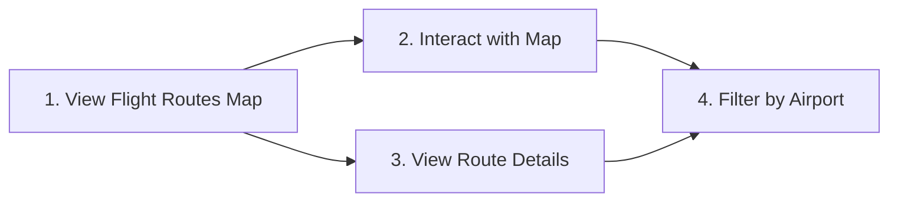
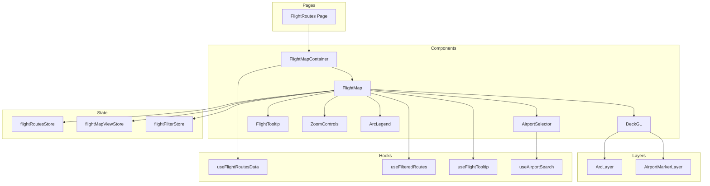

# Flight Routes Visualization - Implementation Plans

This directory contains implementation plans for the Flight Routes Visualization feature, which displays flight routes as arcs on an interactive map using deck.gl's ArcLayer.

## Feature Overview

The flight routes visualization allows users to explore air travel connections between airports. Flight routes are rendered as curved arcs, with visual properties indicating direction (color gradient) and frequency (arc width).

## User Stories

| # | User Story | Implementation Plan |
|---|------------|---------------------|
| 1 | View Flight Routes Map | [01-view-flight-routes-map.md](./01-view-flight-routes-map.md) |
| 2 | Interact with Map | [02-interact-with-map.md](./02-interact-with-map.md) |
| 3 | View Route Details | [03-view-route-details.md](./03-view-route-details.md) |
| 4 | Filter by Airport | [04-filter-by-airport.md](./04-filter-by-airport.md) |

## Recommended Implementation Order



1. **View Flight Routes Map** - Core functionality: data fetching, ArcLayer rendering, and base map setup
2. **Interact with Map** - Pan/zoom controls and view state management
3. **View Route Details** - Tooltip system and hover interactions
4. **Filter by Airport** - Airport selector and route filtering

## Technical Architecture



## File Structure (Proposed)

```
src/
├── components/
│   └── FlightMap/
│       ├── FlightMap.tsx
│       ├── MapContainer.tsx
│       ├── ZoomControls.tsx
│       ├── Filters/
│       │   ├── AirportSelector.tsx
│       │   ├── FilterModeSelector.tsx
│       │   └── FlightFilterStats.tsx
│       ├── Legend/
│       │   └── ArcLegend.tsx
│       ├── Tooltip/
│       │   ├── FlightTooltip.tsx
│       │   └── TooltipContent.tsx
│       ├── layers/
│       │   ├── flightRoutesLayer.ts
│       │   ├── airportMarkerLayer.ts
│       │   ├── arcColorScale.ts
│       │   └── arcWidthScale.ts
│       └── hooks/
│           ├── useFlightTooltip.ts
│           ├── useFilteredRoutes.ts
│           └── useAirportSearch.ts
├── hooks/
│   └── useFlightRoutesData.ts
├── stores/
│   ├── flightRoutesStore.ts
│   ├── flightMapViewStore.ts
│   └── flightFilterStore.ts
├── types/
│   ├── flight.ts
│   └── flightFilter.ts
└── pages/
    └── FlightRoutes.tsx
```

## Key Technologies

| Technology | Purpose |
|------------|---------|
| deck.gl ArcLayer | Render flight routes as 3D arcs |
| MapLibre GL | Base map rendering |
| Zustand | State management for routes, view state, and filters |
| Zod | Runtime validation of flight route data |
| Fuse.js | Fuzzy search for airport selector |

## Visual Design

### Arc Styling

- **Direction**: Color gradient from cyan (origin) to magenta (destination)
- **Frequency**: Arc width scales logarithmically with flight frequency
- **Height**: Arc height proportional to route distance
- **Transparency**: Semi-transparent arcs to show overlapping routes

### Map Configuration

- **Base Map**: Dark theme (CARTO Dark Matter) for arc contrast
- **Initial View**: US-centered with 30° pitch to show arc heights
- **Zoom Range**: 2 (global) to 12 (regional detail)

## Performance Considerations

1. **Binary Data Format**: For datasets > 10,000 routes, use binary attribute buffers
2. **Route Aggregation**: Aggregate multiple airline routes between same city pairs
3. **Memoization**: Memoize layer creation and filtering operations
4. **Transition Throttling**: Debounce view state updates during rapid interactions

## Data Source Options

- OpenFlights database (open source)
- Bureau of Transportation Statistics
- Custom airline API integration

## Related Features

- [Earthquake Visualization](../earthquake-visualization/README.md) - Similar pattern using ScatterplotLayer
- [County Voting Visualization](../county-voting-visualization/README.md) - Similar pattern using GeoJsonLayer
